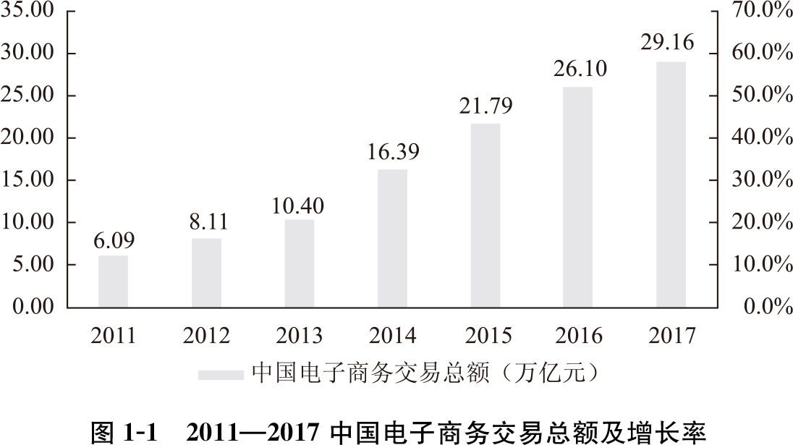
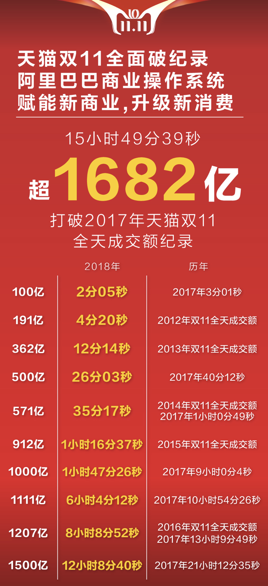
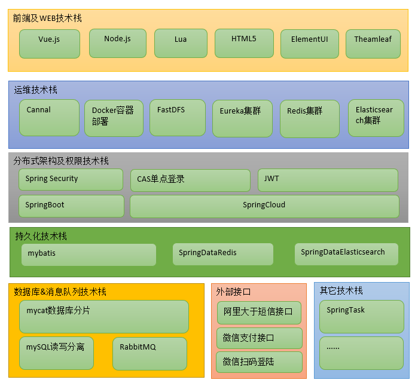
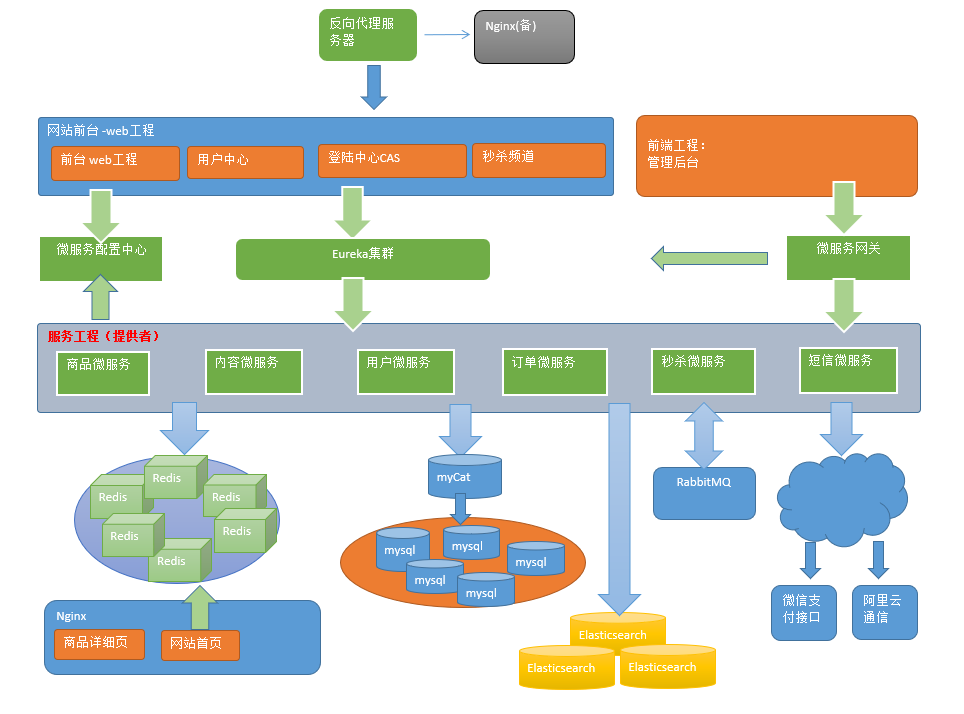
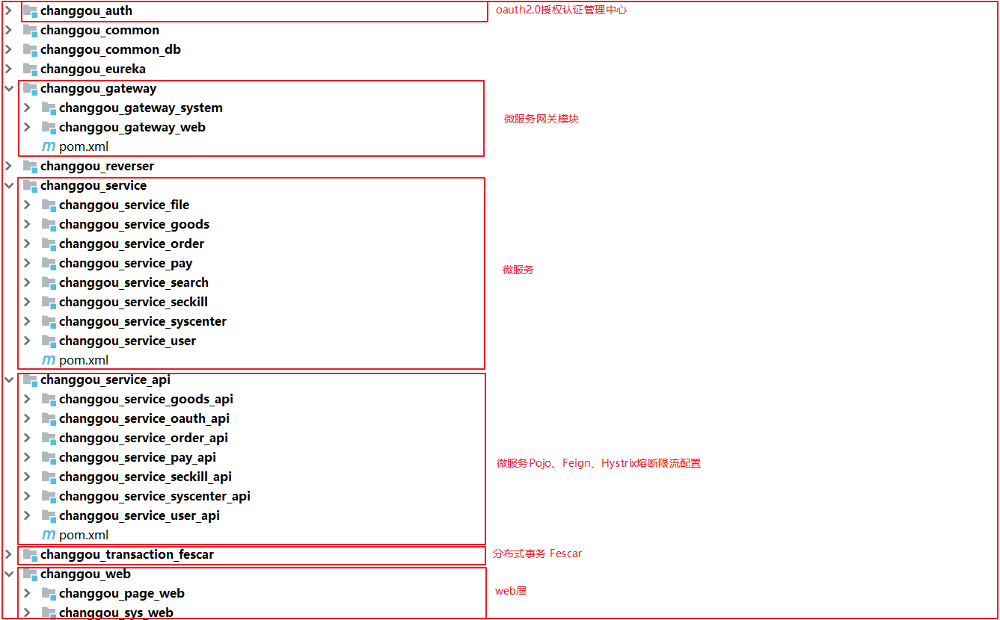

# 第1章 框架搭建

## 学习目标

目标1：了解电商的技术特点和主要电商模式

目标2：理解畅购的需求分析与系统设计

目标3：能够完成畅购工程框架的搭建

目标4：能够完成商品微服务品牌增删改查功能

## 1. 走进电商

### 1.1 电商行业分析

​	近年来，世界经济正向数字化转型，大力发展数字经济成为全球共识。党的十九大报告明确提出要建设“数字中国”“网络强国”，我国数字经济发展进入新阶段，市场规模位居全球第二，数字经济与实体经济深度融合，有力促进了供给侧结构性改革。电子商务是数字经济的重要组成部分，是数字经济最活跃、最集中的表现形式之一。2017年，在政府和市场共同推动下，我国电子商务发展更加注重效率、质量和创新，取得了一系列新的进展，在壮大数字经济、共建“一带一路”、助力乡村振兴、带动创新创业、促进经济转型升级等诸多方面发挥了重要作用，成为我国经济增长的新动力。
​	2017年，我国电子商务交易规模继续扩大，并保持高速增长态势。国家统计局数据显示，2017年全国电子商务交易额达29.16万亿元，同比增长11.7%；网上零售额7.18万亿元，同比增长32.2%。我国电子商务优势进一步扩大，网络零售规模全球最大、产业创新活力世界领先。数据显示，截止2017年底，全国网络购物用户规模达5.33亿，同比增长14.3%；非银行支付机构发生网络支付金额达143.26万亿元，同比增长44.32%；全国快递服务企业业务量累计完成400.6亿件，同比增长28%；电子商务直接从业人员和间接带动就业达4250万人。






### 1.2 电商系统技术特点

 技术新

技术范围广

分布式

高并发、集群、负载均衡、高可用

海量数据

业务复杂

系统安全

### 1.3 主要电商模式

**B2B**

```
B2B （ Business to Business）是指进行电子商务交易的供需双方都是商家（或企业、公司），她（他）们使用了互联网的技术或各种商务网络平台，完成商务交易的过程。电子商务是现代 B2B marketing的一种具体主要的表现形式。

案例：阿里巴巴、慧聪网
```

**C2C**

```
C2C即 Customer（Consumer） to Customer（Consumer），意思就是消费者个人间的电子商务行为。比如一个消费者有一台电脑，通过网络进行交易，把它出售给另外一个消费者，此种交易类型就称为C2C电子商务。

案例：淘宝、易趣、瓜子二手车
```

**B2C**

```
B2C是Business-to-Customer的缩写，而其中文简称为“商对客”。“商对客”是电子商务的一种模式，也就是通常说的直接面向消费者销售产品和服务商业零售模式。这种形式的电子商务一般以网络零售业为主，主要借助于互联网开展在线销售活动。B2C即企业通过互联网为消费者提供一个新型的购物环境——网上商店，消费者通过网络在网上购物、网上支付等消费行为。

案例：唯品会、乐蜂网
```

**C2B**

```
C2B（Consumer to Business，即消费者到企业），是互联网经济时代新的商业模式。这一模式改变了原有生产者（企业和机构）和消费者的关系，是一种消费者贡献价值（Create Value）， 企业和机构消费价值（Consume Value）。

C2B模式和我们熟知的供需模式（DSM, Demand SupplyModel）恰恰相反，真正的C2B 应该先有消费者需求产生而后有企业生产，即先有消费者提出需求，后有生产企业按需求组织生产。通常情况为消费者根据自身需求定制产品和价格，或主动参与产品设计、生产和定价，产品、价格等彰显消费者的个性化需求，生产企业进行定制化生产。

案例：海尔商城、 尚品宅配
```

**O2O**

```
O2O即Online To Offline（在线离线/线上到线下），是指将线下的商务机会与互联网结合，让互联网成为线下交易的平台，这个概念最早来源于美国。O2O的概念非常广泛，既可涉及到线上，又可涉及到线下,可以通称为O2O。主流商业管理课程均对O2O这种新型的商业模式有所介绍及关注。

案例：美团、饿了吗
```

**F2C**

```
F2C指的是Factory to customer，即从厂商到消费者的电子商务模式。
```

**B2B2C**

```
B2B2C是一种电子商务类型的网络购物商业模式，B是BUSINESS的简称，C是CUSTOMER的简称，第一个B指的是商品或服务的供应商，第二个B指的是从事电子商务的企业，C则是表示消费者。

案例：京东商城、天猫商城
注：我们《畅购电商系统开发》课程采用B2C模式
```

## 2. 畅购-需求分析与系统设计 

### 2.1 需求分析

网站前台静态原型演示，打开`资料/页面/前台/project-changgou-portal-fis3-master`，首页`index.html`


网站管理后台静态原型演示

http://czpm.itcast.cn/%E9%9D%92%E6%A9%99%E5%90%8E%E5%8F%B0/#g=1&p=%E5%90%8E%E5%8F%B0%E9%A6%96%E9%A1%B5


打开`资料/页面/后台/project-changgou-cmm-fis3-master/pages`,首页`all-medical-main.html`


### 2.2 系统设计

#### 2.2.1 前后端分离

​	网站后台的部分采用前后端分离方式。

​	以前的JavaWeb项目大多数都是java程序员又当爹又当妈，又搞前端，又搞后端。随着时代的发展，渐渐的许多大中小公司开始把前后端的界限分的越来越明确，前端工程师只管前端的事情，后端工程师只管后端的事情。正所谓术业有专攻，一个人如果什么都会，那么他毕竟什么都不精。

​	对于后端java工程师：

​	把精力放在设计模式，spring+springmvc，linux，mysql事务隔离与锁机制，mongodb，http/tcp，多线程，分布式架构，弹性计算架构，微服务架构，java性能优化，以及相关的项目管理等等。

​	对于前端工程师：

​	把精力放在html5，css3，vuejs，webpack，nodejs，Google V8引擎，javascript多线程，模块化，面向切面编程，设计模式，浏览器兼容性，性能优化等等。


​	我们在本课程中提供与项目课程配套的管理后台的前端代码，但是不讲解前端的内容。这样我们会将更多的精力放在**后端代码**的开发上！

#### 2.2.2 技术架构



#### 2.2.3 系统架构图



## 3. 畅购-框架搭建

### 3.1 环境准备

建库建表（建库建表语句在资源文件夹中提供）

### 3.2 项目结构说明



结构说明：

changgou_gateway

```
网关模块，根据网站的规模和需要，可以将综合逻辑相关的服务用网关路由组合到一起。在这里还可以做鉴权和限流相关操作。
```

changgou_service

```
微服务模块，该模块用于存放所有独立的微服务工程。
```

changgou_service_api

```
对应工程的JavaBean、Feign、以及Hystrix配置，该工程主要对外提供依赖。
```

changgou_transaction_fescar

```
分布式事务模块，将分布式事务抽取到该工程中，任何工程如需要使用分布式事务，只需依赖该工程即可。
```

changgou_web

```
web服务工程，对应功能模块如需要调用多个微服务，可以将他们写入到该模块中，例如网站后台、网站前台等
```

### 3.3 父工程搭建

#### 3.3.1 一级父工程搭建

创建父工程 changgou_parent  ,pom.xml文件中增加配置

```xml
<?xml version="1.0" encoding="UTF-8"?>
<project xmlns="http://maven.apache.org/POM/4.0.0"
         xmlns:xsi="http://www.w3.org/2001/XMLSchema-instance"
         xsi:schemaLocation="http://maven.apache.org/POM/4.0.0 http://maven.apache.org/xsd/maven-4.0.0.xsd">
    <modelVersion>4.0.0</modelVersion>

    <groupId>com.changgou</groupId>
    <artifactId>changgou_parent</artifactId>
    <packaging>pom</packaging>
    <version>1.0-SNAPSHOT</version>

    <parent>
        <groupId>org.springframework.boot</groupId>
        <artifactId>spring-boot-starter-parent</artifactId>
        <version>2.1.4.RELEASE</version>
    </parent>

    <properties>
        <skipTests>true</skipTests>
    </properties>

    <!--依赖包-->
    <dependencies>
        <!--测试包-->
        <dependency>
            <groupId>org.springframework.boot</groupId>
            <artifactId>spring-boot-starter-test</artifactId>
            <scope>test</scope>
        </dependency>
    </dependencies>

    <dependencyManagement>
        <dependencies>
            <dependency>
                <groupId>org.springframework.cloud</groupId>
                <artifactId>spring-cloud-dependencies</artifactId>
                <version>Greenwich.SR1</version>
                <type>pom</type>
                <scope>import</scope>
            </dependency>
        </dependencies>
    </dependencyManagement>
</project>
```

删除src文件夹

#### 3.3.2 二级父工程模块搭建

创建changgou_gateway、changgou_service、changgou_service_api、changgou_web工程，工程全部为pom工程，并将所有工程的src文件删除。

### 3.4 Eureka微服务搭建

（1）pom.xml依赖

创建模块changgou_eureka ，pom.xml引入依赖 

```xml
<?xml version="1.0" encoding="UTF-8"?>
<project xmlns="http://maven.apache.org/POM/4.0.0"
         xmlns:xsi="http://www.w3.org/2001/XMLSchema-instance"
         xsi:schemaLocation="http://maven.apache.org/POM/4.0.0 http://maven.apache.org/xsd/maven-4.0.0.xsd">
    <parent>
        <artifactId>changgou_parent</artifactId>
        <groupId>com.changgou</groupId>
        <version>1.0-SNAPSHOT</version>
    </parent>
    <modelVersion>4.0.0</modelVersion>
    <artifactId>changgou_eureka</artifactId>

    <dependencies>
        <dependency>
            <groupId>org.springframework.cloud</groupId>
            <artifactId>spring-cloud-starter-netflix-eureka-server</artifactId>
        </dependency>
    </dependencies>
</project>
```

（2） appliation.yml配置

创建配置文件application.yml

```yaml
server:
  port: 6868
eureka:
  client:
    register-with-eureka: false #是否将自己注册到eureka中
    fetch-registry: false #是否从eureka中获取信息
    service-url:
      defaultZone: http://127.0.0.1:${server.port}/eureka/
```

（3）启动类配置

创建包com.changgou.eureka  包下创建启动类

```Java
@SpringBootApplication
@EnableEurekaServer
public class EurekaApplication {
    public static void main(String[] args) {
        SpringApplication.run(EurekaApplication.class);
    }
}
```

### 3.5 公共模块搭建

#### 3.5.1 全局公共模块 

（1）pom.xml依赖

创建公共子模块changgou_common，pom.xml引入依赖

```xml
<?xml version="1.0" encoding="UTF-8"?>
<project xmlns="http://maven.apache.org/POM/4.0.0"
         xmlns:xsi="http://www.w3.org/2001/XMLSchema-instance"
         xsi:schemaLocation="http://maven.apache.org/POM/4.0.0 http://maven.apache.org/xsd/maven-4.0.0.xsd">
    <parent>
        <artifactId>changgou_parent</artifactId>
        <groupId>com.changgou</groupId>
        <version>1.0-SNAPSHOT</version>
    </parent>
    <modelVersion>4.0.0</modelVersion>
    <artifactId>changgou_common</artifactId>
    <dependencies>
        <!--web起步依赖-->
        <dependency>
            <groupId>org.springframework.boot</groupId>
            <artifactId>spring-boot-starter-web</artifactId>
        </dependency>
        <!-- redis 使用-->
        <dependency>
            <groupId>org.springframework.boot</groupId>
            <artifactId>spring-boot-starter-data-redis</artifactId>
        </dependency>
        <dependency>
            <groupId>com.alibaba</groupId>
            <artifactId>fastjson</artifactId>
            <version>1.2.51</version>
        </dependency>
        <dependency>
            <groupId>org.springframework.cloud</groupId>
            <artifactId>spring-cloud-starter-netflix-eureka-client</artifactId>
        </dependency>
        <dependency>
            <groupId>org.springframework.cloud</groupId>
            <artifactId>spring-cloud-starter-openfeign</artifactId>
        </dependency>
    </dependencies>
</project>
```

公共子模块引入这些依赖后，其他微服务引入changgou_common后也自动引入了这些依赖

（2）常用对象

创建com.changgou.entity包 ，包下建立类Result用于微服务返回结果给前端

```java
/**
 * 返回结果实体类
 */
public class Result {

    private boolean flag;//是否成功
    private Integer code;//返回码
    private String message;//返回消息

    private Object data;//返回数据

    public Result(boolean flag, Integer code, String message, Object data) {
        this.flag = flag;
        this.code = code;
        this.message = message;
        this.data = data;
    }

    public Result(boolean flag, Integer code, String message) {
        this.flag = flag;
        this.code = code;
        this.message = message;
    }

    public Result() {
        this.flag = true;
        this.code = StatusCode.OK;
        this.message = "执行成功";
    }

    // getter and setter.....
}
```

建立类用于承载分页的数据结果

```java
/**
 * 分页结果类
 */
public class PageResult<T> {

    private Long total;//总记录数
    private List<T> rows;//记录

    public PageResult(Long total, List<T> rows) {
        this.total = total;
        this.rows = rows;
    }

    public PageResult() {
    }

    //getter and setter ......
}
```

创建返回状态码实体类

```java
/**
 * 返回码
 */
public class StatusCode {

    public static final int OK=20000;//成功
    public static final int ERROR =20001;//失败
    public static final int LOGINERROR =20002;//用户名或密码错误
    public static final int ACCESSERROR =20003;//权限不足
    public static final int REMOTEERROR =20004;//远程调用失败
    public static final int REPERROR =20005;//重复操作
}
```

#### 3.5.2 数据访问公共模块搭建

创建公共模块changgou_common_db ，pom文件引入依赖

```xml
<?xml version="1.0" encoding="UTF-8"?>
<project xmlns="http://maven.apache.org/POM/4.0.0"
         xmlns:xsi="http://www.w3.org/2001/XMLSchema-instance"
         xsi:schemaLocation="http://maven.apache.org/POM/4.0.0 http://maven.apache.org/xsd/maven-4.0.0.xsd">
    <parent>
        <artifactId>changgou_parent</artifactId>
        <groupId>com.changgou</groupId>
        <version>1.0-SNAPSHOT</version>
    </parent>
    <modelVersion>4.0.0</modelVersion>

    <artifactId>changgou_common_db</artifactId>
    <dependencies>
        <dependency>
            <groupId>com.changgou</groupId>
            <artifactId>changgou_common</artifactId>
            <version>1.0-SNAPSHOT</version>
        </dependency>
        <!--通用mapper起步依赖-->
        <dependency>
            <groupId>tk.mybatis</groupId>
            <artifactId>mapper-spring-boot-starter</artifactId>
            <version>2.0.4</version>
        </dependency>
        <!--MySQL数据库驱动-->
        <dependency>
            <groupId>mysql</groupId>
            <artifactId>mysql-connector-java</artifactId>
        </dependency>
        <!--mybatis分页插件-->
        <dependency>
            <groupId>com.github.pagehelper</groupId>
            <artifactId>pagehelper-spring-boot-starter</artifactId>
            <version>1.2.3</version>
        </dependency>
    </dependencies>
</project>
```

这个公共模块是连接mysql数据库的公共微服务模块，所以需要连接mysql的微服务都继承自此工程。

### 3.6 商品微服务搭建

#### 3.6.1 商品微服务API工程搭建

（1）changgou_service_api 引入依赖

```xml
        <dependency>
            <groupId>org.springframework.cloud</groupId>
            <artifactId>spring-cloud-starter-openfeign</artifactId>
            <scope>provided</scope>
        </dependency>
        <dependency>
            <groupId>javax.persistence</groupId>
            <artifactId>persistence-api</artifactId>
            <version>1.0</version>
            <scope>compile</scope>
        </dependency>
```

（2）changgou_service_api 下创建changgou_service_goods_api 子模块

#### 3.6.2 微服务工程搭建

（1）changgou_service下创建changgou_service_goods子模块 ，pom.xml引入依赖 

```xml
<?xml version="1.0" encoding="UTF-8"?>
<project xmlns="http://maven.apache.org/POM/4.0.0"
         xmlns:xsi="http://www.w3.org/2001/XMLSchema-instance"
         xsi:schemaLocation="http://maven.apache.org/POM/4.0.0 http://maven.apache.org/xsd/maven-4.0.0.xsd">
    <parent>
        <artifactId>changgou_service</artifactId>
        <groupId>com.changgou</groupId>
        <version>1.0-SNAPSHOT</version>
    </parent>
    <modelVersion>4.0.0</modelVersion>
    <artifactId>changgou_service_goods</artifactId>

    <dependencies>
        <dependency>
            <groupId>com.changgou</groupId>
            <artifactId>changgou_common_db</artifactId>
            <version>1.0-SNAPSHOT</version>
        </dependency>
		<dependency>
            <groupId>com.changgou</groupId>
            <artifactId>changgou_service_goods_api</artifactId>
            <version>1.0-SNAPSHOT</version>
        </dependency>
        <dependency>
            <groupId>org.springframework.cloud</groupId>
            <artifactId>spring-cloud-starter-netflix-eureka-client</artifactId>
        </dependency>
     </dependencies>
</project>
```

（2）创建配置文件application.yml

```yaml
server:
  port: 9011
spring:
  application:
    name: goods
  datasource:
    driver-class-name: com.mysql.jdbc.Driver
    url: jdbc:mysql://192.168.200.128:3306/changgou_goods?useUnicode=true&characterEncoding=UTF-8&serverTimezone=UTC
    username: root
    password: admin
eureka:
  client:
    service-url:
      defaultZone: http://127.0.0.1:6868/eureka
  instance:
    prefer-ip-address: true
feign:
  hystrix:
    enabled: true
    
#hystrix 配置
hystrix:
  command:
    default:
      execution:
        timeout:
        #如果enabled设置为false，则请求超时交给ribbon控制
          enabled: true
        isolation:
          strategy: SEMAPHORE
```

（3）创建包com.changgou 包下创建启动类

```JAVA
@SpringBootApplication
@EnableEurekaClient
@MapperScan(basePackages = {"com.changgou.goods.dao"})
public class GoodsApplication {
    public static void main(String[] args) {
        SpringApplication.run(GoodsApplication.class);
    }
}
```

***注意：@MapperScan是tk.mybatis.spring.annotation包下的，用于扫描Mapper接口*** 

## 4. 商品微服务-品牌增删改查

### 4.1 需求分析

创建商品微服务，实现对品牌表的增删改查功能。具体包括

（1）查询全部列表数据

（2）根据ID查询实体数据

（3）增加

（4）修改

（5）删除

（6）条件查询

（7）分页查询

（8）分页+条件查询

（9）公共异常处理

### 4.2 表结构分析

| 字段名称 | 字段含义     | 字段类型 | 字段长度 | 备注 |
| -------- | ------------ | -------- | -------- | ---- |
| id       | 品牌id       | INT      |          |      |
| name     | 品牌名称     | VARCHAR  |          |      |
| img      | 品牌图片地址 | VARCHAR  |          |      |
| letter   | 品牌的首字母 | CHAR     |          |      |
| seq      | 排序         | INT      |          |      |

### 4.3 代码实现

#### 4.3.1 品牌列表

（1）在changgou_service_goods_api创建com.changgou.pojo包，包下创建Brand实体类

```java
@Table(name="tb_brand")
public class Brand implements Serializable{
	@Id
	private Integer id;//品牌id
	private String name;//品牌名称
	private String img;//品牌图片地址
	private String letter;//品牌的首字母
	private Integer seq;//排序
	
	// getter and setter  .....(省略)
}
```

@Table和@Id都是JPA注解，@Table用于配置表与实体类的映射关系，@Id用于标识主键属性。

（2）Dao创建

在changgou_service_goods微服务下创建com.changgou.goods.dao.BrandMapper接口，代码如下：

```java
public interface BrandMapper extends Mapper<Brand> {
}
```

继承了Mapper接口，就自动实现了增删改查的常用方法。

（3）业务层

创建com.changgou.goods.service.BrandService接口，代码如下：

```java
public interface BrandService {

    /***
     * 查询所有品牌
     * @return
     */
  public  List<Brand> findAll();
}
```

创建com.changgou.goods.service.impl包，包下创建服务实现类 BrandServiceImpl，代码如下：

```java
@Service
public class BrandServiceImpl implements BrandService {
    
    @Autowired
    private BrandMapper brandMapper;
    
    @Override
    public List<Brand> findAll() {
        return brandMapper.selectAll();
    }   
}
```

（3）控制层

控制层  com.changgou.goods包下创建controller包  ，包下创建类

```java
@RestController
@RequestMapping("/brand")
public class BrandController {

    @Autowired
    private BrandService brandService;

    @GetMapping
    public Result findAll(){
        List<Brand> brandList = brandService.findAll();
        return new Result(true, StatusCode.OK,"查询成功",brandList) ;
    }
  
}
```

#### 4.3.2 根据ID查询品牌

（1） 业务层接口

修改com.changgou.goods.service.BrandService接口，添加根据ID查询品牌数据方法，代码如下：

```java
/**
 * 根据ID查询
 * @param id
 * @return
 */
public Brand findById(Integer id);
```

（2）业务层实现

修改com.changgou.goods.service.impl.BrandServiceImpl新增方法，代码如下：

```java
/**
 * 根据ID查询
 * @param id
 * @return
 */
@Override
public Brand findById(Integer id){
    return  brandMapper.selectByPrimaryKey(id);
}
```

（3） 控制层

BrandController新增方法

```java
/***
 * 根据ID查询品牌数据
 * @param id
 * @return
 */
@GetMapping("/{id}")
public Result findById(@PathVariable Integer id){
    Brand brand = brandService.findById(id);
    return new Result(true,StatusCode.OK,"查询成功",brand);
}
```

#### 4.3.3 新增品牌

（1）业务层接口    修改com.changgou.goods.service.BrandService，新增方法

```java
/***
 * 新增品牌
 * @param brand
 */
public void add(Brand brand);
```

（2）业务层实现  修改com.changgou.goods.service.impl.BrandServiceImpl，新增增加品牌方法代码如下：

```java
/**
 * 增加
 * @param brand
 */
@Override
public void add(Brand brand){
    brandMapper.insertSelective(brand);
}
```

（3）控制层    BrandController新增方法

```java
/***
 * 新增品牌数据
 * @param brand
 * @return
 */
@PostMapping
public Result add(@RequestBody Brand brand){
    brandService.add(brand);
    return new Result(true,StatusCode.OK,"添加成功");
}
```

#### 4.3.4 修改品牌

（1） 业务层接口

需改com.changgou.goods.service.BrandService,添加修改品牌方法，代码如下：

```java
/***
 * 修改品牌数据
 * @param brand
 */
public void update(Brand brand);
```

（2）业务层实现   修改com.changgou.goods.service.impl.BrandServiceImpl，添加修改品牌方法，代码如下：

```java
/**
 * 修改
 * @param brand
 */
@Override
public void update(Brand brand){
    brandMapper.updateByPrimaryKeySelective(brand);
}
```

（3）控制层

BrandController新增方法

```java
/***
 * 修改品牌数据
 * @param brand
 * @param id
 * @return
 */
@PutMapping(value="/{id}")
public Result update(@RequestBody Brand brand,@PathVariable Integer id){
    brand.setId(id);
    brandService.update(brand);
    return new Result(true,StatusCode.OK,"修改成功");
}
```

#### 4.3.5 删除品牌

（1）业务层接口

修改com.changgou.goods.service.BrandService，添加删除品牌方法，代码如下：

```java
/***
 * 删除品牌
 * @param id
 */
public void delete(Integer id);
```

（2）业务层实现  修改com.changgou.goods.service.impl.BrandServiceImpl，新增删除品牌方法，代码如下：

```java
/**
 * 删除
 * @param id
 */
@Override
public void delete(Integer id){
    brandMapper.deleteByPrimaryKey(id);
}
```

（3）控制层  BrandController新增方法  

```java
/***
 * 根据ID删除品牌数据
 * @param id
 * @return
 */
@DeleteMapping(value = "/{id}" )
public Result delete(@PathVariable Integer id){
    brandService.delete(id);
    return new Result(true,StatusCode.OK,"删除成功");
}
```

#### 4.3.6 品牌列表条件查询

（1） 业务层接口

修改com.changgou.goods.service.BrandService，增加根据条件搜索品牌方法，代码如下：

```java
/***
 * 多条件搜索品牌方法
 * @param searchMap
 * @return
 */
public List<Brand> findList(Map<String, Object> searchMap);
```

（2）业务层实现  修改com.changgou.goods.service.impl.BrandServiceImpl，添加根据多条件搜索品牌方法的实现，代码如下：

```java
/**
 * 条件查询
 * @param searchMap
 * @return
 */
@Override
public List<Brand> findList(Map<String, Object> searchMap){
	Example example = createExample(searchMap);
	return brandMapper.selectByExample(example);
}

/**
 * 构建查询对象
 * @param searchMap
 * @return
 */
private Example createExample(Map<String, Object> searchMap){
	Example example=new Example(Brand.class);
	Example.Criteria criteria = example.createCriteria();
	if(searchMap!=null){
		// 品牌名称
		if(searchMap.get("name")!=null && !"".equals(searchMap.get("name"))){
			criteria.andLike("name","%"+searchMap.get("name")+"%");
		}
		// 品牌的首字母
		if(searchMap.get("letter")!=null && !"".equals(searchMap.get("letter"))){
			criteria.andEqualTo("letter",searchMap.get("letter"));
		}
	}
	return example;
}
```

（3） 控制层   BrandController新增方法

```java
/***
 * 多条件搜索品牌数据
 * @param searchMap
 * @return
 */
@GetMapping(value = "/search" )
public Result findList(@RequestParam Map searchMap){
	List<Brand> list = brandService.findList(searchMap);
	return new Result(true,StatusCode.OK,"查询成功",list);
}
```

#### 4.3.7 品牌列表分页查询

（1） 业务层接口  修改com.changgou.goods.service.BrandService添加分页方法，代码如下：

```java
/***
 * 分页查询
 * @param page
 * @param size
 * @return
 */
public Page<Brand> findPage(int page, int size);
```

（2）业务层实现  修改com.changgou.goods.service.impl.BrandServiceImpl添加分页方法实现，代码如下：

```java
/**
 * 分页查询
 * @param page
 * @param size
 * @return
 */
@Override
public Page<Brand> findPage(int page, int size){
    PageHelper.startPage(page,size);
    return (Page<Brand>)brandMapper.selectAll();
}
```

（3） 控制层 BrandController新增方法

```java
/***
 * 分页搜索实现
 * @param searchMap
 * @param page
 * @param size
 * @return
 */
@GetMapping(value = "/search/{page}/{size}" )
public Result findPage(@PathVariable  int page, @PathVariable  int size){
	Page<Brand> pageList = brandService.findPage(page, size);
	PageResult pageResult=new PageResult(pageList.getTotal(),pageList.getResult());
	return new Result(true,StatusCode.OK,"查询成功",pageResult);
}
```

#### 4.3.8 品牌列表条件+分页查询

（1） 业务层接口  修改com.changgou.goods.service.BrandService，增加多条件分页查询方法，代码如下：

```java
/***
 * 多条件分页查询
 * @param searchMap
 * @param page
 * @param size
 * @return
 */
Page<Brand> findPage(Map<String, Object> searchMap, int page, int size);
```

（2）业务层实现  修改com.changgou.goods.service.impl.BrandServiceImpl，添加多条件分页查询方法代码如下：

```java
/**
 * 条件+分页查询
 * @param searchMap 查询条件
 * @param page 页码
 * @param size 页大小
 * @return 分页结果
 */
@Override
public Page<Brand> findPage(Map<String,Object> searchMap, int page, int size){
    PageHelper.startPage(page,size);
    Example example = createExample(searchMap);
    return (Page<Brand>)brandMapper.selectByExample(example);
}
```

（3）控制层  BrandController新增方法

```java
/***
 * 分页搜索实现
 * @param searchMap
 * @param page
 * @param size
 * @return
 */
@GetMapping(value = "/search/{page}/{size}" )
public Result findPage(@RequestParam Map searchMap, @PathVariable  int page, @PathVariable  int size){
	Page<Brand> pageList = brandService.findPage(searchMap, page, size);
	PageResult pageResult=new PageResult(pageList.getTotal(),pageList.getResult());
	return new Result(true,StatusCode.OK,"查询成功",pageResult);
}
```

#### 4.3.9 公共异常处理

为了使我们的代码更容易维护，我们创建一个类集中处理异常

在com.changgou.goods.controller包下创建公共异常处理类BaseExceptionHandler

```java
/**
 * 统一异常处理类
 */
@ControllerAdvice
public class BaseExceptionHandler {
	
    @ExceptionHandler(value = Exception.class)
    @ResponseBody
    public Result error( Exception e) {
        e.printStackTrace();        
        return new Result(false, StatusCode.ERROR, e.getMessage());
    }
}
```

## 作业-相册管理增删改查

相册是用于存储图片的管理单元，我们通常会将商品的图片先上传到相册中，在添加商品时可以直接在相册中选择，获取相册中的图片地址，保存到商品表中。

前端交互方式见管理后台的静态原型

相册表结构如下：

tb_album  表（**相册表**）

| 字段名称  | 字段含义 | 字段类型 | 字段长度 | 备注                                                         |
| --------- | -------- | -------- | -------- | ------------------------------------------------------------ |
| id        | 编号     | BIGINT   |          |                                                              |
| title     | 相册名称 | VARCHAR  |          |                                                              |
| img       | 相册封面 | VARCHAR  |          |                                                              |
| img_items | 图片列表 | TEXT     |          | [{"url":"http://localhost:9101/img/1.jpg","uid":1548143143154,"status":"success"},{"url":"http://localhost:9101/img/7.jpg","uid":1548143143155,"status":"success"}] |

实现步骤参考品牌管理