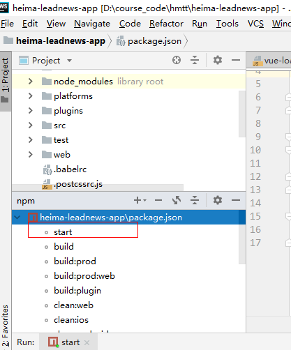
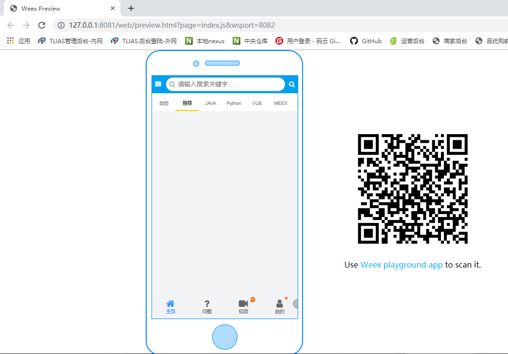
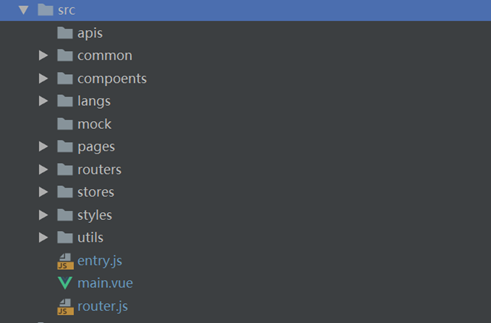
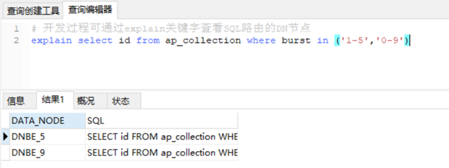

# 文章列表前端成形与后端变身

## 学习目标

熟悉项目前端工程结构

熟悉Weex的在移动端的好处

熟悉移动端列表页面的结构与开发过程

熟悉生产与测试环境的数据库差异

熟悉Mycat技术的开发与实战技巧

掌握分库分表的设计技巧

掌握Mycat自定义分表算法开发

## 1.前端工程结构

前端工程基于VUE技术，分为3个独立的项目：


- heima-leadnews-app：移动端的功能实现；
- heima-leadnews-wemedia：自媒体系统的前端实现；
- heima-leadnews-admin：管理系统的前端实现；

### 1.1 环境准备

- Nodejs已安装

  安装资料文件夹下的node即可

- Cnpm、Nrm、Webpack

  安装完nodejs以后会自动安装npm,但是npm的镜像源是国外的站点，所以建议使用cnpm,或者把npm的镜像源设置为taobao镜像源也是可以的

  需要安装webpack  全局安装

- Weex Toolkit

  安装weex的toolkit

  ```shell
  npm i -g weex-toolkit 
  weex -v // 查看当前weex工具版本
  ```

- WebStorm

#### 1.1.1 导入工程

导入资料文件夹下的原始项目heima-leadnews-app这个客户端项目即可，后续的项目随着课程的深入会依次导入其他项目，在当天资料中解压heima-leadnews-app.zip文件，拷贝到一个没有中文和空格的目录，使用web storm工具打开即可

#### 1.1.2 测试运行

执行命令



运行效果




在命令行运行 npm run serve  默认浏览器便会到开对应网页。

也可使用Playground扫描页面上的二维码，在手机上体验网页。

**注意**：项目默认选用无线网络运行，如需修改，可以修改config/config.js和webpack.dev.conf.js文件中的下列代码：


**注：手机扫描时，手机和电脑应该在同一局域网内。**

### 1.2 weex 跨终端前端框架

https://weex.apache.org/zh/guide/introduction.html

Weex 致力于使开发者能基于通用跨平台的 Web 开发语言和开发经验，来构建 Android、iOS 和 Web 应用。简单来说，在集成了 WeexSDK 之后，你可以使用 JavaScript 语言和前端开发经验来开发移动应用。

### 1.3 工程结构说明


### 1.4 源码结构



- apis ：按页面存放各个页面的api文件

- common ：存放公共配置和api

- compoents ：存放公用组件

- langs ：存放国际化语言包

- mock ：存放单元测试数据

- pages ：存放页面源码

- routers ：存放路由配置源码

- stores : 存放本地缓存源码

- styles ：存放样式源码

- utils ：存放通用工具类

### 1.5 WEEX UI

一个基于 [Weex](https://github.com/apache/incubator-weex) 的富交互、轻量级、高性能的 UI 组件库

官方文档：https://alibaba.github.io/weex-ui/#/cn/

## 2.文章列表前端开发

为提高开发效率，项目可使用weex-ui快速开发，选用的列表样式参考：

https://alibaba.github.io/weex-ui/#/cn/packages/wxc-tab-page/

### 2.1 创建文件

创建src/apis/home/api.js文件，用于封装Home页面文章数据请求

```json
function Api(){
    var vue;
}
Api.prototype = {
    setVue : function(vue){
        this.vue = vue;
    },
    // 加载数据
    loaddata : function(params){
        let dir = params.loaddir
        let url = this.getLoadUrl(dir)
        return new Promise((resolve, reject) => {
            this.vue.$request.get(url,params).then((d)=>{
                resolve(d);
            }).catch((e)=>{
                reject(e);
            })
        })
    },
    // 保存展现行为数据
    saveShowBehavior : function(params){
        let ids = [];
        for(let k in params){
            if(params[k]){
                ids.push({id:k});
            }
        }
        console.log(params)
        if(ids.length>0){
            let url = this.vue.$config.urls.get('show_behavior')
            return new Promise((resolve, reject) => {
                this.vue.$request.post(url,JSON.stringify({equipmentId:1,articleIds:ids})).then((d)=>{
                    d.data=ids
                    resolve(d);
                }).catch((e)=>{
                    reject(e);
                })
            })
        }
    },
    // 区别请求那个URL
    getLoadUrl : function(dir){
        let url = this.vue.$config.urls.get('load')
        if(dir==0)
            url = this.vue.$config.urls.get('loadnew')
        else if(dir==2)
            url = this.vue.$config.urls.get('loadmore')
        return url;
    }
}

export default new Api()
```


创建src/pages/home/config.js文件，用于封装频道Tab页名称和样式

```json
export default {
    tabTitles: [{title: '动态',id:'__dyna__'},
        {title: '推荐',id:'__all__'},
        { title: 'JAVA',id:1},
        { title: 'Python',id:2},
        {title: 'VUE',id:3},
        {title: 'WEEX',id:4},
        {title: '大数据',id:5},
        {title: 'Docker',id:6},
        {title: '其它',id:0}
    ],
    tabStyles: {
        bgColor: '#FFFFFF',
        titleColor: '#9b9b9b',
        activeTitleColor: '#3D3D3D',
        activeBgColor: '#FFFFFF',
        isActiveTitleBold: true,
        iconWidth: 70,
        iconHeight: 70,
        width: 120,
        height: 80,
        fontSize: 24,
        hasActiveBottom: true,
        activeBottomColor: '#3194ff',
        activeBottomHeight: 6,
        activeBottomWidth: 36,
        textPaddingLeft: 10,
        textPaddingRight: 10,
        normalBottomColor: 'rgba(0,0,0,0.4)',
        normalBottomHeight: 2,
        hasRightIcon: false,
        rightOffset: 100
    }
}
```


### 2.2 Model定义

#### 2.2.1  在src/pages/home/index.vue中定义列表Model

```javascript
data: () => ({
    api: null,// API
    shownew: false,//是否显示loadnew动画
    showmore: false,//是否显示loadmore动画
    tabTitles: Config.tabTitles,//频道配置
    tabStyles: Config.tabStyles,//频道样式
    tabList: [],//列表数据集合
    tabPageHeight: 1334,//列表总高度
    params: {
        loaddir: 1,
        index: 0,
        tag: "__all__",
        size: 20,
        max_behot_time: 1559789043,
        min_behot_time: 1559789043
    },//列表数据请求参数
    ashow: {}//列表展示行为记录表
}),
```

### 2.3 实现Api

在src/apis/home/api.js中实现Api

首页API需实现load、loadnew、loadmore、show_behavior等后端接口的调用，其实现代码如下

```javascript
function Api(){
    var vue;
}
Api.prototype = {
    setVue : function(vue){
        this.vue = vue;
    },
    // 加载数据
    loaddata : function(params){
        let dir = params.loaddir
        let url = this.getLoadUrl(dir)
        return new Promise((resolve, reject) => {
            this.vue.$request.get(url,params).then((d)=>{
                resolve(d);
            }).catch((e)=>{
                reject(e);
            })
        })
    },
    // 保存展现行为数据
    saveShowBehavior : function(params){
        let ids = [];
        for(let k in params){
            if(params[k]){
                ids.push({id:k});
            }
        }
        console.log(params)
        if(ids.length>0){
            let url = this.vue.$config.urls.get('show_behavior')
            return new Promise((resolve, reject) => {
                this.vue.$request.post(url,JSON.stringify({equipmentId:1,articleIds:ids})).then((d)=>{
                    d.data=ids
                    resolve(d);
                }).catch((e)=>{
                    reject(e);
                })
            })
        }
    },
    // 区别请求那个URL
    getLoadUrl : function(dir){
        let url = this.vue.$config.urls.get('load')
        if(dir==0)
            url = this.vue.$config.urls.get('loadnew')
        else if(dir==2)
            url = this.vue.$config.urls.get('loadmore')
        return url;
    }
}

export default new Api()
```

定义通用的url路径处理，common/conf.js中处理url

```javascript
const  config = {

    urls:{
        baseUrl:'/toutiao',
        load:'api/v1/article/load',
        loadmore:'api/v1/article/loadmore',
        loadnew:'api/v1/article/loadnew',
        // 解决多平台问题
        getBase : function(){
            if(weex.config.env.platform=='Web'){
                return config.urls.baseUrl;
            }else{
                return "http://m.toutiao.com"
            }
        },
        get:function(name){
            let tmp = config.urls[name];
            if(tmp)
                return config.urls.getBase()+"/"+tmp;
            else
                return config.urls.getBase()+"/"+name;
        }
    },style:{
        main_bg:'#3296fa'
    }

}
export default config
```


### 2.4 实现VIEW

Index.vue中template部分

VIEW包含头部功能条和文章列表组件，这两个组件采用column布局，其代码如下：

```html
<template>
    <div class="wrapper">
        <div class="top-body">
            <Home_Bar/>
        </div>
        <div class="content-body">
            <wxc-tab-page ref="wxc-tab-page" :tab-titles="tabTitles" :tab-styles="tabStyles" title-type="text"
                          :tab-page-height="tabPageHeight" @wxcTabPageCurrentTabSelected="wxcTabPageCurrentTabSelected">
                <list v-for="(v,index) in tabList" :key="index" class="item-container"
                      :style="{ height: (tabPageHeight - tabStyles.height) + 'px' }">
                    <!-- 下来刷新最新 -->
                    <refresh @refresh='loadnew' :display="shownew?'show':'hide'" class="loading">
                        <loading-indicator class="loading-icon"></loading-indicator>
                        <text class="loading-text">{{load_new_text}}</text>
                    </refresh>
                    <!-- 列表项，并绑定显示事件 -->
                    <cell v-for="(item,key) in v" class="cell" @appear="show(item.id)" :key="key">
                        <wxc-pan-item :ext-id="'1-' + (v) + '-' + (key)" :url="item.id"
                                      @wxcPanItemClicked="wxcPanItemClicked(item.id)" @wxcPanItemPan="wxcPanItemPan">
                            <Item0 v-if="item.type==0" :data="item"/>
                            <Item1 v-if="item.type==1" :data="item"/>
                            <Item3 v-if="item.type==3" :data="item"/>
                        </wxc-pan-item>
                    </cell>
                    <!-- 上来加载更多 -->
                    <loading @loading="load" :display="showmore?'show':'hide'" class="loading">
                        <loading-indicator class="loading-icon"></loading-indicator>
                        <text class="loading-text">{{load_more_text}}</text>
                    </loading>
                </list>
            </wxc-tab-page>
        </div>
    </div>
</template>
```

样式style

```css
<style lang="less" scoped>
  @import '../../styles/article';
  .wrapper{
    background-color: @body-background;
    font-size: @font-size;
    font-family: @font-family;
    flex-direction : column;
    flex-wrap:wrap;
  }
  .top-body{
    position: fixed;
    left: 0;
    top: 0;
  }
  .content-body{
    flex: 1;
    flex-direction : column;
    margin-top: 100px;
  }
  .item-container {
    width: 750px;
    background-color: #f2f3f4;
  }
  .cell {
    background-color: #ffffff;
  }
</style>
```

### 2.5 实现VM

核心方法

```java
// 缓存国际化数据
	computed:{ },
// 初始化变量和页面样式
created () {},
methods: {
  // 列表项在可见区域展示后的事件处理
  show:function(id){ },
  // 上拉加载更多
  loadmore:function(){},
  // 下来刷新数据
  loadnew:function(){},
  // 正常加载数据
  load : function(){},
  // 列表数据转换成View需要的Model对象
  tanfer : function(data){ },
  // 频道页切换事件
  wxcTabPageCurrentTabSelected (e) {},
  // 兼容回调
  wxcPanItemPan (e) {},
  // 列表项点击事件
  wxcPanItemClicked(id){}
}

```

实现代码

```javascript
<script>
    import Home_Bar from "@/compoents/bars/home_bar"
    import {WxcTabPage, Utils, BindEnv, WxcPanItem} from 'weex-ui'
    import Item0 from '../../compoents/cells/article_0.vue'
    import Item1 from '../../compoents/cells/article_1.vue'
    import Item3 from '../../compoents/cells/article_3.vue'
    import Config from './config'
    import Api from '@/apis/home/api'

    export default {
        name: 'HeiMa-Home',
        components: {Home_Bar, WxcTabPage, Item0, Item1, Item3, WxcPanItem},
        data: () => ({
            api: null,// API
            shownew: false,//是否显示loadnew动画
            showmore: false,//是否显示loadmore动画
            tabTitles: Config.tabTitles,//频道配置
            tabStyles: Config.tabStyles,//频道样式
            tabList: [],//列表数据集合
            tabPageHeight: 1334,//列表总高度
            params: {
                loaddir: 1,
                index: 0,
                tag: "__all__",
                size: 20,
                max_behot_time: 1559789043,
                min_behot_time: 1559789043
            },//列表数据请求参数
            ashow: {}//列表展示行为记录表
        }),
        computed: {
            // 渲染加载最新和更多的国际化语言
            load_new_text: function () {
                return this.$lang.load_new_text
            },
            load_more_text: function () {
                return this.$lang.load_more_text
            }
        },
        mounted() {
            // 激活推荐按钮
            this.$refs['wxc-tab-page'].setPage(1, null, false);
        },
        created() {
            // 初始化高度，顶部菜单高度120+顶部bar 90
            this.tabPageHeight = Utils.env.getPageHeight() - 210;
            this.tabList = [...Array(this.tabTitles.length).keys()].map(i => []);
            Api.setVue(this);
            let _this = this;
            // 每隔5秒提交一次数据
            setInterval(function () {
                let result = Api.saveShowBehavior(_this.ashow);
                if (result) {
                    result.then((d) => {
                        console.log(d)
                        // 标记已经处理完成
                        let ids = d.data;
                        for (let i = 0; i < ids.length; i++) {
                            _this.ashow[ids[i].id] = false;
                        }
                    });
                }
            }, 5000);
        },
        methods: {
            // 列表项在可见区域展示后的事件处理
            show: function (id) {
                if (this.ashow[id] == undefined) {
                    this.ashow[id] = true;
                }
            },
            // 上拉加载更多
            loadmore: function () {
                this.showmore = true;
                this.params.loaddir = 2
                this.load();
            },
            // 下来刷新数据
            loadnew: function () {
                this.shownew = true;
                this.params.loaddir = 0
                this.load();
            },
            // 正常加载数据
            load: function () {
                Api.loaddata(this.params).then((d) => {
                    this.tanfer(d.data);
                }).catch((e) => {
                    console.log(e)
                })
            },
            // 列表数据转换成View需要的Model对象
            tanfer: function (data) {
                let arr = []
                for (let i = 0; i < data.length; i++) {
                    let tmp = {
                        id: data[i].id,
                        title: data[i].title,
                        comment: data[i].comment,
                        source: data[i].authorName,
                        date: data[i].publishTime,
                        type: data[i].layout,
                        image: data[i].images == null ? [] : data[i].images.split(','),
                        icon: '/uf06d'
                    }
                    let time = data[i].publishTime;
                    if (this.params.max_behot_time < time) {
                        this.params.max_behot_time = time;
                    }
                    if (this.params.min_behot_time > time) {
                        this.params.min_behot_time = time;
                    }
                    arr.push(tmp);
                }
                let newList = [...Array(this.tabTitles.length).keys()].map(i => []);
                if (this.params.loaddir == 0) {
                    arr = this.tabList[this.params.index].concat(arr);
                } else {
                    arr = arr.concat(this.tabList[this.params.index]);
                }
                newList[this.params.index] = arr;
                this.tabList = newList;
                this.showmore = false;
                this.shownew = false;
            },
            // 频道页切换事件
            wxcTabPageCurrentTabSelected(e) {
                this.params.loaddir = 1
                this.params.index = e.page
                this.params.tag = Config.tabTitles[e.page]['id'];
                this.load();
            },
            // 兼容回调
            wxcPanItemPan(e) {
                if (BindEnv.supportsEBForAndroid()) {
                    this.$refs['wxc-tab-page'].bindExp(e.element);
                }
            },
            // 列表项点击事件
            wxcPanItemClicked(id) {
            }
        }
    };
</script>
```

完整的代码：

```html
<template>
  <div class="wrapper">
    <div class="top-body"><Home_Bar/></div>
    <div class="content-body">
      <wxc-tab-page ref="wxc-tab-page" :tab-titles="tabTitles" :tab-styles="tabStyles" title-type="text" :tab-page-height="tabPageHeight" @wxcTabPageCurrentTabSelected="wxcTabPageCurrentTabSelected">
        <list v-for="(v,index) in tabList"  :key="index" class="item-container" :style="{ height: (tabPageHeight - tabStyles.height) + 'px' }">
          <!-- 下来刷新最新 -->
          <refresh @refresh='loadnew'  :display="shownew?'show':'hide'" class="loading">
            <loading-indicator class="loading-icon"></loading-indicator>
            <text class="loading-text">{{load_new_text}}</text>
          </refresh>
          <!-- 列表项，并绑定显示事件 -->
          <cell v-for="(item,key) in v" class="cell" @appear="show(item.id)" :key="key">
            <wxc-pan-item :ext-id="'1-' + (v) + '-' + (key)" @wxcPanItemClicked="wxcPanItemClicked(item)" @wxcPanItemPan="wxcPanItemPan">
              <Item0 v-if="item.type==0" :data="item"/>
              <Item1 v-if="item.type==1" :data="item"/>
                <Item3 v-if="item.type==2" :data="item"/>
              <Item3 v-if="item.type==3" :data="item"/>
            </wxc-pan-item>
          </cell>
          <!-- 上来加载更多 -->
          <loading @loading="loadmore" :display="showmore?'show':'hide'" class="loading">
            <loading-indicator class="loading-icon"></loading-indicator>
            <text class="loading-text">{{load_more_text}}</text>
          </loading>
        </list>
        <text slot="rightIcon">1212</text>
      </wxc-tab-page>
    </div>
  </div>
</template>

<script>
  import Home_Bar from "@/compoents/bars/home_bar"
  import WxcTabPage from "@/compoents/tabs/home_tabs"
  import {Utils, BindEnv,WxcPanItem } from 'weex-ui'
  import Item0 from '../../compoents/cells/article_0.vue'
  import Item1 from '../../compoents/cells/article_1.vue'
  import Item3 from '../../compoents/cells/article_3.vue'
  import Config from './config'
  import Api from '@/apis/home/api'

  const modal = weex.requireModule("modal")

  export default {
    name: 'HeiMa-Home',
    components: {Home_Bar,WxcTabPage, Item0,Item1,Item3,WxcPanItem},
    data: () => ({
      api:null,// API
      shownew:true,//是否显示loadnew动画
      showmore:false,//是否显示loadmore动画
      tabTitles: Config.tabTitles,//频道配置
      tabStyles: Config.tabStyles,//频道样式
      tabList: [...Array(Config.tabTitles.length).keys()].map(i => []),//列表数据集合
      tabPageHeight: 1334,//列表总高度
      params:{
        loaddir:1,
        index:0,
        tag:"__all__",
        size:10,
        max_behot_time:0,
        min_behot_time:20000000000000
      },//列表数据请求参数
      ashow : {},//列表展示行为记录表
      timer : null//定时函数
    }),
    computed:{
      // 渲染加载最新和更多的国际化语言
      load_new_text:function(){return this.$lang.load_new_text},
      load_more_text:function(){return this.$lang.load_more_text}
    },
    mounted(){
      // 激活推荐按钮
      this.$refs['wxc-tab-page'].setPage(1,null,true);
    },
    destroyed(){
      clearInterval(this.timer)
    },
    created () {
      // 初始化高度，顶部菜单高度120+顶部bar 90
      this.tabPageHeight = Utils.env.getPageHeight()-222;
      Api.setVue(this);
      let _this = this;
      // 每隔5秒提交一次数据
      this.timer = setInterval(function(){
        let result = Api.saveShowBehavior(_this.ashow);
        if(result){
          result.then((d)=>{
            // 标记已经处理完成
            let ids=d.data;
            for(let i=0;i<ids.length;i++){
              _this.ashow[ids[i].id]=false;
            }
          });
        }
      },5000);
    },
    methods: {
      // 列表项在可见区域展示后的事件处理
      show:function(id){
        if(this.ashow[id]==undefined){
          this.ashow[id]=true;
        }
      },
      // 上拉加载更多
      loadmore:function(){
        this.showmore=true;
        this.params.loaddir=2
        this.load();
      },
      // 下来刷新数据
      loadnew:function(){
        this.shownew=true;
        this.params.loaddir=0
        this.load();
      },
      // 正常加载数据
      load : function(){
        Api.loaddata(this.params).then((d)=>{
          this.tanfer(d.data);
        }).catch((e)=>{
          console.log(e)
        })
      },
      // 列表数据转换成View需要的Model对象
      tanfer : function(data){
        if(data.length==0){
          this.showmore=false;
          this.shownew=false;
          modal.toast({message:'没有数据了...',duration:3})
          return ;
        }
        let arr = []
        for(let i=0;i<data.length;i++){
          let ims = []
          if(data[i].images){
            ims = data[i].images.replace(/[/[/]]/ig,'').split(',')
          }
          let tmp = {
            id:data[i].id,
            title:data[i].title,
            comment:data[i].comment,
            authorId:data[i].author_id,
            source:data[i].author_name,
            date:data[i].publish_time,
            type:ims.length==2?1:ims.length,
            image:ims,
            icon:'/uf06d'
          }
          let time = data[i].publish_time;
          if(this.params.max_behot_time<time){
            this.params.max_behot_time=time;
          }
          if(this.params.min_behot_time>time){
            this.params.min_behot_time=time;
          }
          arr.push(tmp);
        }
        let newList = [...Array(this.tabTitles.length).keys()].map(i => []);
        if(this.params.loaddir!=0){
          arr = this.tabList[this.params.index].concat(arr);
        }else{
          arr=arr.concat(this.tabList[this.params.index]);
        }
        newList[this.params.index] = arr;
        this.tabList = newList;
        this.showmore=false;
        this.shownew=false;
      },
      // 频道页切换事件
      wxcTabPageCurrentTabSelected (e) {
        this.params.loaddir=1
        this.params.index=e.page
        this.params.tag = Config.tabTitles[e.page]['id'];
        this.params.max_behot_time=0
        this.params.min_behot_time=20000000000000
        this.shownew=true
        this.load();
      },
      // 兼容回调
      wxcPanItemPan (e) {
        if (BindEnv.supportsEBForAndroid()) {
          this.$refs['wxc-tab-page'].bindExp(e.element);
        }
      },
      // 列表项点击事件
      wxcPanItemClicked(item){
        this.$router.push({
          name:'article-info',
          params:item
        })
      }
    }
  };
</script>

<style lang="less" scoped>
  @import '../../styles/article';
  .wrapper{
    background-color: @body-background;
    font-size: @font-size;
    font-family: @font-family;
    flex-direction : column;
    flex-wrap:wrap;
  }
  .top-body{
    position: fixed;
    left: 0;
    top: 0;
  }
  .content-body{
    flex: 1;
    flex-direction : column;
    margin-top: 90px;
  }
  .item-container {
    width: 750px;
    background-color: #ffffff;
  }
  .cell {
    background-color: #ffffff;
  }
</style>
```


### 2.6 效果演示


## 3.Mycat集成

### 3.1 为什么使用Mycat

我们的项目设计目标如下图：

从中可以看出，有上亿级别的用户，单表存储已超出Mysql最优性能数据量区间，因此会导致数据库各种操作效率会非常低下，此时可以通过分库分表的方案来解决。Mycat是一款非常优秀的分布式数据库中间件。对读写分离和分库分表都有支持，而且比较易用，对原有的应用系统侵入比较小，系统改造比较易于实现。黑马头条项目将以此作为分库分表的中间拆分数据表，以实现设计目标。

### 3.2 Mycat概念

mycat相关介绍，请参考资料文件夹/Mycat权威指南.pdf

数据节点： DataNode:存储数据的节点，每个节点可以分配一个或多个数据表。
主机节点：Datahost：主机节点，每个主机可以分配一个或多个数据节点。
分表策略：根据分表策略决定数据写入到哪个节点。
管理信息：管理MYCAT连接和配置信息。

### 3.3 数据节点需求

按照黑马头条项目数据量需求，如何设计分库分表可参考以下示例：

- 用户数据表 ap_user 
- 数据量1亿条
- 每日新增用户100万
- 一年大概会产生4亿条数据

一般情况下，一个优化后的MySQL单表可以存储1000万条数据。也是我们分表的基准。所以一年后约为4亿条数据，根据我们单表的1000万基准，划分40个节点。

以此类推，可规划出项目中每个数据库的DN节点数需求如下：

- app_info，需40个
- app_behavior，需50个
- wemedia，需6个
- crawlers，需6个
- admin，需4个

### 3.4 分库分表设计

除了节点需求之外，还需要设计每张表的分表数量，计算的方法类似节点的计算，但存在一些细节地方，详见以下说明：

- 需要考虑表是否扩容，数据量存表之后，如何扩容？
- 需要考虑分表的关键字段，是一个字段分表，还是复合字段分表？
- 需要考虑主键生成方式，托管方式还是编程式？
- 需要考虑分表数量
- 需要考虑分表存放的DN位置，如何均匀的分配节点上表数据存储，已达数据均匀的目的？
- 需要考虑是否进行读写分离（本例中不涉及，可线下探讨拓展）
- 需要考虑是否进行热备数据源（本例中不涉及，可线下探讨拓展）

如app_info分库分表设计输出的信息如下（其它库表详见资料下《数据库路由设计.xlsx》）：


### 3.5 Mycat配置详解

MYCAT常用配置文件为一下4个：

##### server.xml

- 配置mycat连接信息
- 一些性能优化等管理信息

这里我们主要配置了连接信息:

```xml
<user name="root">
    <property name="password">123456</property>
    <property name="schemas">itheima-news</property>
</user>
```

##### schema.xml

- 配置Mycat节点信息
- 配置Mycat主机信息
- 配置分表策略
- 一些连接信息或者读写分离主机配置


**定义数据节点**:

```xml
<dataNode name="DNAP_0" dataHost="HOST0" database="app_info_0" />
```

- name：数据节点名称
- dataHost：主机名称 跟dataHost name="HOST0"标签 name值对应
- database：节点的数据库名

**定义主机节点**：

```xml
<dataHost name="HOST0" maxCon="600" minCon="200" balance="0"
	                  writeType="0" dbType="mysql" dbDriver="native" switchType="1"  slaveThreshold="100">
	        <heartbeat>select user()</heartbeat>
	        <writeHost host="HOST0_M" url="47.94.7.85:3306" user="root" password="root"/>
	</dataHost>
```

- name：主机节点名称
- minCon：最小连接线程
- maxCon：最大连接线程
- balance：负载均衡策略
- writeHost 该标签配置节点对应的mysql主机

**定义表信息**：

```xml
<table name="ap_article" dataNode="DNAP_$0-39" autoIncrement="true" primaryKey="id" rule="mod-long40"/>
```

- name：数据库表名
- dataNode：该表在那些数据节点设置了分片
- autoIncrement：是否自增，如果设置为true,需要在sequence_db_conf.properties文件配置自增相关数据。
- rule:分片策略 mod-long40表示 主键求余40

##### rule.xml

该文件主要定义分表策略：
示例：
主键求余策略：

- 配置 function class指定分片算法 本例为求余算法
- 配置 tableRule 设置对那个字段执行分片操作 本例为id对40求余

```xml
	<function name="mod-long40" class="io.mycat.route.function.PartitionByMod">
		<!-- how many data nodes -->
		<property name="count">40</property>
	</function>
	
	<tableRule name="mod-long40">
		<rule>
			<columns>id</columns>
			<algorithm>mod-long40</algorithm>
		</rule>
	</tableRule>
```

##### sequence_db_conf.properties

该文件为全局自增主键配置对于table定义了autoIncrement="true" primaryKey="id"的表，需要配置全局自增序号（注意全大写）。

```xml
AP_ARTICLE=DNSQ
```

同时在DNSQ也就是app_seq表里插入一条记录：

```mysql
INSERT INTO `app_seq`.`MYCAT_SEQUENCE` (`name`, `current_value`, `increment`) VALUES ('ap_article', '1000', '1000');
```

- current_value:为初始值
- increment：为每次获取序列的自增值，该值的数据根据对应表的数据新增速率设置。

### 3.6 Mycat项目集成

mycat的连接使用跟MySQL类似：只需要配置文件配置即可

```properties
# 数据库配置
mysql.core.jdbc.url=jdbc:mysql://localhost:8066/itheima-news?autoReconnect=true&useUnicode=true&characterEncoding=utf8&serverTimezone=Asia/Shanghai
mysql.core.jdbc.username=root
mysql.core.jdbc.password=654321
```

注意：这里密码做了反转处理，具体的情参考项目配置。本文使用的配置文件的全部内容在本文档所在文件下对应的名称。

## 4.路由开发

为便于管理维护Mycat的路由配置和自定分片算法的源码，在工程下创建service-mycat模块。

### 4.1 工程创建

- 在根项目下创建Maven module项目，项目名称为service-mycat，groupId:com.heima。创建后在根pom.xml中module元素中增加以下代码：

```xml
<module>service-mycat</module>
```

- 在service-mycat pom.xml中增加父项目信息：

```xml
<parent>
  <artifactId>heima-leadnews</artifactId>
  <groupId>com.heima</groupId>
  <version>1.0-SNAPSHOT</version>
</parent>
```

- 在service-mycat路径下拷贝dev、test、prod三个环境配置文件

- service-mycat根路径下创建config文件夹（用于存放mycat的路由配置，便于持续部署），并拷贝‘资料/ mycat初始配置文件’下文件到config下

### 4.2 依赖导入

开发Mycat的分片策略，需要依赖Mycat-server-1.6.7.1-release.jar文件。在项目中以本地文件方式进行导入，操作步骤如下：

- 在service-mycat下新建文件夹libs

- 拷贝讲义资料下面的Mycat-server-1.6.7.1-release.jar到libs中

- 在service-mycat/pom.xml中做以下依赖配置

```xml
<dependencies>
      <dependency>
          <groupId>com.mycat</groupId>
          <artifactId>mycat-server</artifactId>
          <version>1.0.0</version>
          <scope>system</scope>
          <systemPath>${basedir}/libs/Mycat-server-1.6-release.jar</systemPath>
      </dependency>
</dependencies>
```

 

### 4.3 算法设计

在项目中**分片字段规范命名为burst**，类型为String，值格式为dataId-分表ID，dataId用于分组ID计算，为数据量提供扩展性；分表ID用于组内表的分配，其分片公式如下：

**分片ID =** **（dataId/volume）* step +分表ID/mod **

- Volume是每组分片的数据容量

- Step是每组分片的DateNode数量

- Mode是表在每组分片中的节点数量

### 4.4 算法实现

实现步骤如下：

- 创建类文件：com.heima.HeiMaBurstRuleAlgorithm

- 修改类继承AbstractPartitionAlgorithm 和实现RuleAlgorithm接口

- 在类中定义volume、step、mod三个变量，并提供set方法

- 实现calculate 等值分片DN计算方法（参数是burst值）

- 实现calculateRange范围分片DN计算方法（参数是burst值）

完整代码如下：

```java
/**
 * 自定义多字段算法计算
 */
public class HeiMaBurstRuleAlgorithm extends AbstractPartitionAlgorithm implements RuleAlgorithm {
    // 单组数据容量
    Long volume;
    // 单组DN节点数量
    Integer step;
    // 分片模
    Integer mod;

    public void init(){}

    /**
     *
     * @param columnValue 数据ID-桶ID
     * @return
     */
    public Integer calculate(String columnValue){
        if(columnValue!=null){
            String[] temp = columnValue.split("-");
            if(temp.length==2){
                try {
                    Long dataId = Long.valueOf(temp[0]);
                    Long burstId = Long.valueOf(temp[1]);
                    int group = (int)(dataId/volume)*step;
                    int pos = group + (int)(burstId%mod);
                    System.out.println("HEIMA RULE INFO ["+columnValue+"]-[{"+pos+"}]");
                    return pos;
                }catch (Exception e){
                    System.out.println("HEIMA RULE INFO ["+columnValue+"]-[{"+e.getMessage()+"}]");
                }
            }
        }
        return 0;
    }

    /**
     * 范围计算
     * @param beginValue
     * @param endValue
     * @return
     */
    public Integer[] calculateRange(String beginValue, String endValue){
        if(beginValue!=null&&endValue!=null){
            Integer begin = calculate(beginValue);
            Integer end = calculate(endValue);
            if(begin == null || end == null){
                return new Integer[0];
            }
            if (end >= begin) {
                int len = end - begin + 1;
                Integer[] re = new Integer[len];
                for (int i = 0; i < len; i++) {
                    re[i] = begin + i;
                }
                return re;
            }
        }
        return new Integer[0];
    }

    public void setVolume(Long volume) {
        this.volume = volume;
    }

    public void setStep(Integer step) {
        this.step = step;
    }

    public void setMod(Integer mod) {
        this.mod = mod;
    }

}
```

### 4.5 算法应用

在项目中主要用到50DN、40DN的可扩展分片算法，可定义成两个tableRule.

#### 4.5.1     Burst5050

Burst5050单组有50个DN，单组容量为5亿，分50张表，每个DN上存储一张对应表；其定义在service-mycat/config/rule.xml中，定义代码为：

```xml
<tableRule name="burst5050">
   <rule>
      <columns>burst</columns>
      <algorithm>burst5050</algorithm>
   </rule>
</tableRule>
 
<function name="burst5050" class="com.heima.HeiMaBurstRuleAlgorithm">
   <property name="volume">500000000</property><!-- 单组容量 -->
   <property name="step">50</property><!-- 单组节点量 -->
   <property name="mod">50</property><!-- 单组数据mod -->
</function>
```

#### 4.5.2     Burst4040

Burst4040单组有40个DN，单组容量为4亿，分40张表，每个DN上存储一张对应表；其定义在service-mycat/config/rule.xml中，定义代码为：

```xml
<tableRule name="burst4040">
   <rule>
      <columns>burst</columns>
      <algorithm>burst4040</algorithm>
   </rule>
</tableRule>
 
<function name="burst5050" class="com.heima.HeiMaBurstRuleAlgorithm">
   <property name="volume">400000000</property><!-- 单组容量 -->
   <property name="step">40</property><!-- 单组节点量 -->
   <property name="mod">40</property><!-- 单组数据mod -->
</function>
```

#### 4.5.3     规则使用

在service-mycat/config/schema.xml中，可使用以上定义的规则，示例如下：

```xml
<table name="ap_behavior_entry" dataNode="DNBE_$0-49" rule="burst5050"/>
<table name="ap_collection" dataNode="DNBE_$0-40" rule="burst4040"/>
```

在service-mycat/config/sequence_db_conf.properties中去掉对应表的sequence配置：

```
 AP_BEHAVIOR_ENTRY=...
 AP_COLLECTION=...
```

### 4.6 算法部署

- 进入到项目service-mycat项目根路径，运行mvn clean package打包命令打包项目

- 拷贝service-mycat/config下的文件到mycat安装目录下的config文件夹下

- 拷贝service-mycat/config下的文件到mycat安装目录下的config文件夹下

- 拷贝service-mycat/target/ service-mycat-1.0-SNAPSHOT.jar文件到mycat安装目录lib文件夹下

- 重启mycat服务

### 4.7 算法测试

算法测试分为工具测试和程序应用测试，工具测试用于开发过程中辅助开发人员，程序应用测试在此会说明项目中用到的方式，具体测试在后面的功能中进行演示。

注意：以下测试说明只针对带有burst复合字段分库分表的物理表。

#### 4.7.1 工具测试

在mysql客户端工具中我们可以通过explain关键字查看sql会在哪些DN节点上执行。例：



#### 4.7.2 BurstUtils类

此工具类用于拼接处理burst，定义在utils工程下com.heima.common.BurstUtils，其实现代码如下：

```java
/**
 * 分片桶字段算法
 */
public class BurstUtils {

    public final static String SPLIT_CHAR = "-";

    /**
     * 用-符号链接
     * @param fileds
     * @return
     */
    public static String encrypt(Object... fileds){
        StringBuffer sb  = new StringBuffer();
        if(fileds!=null&&fileds.length>0) {
            sb.append(fileds[0]);
            for (int i = 1; i < fileds.length; i++) {
                sb.append(SPLIT_CHAR).append(fileds[i]);
            }
        }
        return sb.toString();
    }

    /**
     * 默认第一组
     * @param fileds
     * @return
     */
    public static String groudOne(Object... fileds){
        StringBuffer sb  = new StringBuffer();
        if(fileds!=null&&fileds.length>0) {
            sb.append("0");
            for (int i = 0; i < fileds.length; i++) {
                sb.append(SPLIT_CHAR).append(fileds[i]);
            }
        }
        return sb.toString();
    }
}
```

#### 4.7.3 程序-数据插入

在程序中要正确的插入数据，需要给对应表增加burst字段，并在程序中拼接字段值，同时数据主键id的值需要在程序中生成（既项目中使用ZKSEQUENCE方式生成），例：

程序中拼接字段值：

```java
alb.setId(sequences.sequenceApLikes());//设置主键
alb.setBurst(BurstUtils.encrypt(alb.getId(),alb.getBehaviorEntryId()));//设置分片
```

Mapper.xml中正常插入：

```sql
<insert id="insert" parameterType="com.heima.article.mysql.core.model.pojos.app.ApLikesBehavior" >
  insert into ap_likes_behavior (id, behavior_entry_id, entry_id, type, operation, created_time,burst)
  values (#{id}, #{behaviorEntryId}, #{entryId}, #{type}, #{operation},
    #{createdTime},#{burst})
</insert>
```

#### 4.7.4 程序-数据查询

- 【问题】

数据查询的问题有两点：

1、不能明确数据id，所以无法直接拼接burst

2、 burst字段用于分片，写在where条件之后不够优雅

- 【解决方案】

第一个问题查询时可假定id为0，既默认为在第一组中查询，以后有多组时可以默认每组第一个数据id；这样设计的原因是只要组容量内的id和第一个数据id计算出的结果一致。

第二个问题可以通过Mycat提供的注解语法优雅的编写我们的SQL。

- 【示例】

综合以上解决思路，代码实现的示例如下：

```sql
<select id="selectLastLike" resultMap="BaseResultMap">
  /*!mycat:sql=select id from ap_likes_behavior where burst='${burst}'*/
    select * from ap_likes_behavior where behavior_entry_id=#{objectId} and entry_id=#{entryId} and type=#{type} order by created_time desc limit 1
</select>
```

以上代码在Mycat中执行，首先会执行注解代码确定SQL路由的指定节点，然后再分发SQL具体执行。其中注解中的burst有多个可以使用in，其值需用$连接（由于burst字段完全有后端程序控制值，所以这里不存在外部安全问题），否则会抛出预编译参数不匹配的问题。

 

#### 4.7.5 程序-数据更新

数据更新请参考《数据查询》

#### 4.7.6 程序-数据删除

数据删除请参考《数据查询》

## 5.后端程序改造

#### 5.1 ap_article

已实现的文章列表查询功能，分了40个表，对于查询功能暂无需调整。

#### 5.2 ap_show_behavior

ap_show_behavior数据是通过批量方式插入的，集成Mycat之后，需要使用注解，以便实现注解的托管生成。

```xml
<insert id="saveBehaviors">
  /*!mycat:catlet=io.mycat.route.sequence.BatchInsertSequence */
  insert into ap_show_behavior ( entry_id, article_id,is_click, show_time, created_time) values  
    <foreach item="item" collection="articleIds" separator=",">    
        (#{entryId}, #{item},0, now(),now())  
    </foreach>
</insert>
```