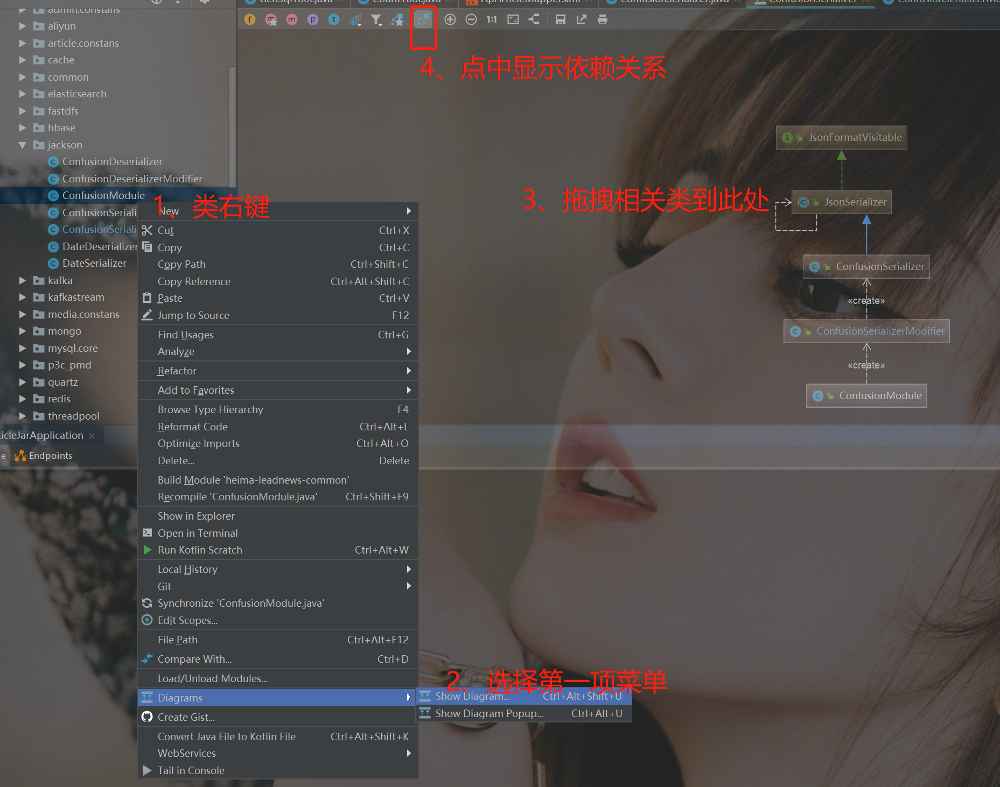
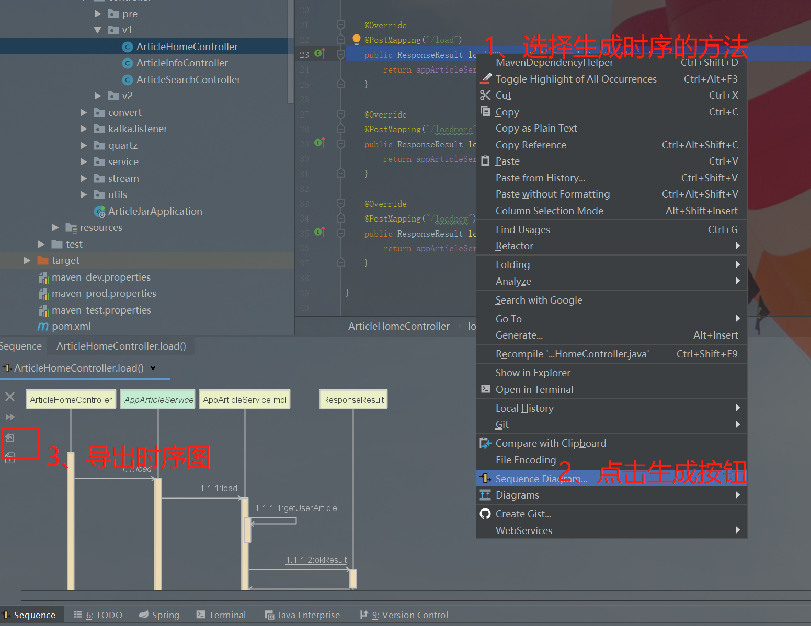

## 课程内容目录（23/7）

### 1、分布式主键封装

#### A、知识点（3）

- 【熟练】Zookeeper与项目的集成
- 【熟练】分布式并发自增类的使用DistributedAtomicLong
- 【熟悉】统一封装统一管理的编程思想
- 【熟练】Sequences的使用

### 2、文章详情需求分析

#### A、知识点（4）

- 【了解】文章详情的功能需求
- 【了解】黑马头条文章列表实现功能的范围
- 【熟悉】文章详情页面功能设计的后端表设计
- 【了解】文章详情页面布局组件的定义
- 【熟悉】APP前端项目的结构定义

### 3、文章详情功能开发

#### A、知识点（8）

- 【熟练】文章内容获取接口定义与开发
- 【熟练】文章关系获取接口定义与开发
- 【熟练】用户关注接口定义与开发
- 【熟练】点赞接口定义与开发
- 【熟练】不喜欢接口定义与开发
- 【熟练】阅读接口定义与开发
- 【熟练】通过MockMvc进行接口单元测试
- 【了解】项目后端存在的一些开发规范问题，并思考自己会如何解决？

#### B、拓展知识点（6）

- 【熟悉】功能点的类图定义

  > 请参考资料目录下《文章详情后端开发说明.docx》文件
  
- 【熟悉】功能点实现流程的时序图定义

  > 请参考资料目录下《文章详情后端开发说明.docx》文件

- 【熟悉】转发、收藏、分享等接口的定义与开发

  > 请参考资料目录下《文章详情后端开发说明.docx》文件

- 【熟悉】使用IDEA快速输出UML类图

  > 
  
- 【熟悉】使用IDEA插件快速输出UML时序图

  > 安装时序图生成插件SequenceDiagram
  >
  > 
  
- 【熟悉】Spring项目的几种场景测试

  > 测试分很多种，每种对于测试成本是不一样的，了解之后合理应用测试，可提供测试效率，常见三种：
  >
  > - JUnit测试：常用于工具类、算法类的测试
  > - JUnit+Spring Appliaction容器测试：常用于对Service、Dao的测试
  > - JUnit+Spring WebAppliaction容器测试：常用于对依赖Web容器的测试，比如控制层测试

### 4、前端详情开发

#### A、知识点（7）

- 【了解】详情页面前端功能需求
- 【熟悉】文章详情页面的Model定义
- 【掌握】Request类的验签和Token的组装
- 【熟悉】迭代优化Api代码过程
- 【掌握】跨终端富文本的解决方案
- 【熟练】通过项目封装的工具类快速集成后端接口
- 【熟悉】新增页面之后路由配置过程

#### B、拓展知识点（1）

- 【熟悉】文章详情页面组件的开发

  > 详见资料文件夹下《文章详情前端组件开发说明.docx》文件
  

