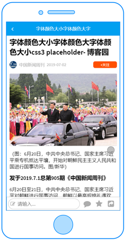
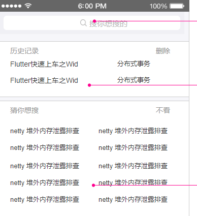
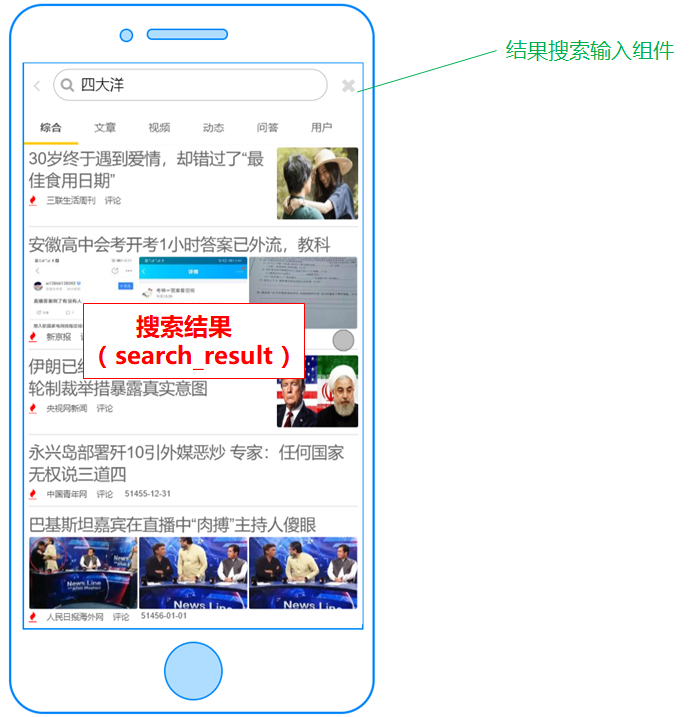
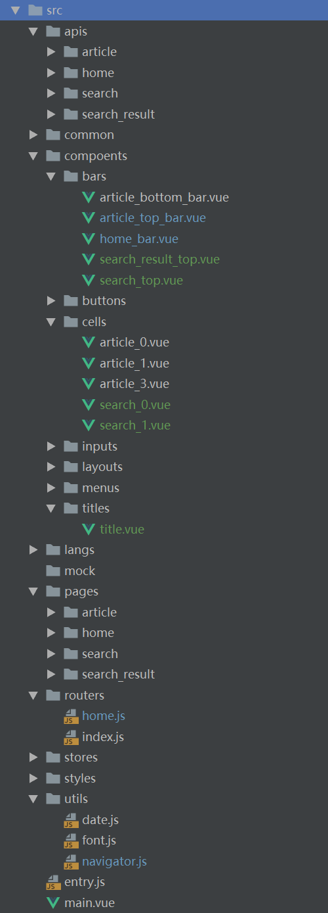
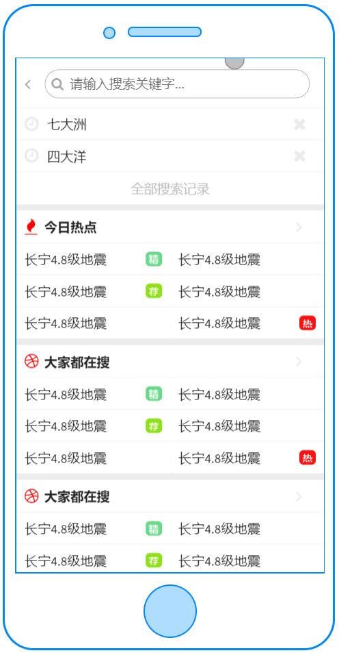
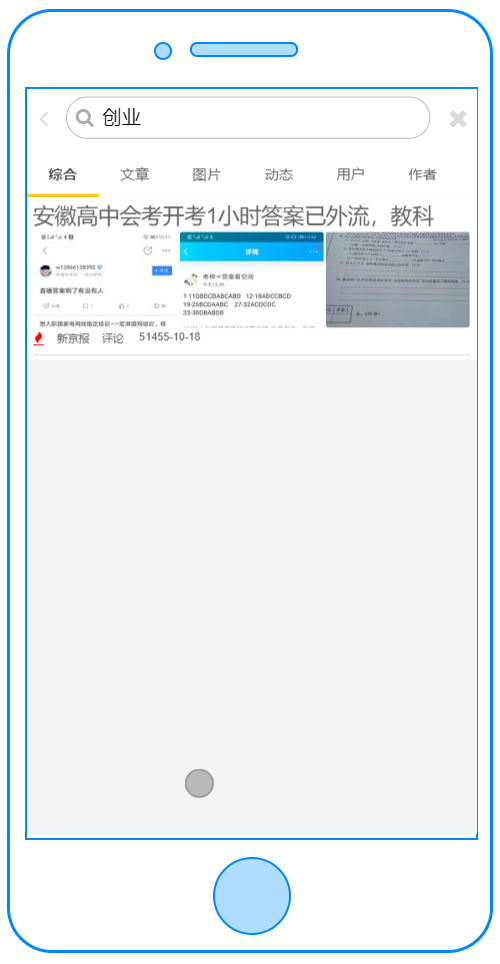

文章搜索前后端成形记 & admin实名认证审核

- 掌握app登录模块的开发
- 熟悉文章详情前台代码流程
- 掌握ES的封装集成
- 熟练ES的API使用
- 熟悉admin管理平台前后端开发
- 掌握JWT技术以及实战应用技巧
- 熟悉VUE+ELEMENT UI的实战开发


# 1 文章详情-前端开发

### 1.1登录接口

参考其他微服务，创建heima-leadnews-login搭建环境

#### 1.1.1 基本定义

通过用户输入用户名和密码验证用户，并且返回jwt字符串

| 参考标准 | 请参考通用接口规范                                  |
| -------- | --------------------------------------------------- |
| 接口名称 | /api/v1/login/login_auth                            |
| 请求DTO  | com.heima.model.user.pojos.ApUser                   |
| 响应DTO  | ResponseResult:{token:"验证字符串",user:{用户信息}} |

#### 1.1.2 code定义

| PARAM_INVALID          | PARAM_INVALID(501,"无效参数"),                  |
| ---------------------- | ----------------------------------------------- |
| AP_USER_DATA_NOT_EXIST | AP_USER_DATA_NOT_EXIST(1001,"ApUser数据不存在") |
| LOGIN_PASSWORD_ERROR   | LOGIN_PASSWORD_ERROR(2,"密码错误")              |

#### 1.1.3 mapper实现

在ApUserMapper接口新增方法

```java
ApUser selectByApPhone(String phone);
```

ApUserMapper.xml文件

```xml
<select id="selectByApPhone" resultMap="BaseResultMap">
    select
    <include refid="Base_Column_List" />
    from ap_user where phone = #{phone} limit 1;
</select>
```


#### 1.1.4 service代码实现

创建接口：com.heima.login.service.ApUserLoginService

```java
public interface ApUserLoginService {
    /**
     * 用户登录验证
     * @param user
     * @return
     */
    ResponseResult loginAuth(ApUser user);

}
```

实现类：com.heima.login.service.impl.ApUserLoginServiceImpl

```java
@Service
public class ApUserLoginServiceImpl implements ApUserLoginService {


    @Autowired
    private ApUserMapper apUserMapper;

    @Override
    public ResponseResult loginAuth(ApUser user) {
        //验证参数
        if(StringUtils.isEmpty(user.getPhone()) || StringUtils.isEmpty(user.getPassword())){
            return ResponseResult.errorResult(AppHttpCodeEnum.PARAM_INVALID);
        }
        //查询用户
        ApUser dbUser = apUserMapper.selectByApPhone(user.getPhone());
        if(dbUser==null){
            return ResponseResult.errorResult(AppHttpCodeEnum.AP_USER_DATA_NOT_EXIST);
        }
        //密码错误
        if(!user.getPassword().equals(dbUser.getPassword())){
            return ResponseResult.errorResult(AppHttpCodeEnum.LOGIN_PASSWORD_ERROR);
        }
        dbUser.setPassword("");
        Map<String,Object> map = Maps.newHashMap();
        map.put("token", AppJwtUtil.getToken(dbUser));
        map.put("user",dbUser);
        return ResponseResult.okResult(map);
    }
}
```

#### 1.1.5 接口定义及controller实现

定义接口com.heima.login.apis.LoginControllerApi

```java
public interface LoginControllerApi {

    public ResponseResult login(@RequestBody ApUser user)
}
```

编写controller

```java
@RestController
@RequestMapping("/api/v1/login")
public class LoginController implements LoginControllerApi {

    @Autowired
    private ApUserLoginService apUserLoginService;

    @PostMapping("login_auth")
    @Override
    public ResponseResult login(@RequestBody ApUser user) {
        return apUserLoginService.loginAuth(user);
    }
}
```

## 1.2其他配置项（必须配置）

### 1.2.1配置jackson解析

在article、behavior、user、login微服务模块中都设置

在数字id进行参数传递的时候需要序列化和反序列化，详细可参考第一天jackson封装

```java
@Configuration
@ComponentScan("com.heima.common.common.init")
public class InitConfig {
}
```

### 1.2.2  配置过滤

在article、behavior、user、login微服务模块中都设置

在登录之后验证工作都是在这些过滤器中处理，比如把登录之后的用户放入线程中，详细可查看com.heima.common.web.app.security这个包下的类

```java
@Configuration
@ServletComponentScan("com.heima.common.web.app.security")
public class SecurityConfig {
}
```


## 1.3 前端详情开发

在进行前端开发过程中，我们会遇见2个棘手的问题，以及相关的解决思路如下：

- 文章内容富文本内容，如何跨平台渲染？

  > 内容是一个JSON对象数组，每个对象对应一种输出类型，比如文本、图片。

- 图片如何自适应高度？（此问题作为线下探讨话题，后面课程会给出参考代码）

  > 获得图真实高度之后，按照屏幕自动缩放比例。

### 1.3.1   创建文件

创建src/pages/article/index.vue文件，用于实现页面功能

### 1.3.2   Model定义

- 页面包含的参数，主要是文章列表项的数据对象，包含文章id、文章标题等：

  ['id','title','date','comment','type','source','authorId']

- 详情页面属性主要包括以下几部分：

  - scrollerHeight：辅助实现文章内容高度的计算
  - icon：定义页面用到的button图标
  - config：存储文章的配置，比如是否删除、是否可评论
  - content：存储当前页面显示的文章内容，其属性字段，参考后端返回的model
  - relation：定义行为实体与当前文章的关系，比如是否点赞、是否收藏等
  - time：定义文章详情页面的时间参数和变量
  - test：用于功能演示的测试变量

```javascript
props:['id','title','date','comment','type','source','authorId'],
data(){
    return {
        scrollerHeight:'500px',
        icon : {
            like : '/uf164',
            unlike : '/uf1f6',
            wechat : '/uf086',
            friend : '/uf268'
        },
        config:{},//文章配置
        content:{},//文章内容
        relation:{
            islike: false,
            isunlike: false,
            iscollection: false,
            isfollow: false,
            isforward:false
        },//关系
        time : {
            timer:null,//定时器
            timerStep:100,//定时器步长
            readDuration:0,//阅读时长
            percentage:0,//阅读比例
            loadDuration:0,//加载时长
            loadOff:true//加载完成控制
        },//时间相关属性
        test : {
            isforward : false
        }
    }
}
```

### 1.3.3   实现Api

详情页面的部分行为不要求用户必须登录，有设备ID好即可，并且在后端接口中会要求传入设备ID，前端对此参数需做全局存储管理，可存储在store中。

（1）store调整

src/store/store.js文件中需要增加对设备ID存储和获取的方法，具体调整如下：

- 定义函数中增加变量

```javascript
this.equipmentidKey = "EQUIPMENTID_KEY"
```

- 属性方法中增加对应方法

```javascript
setEquipmentId : function(equipmentId){
    return this.__setItem(this.equipmentidKey,equipmentId);
},
getEquipmentId : function(){
    return this.__getItem(this.equipmentidKey);
}
```

- 在__check函数中增加初始化值得逻辑，以方便接口测试

```javascript
if(this.storage==null){
    this.storage = weex.requireModule("storage");
    // equipmentId=1
    this.setEquipmentId("8D3E8E0CF883C4E99329AF8A29300AB6")
}
```

 

（2）request调整

**基本调整**

详情页面关注功能要求传入用户Id，因此需要实现后端接口的JWT和验签功能，调整如下：

- 在定义函数中增加变量

```javascript
this.store = null;
```

- 在属性方法中增加setStore方法

```javascript
setStore : function(store){
    this.store = store
}
```

- 在entry.js文件中调用setStore方法

```javascript
Vue.prototype.$store = store
request.setStore(store)
Vue.prototype.$request = request
```

**完整代码**

Request的调整还有以下调整：

- 安装crypto-js加密库
- 实现安装查询字符串排序参数，并生成验签字符串的sign方法
- 在__check方法中初始化JWT token字符串（这里做测试，后续登录接口成功后会设置此值）
- 在post方法中调整body为对象参，增加parms参数，并传入header安全参数
- 在get方法中传入header安全参数

```javascript
var querystring=require("querystring");
var crypto =require('crypto-js')
function Request() {
    this.stream=null;
    this.store = null;
}
Request.prototype={
    setStore : function(store){
        this.store = store
    },
    __check : function(){
        if(!this.stream){
            this.stream = weex.requireModule("stream");
            // user=1
            this.store.setToken("eyJhbGciOiJIUzUxMiIsInppcCI6IkdaSVAifQ.H4sIAAAAAAAAADWLQQqEMAwA_5KzPcQ2LfU3iWbZCkIhFVyW_fvGg7cZhvnCPhosIBXzq2gKlYlDypsE0RVDwiI0C9FaIkzQeMCClCNSzDVNYKf4bR8betzdzPWt7WA3Pjc37t1Zr_6cZb7P5g1_fxA93U6AAAAA.vWYfL-u7d2no6iVdqS-DzlD4WcQrSsx_U8gLjvZJQ9Itmlw1zeQLCl4sVZ_4EeU33ExCNCHjuCTPoGay4OYEcw")
        }
        return this.stream;
    },
    post : function(path,body,parms){
        let stream = this.__check()
        let time = new Date().getTime()
        if(parms==undefined)parms={}
else{
    path = path+"?"+querystring.stringify(parms)
}
        parms['t']=time
        return this.store.getToken().then(token=>{
            return new Promise((resolve, reject) => {
                stream.fetch({
                    method: 'POST',
                    url: path,
                    type: 'json',
                    headers:{
                        'Content-Type': 'application/json; charset=UTF-8',
                        'token':token,
                        't': ''+time,
                        'md':this.sign(parms)
                    },
                    body:JSON.stringify(body)
                }, (response) => {
                    if (response.status == 200) {
                        resolve(response.data)
                    }
                    else {
                        reject(response)
                    }
                })
            })
        }).catch(e=>{
            return new Promise((resolve, reject) => {
                reject(e);
            })
        })
    },
    get : function(path,parms){
        let stream = this.__check();
        if(parms){
            let tmp = querystring.stringify(parms)
            if(path.indexOf("?")==-1){
                tmp="?"+tmp;
            }else{
                tmp="&"+tmp;
            }
            path+=tmp;
        }
        let time = new Date().getTime()
        parms['t']=time
        return this.store.getToken().then(token=>{
            return new Promise((resolve, reject) => {
                stream.fetch({
                    method: 'GET',
                    url: path,
                    type: 'json',
                    headers:{
                        'Content-Type': 'application/json; charset=UTF-8',
                        'token':token,
                        't': ''+time,
                        'md':this.sign(parms)
                    }
                }, (response) => {
                    if (response.status == 200) {
                        resolve(response.data)
                    }
                    else {
                        reject(response)
                    }
                })
            })
        }).catch(e=>{
            return new Promise((resolve, reject) => {
                reject(e);
            })
        })
    },
    sign : function(parms){
        let arr = [];
        for (var key in parms) {
            arr.push(key)
        }
        arr.sort();
        let str = '';
        for (var i in arr) {
            if(str!=''){
                str+="&"
            }
            str += arr[i] + "=" + parms[arr[i]]
        }
        return crypto.MD5(str).toString()
    }
}
export  default new Request()
```

（3）Article api代码

api是对后端接口的一一实现，由于安全已在request.js中封装，因此api实现较为简单，其文件代码如下，包含了关注、收藏、转发、点赞、不喜欢、阅读、分享、加载文章内容、加载文章关系几个接口的实现：

```javascript
function Api(){
    var vue;
}
Api.prototype = {
    setVue : function(vue){
        this.vue = vue;
    },
    // 保存展现行为数据
    loadinfo : function(articleId){
        let url = this.vue.$config.urls.get('load_article_info')
        return new Promise((resolve, reject) => {
            this.vue.$request.post(url,{articleId:articleId}).then((d)=>{
                resolve(d);
            }).catch((e)=>{
                reject(e);
            })
        })
    },
    // 加载文章关系信息
    loadbehavior: function(articleId,authorId){
        let url = this.vue.$config.urls.get('load_article_behavior')
        return this.vue.$store.getEquipmentId().then(equipmentId=>{
            return new Promise((resolve, reject) => {
                this.vue.$request.post(url,{equipmentId:equipmentId,articleId:articleId,authorId:authorId}).then((d)=>{
                    resolve(d);
                }).catch((e)=>{
                    reject(e);
                })
            })
        }).catch(e=>{
            return new Promise((resolve, reject) => {
                reject(e);
            })
        })
    },
    // 喜欢、点赞
    like : function(data){
        let url = this.vue.$config.urls.get('like_behavior')
        return this.vue.$store.getEquipmentId().then(equipmentId=>{
            return new Promise((resolve, reject) => {
                this.vue.$request.post(url,{equipmentId:equipmentId,entryId:data.articleId,type:0,operation:data.operation}).then((d)=>{
                    resolve(d);
                }).catch((e)=>{
                    reject(e);
                })
            })
        }).catch(e=>{
            return new Promise((resolve, reject) => {
                reject(e);
            })
        })
    },
    // 不喜欢
    unlike : function(data){
        let url = this.vue.$config.urls.get('unlike_behavior')
        return this.vue.$store.getEquipmentId().then(equipmentId=>{
            return new Promise((resolve, reject) => {
                this.vue.$request.post(url,{equipmentId:equipmentId,articleId:data.articleId,type:data.type}).then((d)=>{
                    resolve(d);
                }).catch((e)=>{
                    reject(e);
                })
            })
        }).catch(e=>{
            return new Promise((resolve, reject) => {
                reject(e);
            })
        })
    },
    // 不喜欢
    read : function(data){
        let url = this.vue.$config.urls.get('read_behavior')
        return this.vue.$store.getEquipmentId().then(equipmentId=>{
            return new Promise((resolve, reject) => {
                this.vue.$request.post(url,{
                    equipmentId:equipmentId,
                    articleId:data.articleId,
                    count:1,
                    readDuration:data.readDuration,
                    percentage:data.percentage,
                    loadDuration:data.loadDuration
                }).then((d)=>{
                    resolve(d);
                }).catch((e)=>{
                    reject(e);
                })
            })
        }).catch(e=>{
            return new Promise((resolve, reject) => {
                reject(e);
            })
        })
    },
    // 收藏
    collection : function(data){
        let url = this.vue.$config.urls.get('collection_behavior')
        return this.vue.$store.getEquipmentId().then(equipmentId=>{
            return new Promise((resolve, reject) => {
                this.vue.$request.post(url,{
                    equipmentId:equipmentId,
                    entryId:data.articleId,
                    publishedTime:data.publishedTime,
                    type:0,
                    operation:data.operation
                }).then((d)=>{
                    resolve(d);
                }).catch((e)=>{
                    reject(e);
                })
            })
        }).catch(e=>{
            return new Promise((resolve, reject) => {
                reject(e);
            })
        })
    },
    // 转发
    forward : function(data){
        let url = this.vue.$config.urls.get('forward_behavior')
        return this.vue.$store.getEquipmentId().then(equipmentId=>{
            return new Promise((resolve, reject) => {
                this.vue.$request.post(url,{
                    equipmentId:equipmentId,
                    articleId:data.articleId
                }).then((d)=>{
                    resolve(d);
                }).catch((e)=>{
                    reject(e);
                })
            })
        }).catch(e=>{
            return new Promise((resolve, reject) => {
                reject(e);
            })
        })
    },
    // 分享
    share : function(data){
        let url = this.vue.$config.urls.get('share_behavior')
        return this.vue.$store.getEquipmentId().then(equipmentId=>{
            return new Promise((resolve, reject) => {
                this.vue.$request.post(url,{
                    equipmentId:equipmentId,
                    articleId:data.articleId,
                    type:data.type
                }).then((d)=>{
                    resolve(d);
                }).catch((e)=>{
                    reject(e);
                })
            })
        }).catch(e=>{
            return new Promise((resolve, reject) => {
                reject(e);
            })
        })
    }
    ,
    // 关注
    follow : function(data){
        let url = this.vue.$config.urls.get('user_follow')
        return new Promise((resolve, reject) => {
            this.vue.$request.post(url,{
                authorId:data.authorId,
                operation:data.operation,
                articleId:data.articleId
            }).then((d)=>{
                resolve(d);
            }).catch((e)=>{
                reject(e);
            })
        })
    }
}

export default new Api()
```

思考这个地方的代码有没有可优化的点？后续再做代码优化

（4）Home api代码

由于调整了request的规则，对于之前主页的API需要调整调用方式，具体代码如下：

- 调整loaddata方法，从store中获取设备ID
- 调整saveShowBehavior方法，从store中获取设备ID

```javascript
function Api(){
    this.vue;
}
Api.prototype = {
    setVue : function(vue){
        this.vue = vue;
    },
    // 加载数据
    loaddata : function(params){
        let dir = params.loaddir
        let url = this.getLoadUrl(dir)
        return this.vue.$store.getEquipmentId().then(equipmentId=> {
            return new Promise((resolve, reject) => {
                this.vue.$request.get(url,params).then((d)=>{
                    resolve(d);
                }).catch((e)=>{
                    reject(e);
                })
            })
        }).catch(e=>{
            return new Promise((resolve, reject) => {
                reject(e);
            })
        })
    },
    // 保存展现行为数据
    saveShowBehavior : function(params){
        let ids = [];
        for(let k in params){
            if(params[k]){
                ids.push({id:k});
            }
        }
        if(ids.length>0){
            let url = this.vue.$config.urls.get('show_behavior')
            return this.vue.$store.getEquipmentId().then(equipmentId=> {
                return new Promise((resolve, reject) => {
                    this.vue.$request.post(url, {
                        equipmentId: equipmentId,
                        articleIds: ids
                    }).then((d) => {
                        d.data = ids
                        resolve(d);
                    }).catch((e) => {
                        reject(e);
                    })
                })
            }).catch(e=>{
                return new Promise((resolve, reject) => {
                    reject(e);
                })
            })
        }
    },
    // 区别请求那个URL
    getLoadUrl : function(dir){
        let url = this.vue.$config.urls.get('load')
        if(dir==0)
            url = this.vue.$config.urls.get('loadnew')
        else if(dir==2)
            url = this.vue.$config.urls.get('loadmore')
        return url;
    }
}

export default new Api()
```


### 1.3.4   实现VIEW

详情页面包含顶部导航栏和底部功能栏，其中内容区域注意使用scroller滚动组件进行包装，相关实现代码如下：

```javascript
<template>
    <div class="art-page">
        <div class="art-top"><TopBar :text="title"/></div>
        <scroller class="scroller" ref="scroller" @scroll="scroller" show-scrollbar="true">
            <text class="title">{{title}}</text>
            <div class="info">
                <image src="https://p3.pstatp.com/thumb/1480/7186611868" class="head"></image>
                <text class="author">{{source}}</text>
                <text class="time">{{formatDate(date)}}</text>
                <div class="empty"></div>
                <wxc-button class="button" v-if="relation.isfollow" @wxcButtonClicked="follow" text="取消关注" size="small"></wxc-button>
                <wxc-button class="button" v-if="!relation.isfollow" @wxcButtonClicked="follow" text="+关注" size="small"></wxc-button>
            </div>
            <div class="content">
                <template v-for="item in content">
                    <text class="text" :style="getStyle(item.style)" v-if="item.type=='text'">{{item.value}}</text>
                    <image class="image" :style="getStyle(item.style)" v-if="item.type=='image'" :src="item.value"></image>
                </template>
            </div>
            <div class="tools">
                <Button text="点赞" @onClick="like" :icon='icon.like' :active="relation.islike" active-text="取消赞"/>
                <Button text="不喜欢" @onClick="unlike" :icon='icon.unlike' :active="relation.isunlike" />
                <Button text="微信" :icon='icon.wechat' @onClick="share(0)"/>
                <Button text="朋友圈" :icon='icon.friend' @onClick="share(1)"/>
            </div>
        </scroller>
        <div class="art-bottom"><BottomBar :forward="test.isforward" @clickForward="forward"
                                           :collection="relation.iscollection" @clickCollection="collection" /></div>
    </div>
</template>
```

### 1.3.5   实现VM

VM需要调用API进行内容数据绑定，以及实现行为数据的收集与提交。

（1）mounted

挂载完成需要重新设置文章内容部分的高度，以适应内容自动提供滚动功能。

```javascript
mounted(){
    this.scrollerHeight=(Utils.env.getPageHeight()-180)+'px';
}
```

（2）created

创建完成后需要做以下几件事情：

- 初始化Api vue属性
- 调用文章内容加载方法loadInfo
- 调用文章关系加载方法loadBehavior
- 启动定时器记录用户在此页面停留时长、loadInfo方法的加载时长

```javascript
created(){
    Api.setVue(this);
    this.loadInfo();
this.loadBehavior();
    let _this = this;
    this.time.timer = setInterval(function(){
        _this.time.readDuration+=_this.time.timerStep
        if(_this.time.loadOff){
            _this.time.loadDuration+=_this.time.timerStep
        }
    },this.time.timerStep)
}
```

（3）destoryed

在用户离开页面时，提交用户的阅读行为数据，并清理timer

```javascript
destroyed(){
    this.read();
}
```

（4）loadInfo

调用loadinfo的方法，如果返回成功则赋值config和content值，注意content为支持富文本展示功能，其值格式被定义为JSON数组字符串，设置时可用eval转换。

```javascript
loadInfo : function(){
    Api.loadinfo(this.id).then((d)=>{
        if(d.code==0){
            this.config = d.data['config']
            let temp = d.data['content']
            if(temp){
                temp = temp.content
                this.content = eval("("+temp+")")
                this.time.loadOff=false;//关闭加载时间的记录
            }
        }else{
            modal.toast({message: d.errorMessage,duration: 3})
        }
    }).catch((e)=>{
        console.log(e)
    })
}
```

- content值格式示例：

```json
[
{
        type: 'text',
        value: '这个暑期档被灭霸打了响指之后就显得非常暗淡。易烊千玺的首部大荧幕男主角作品《少年的你》撤档，管虎的战争片《八佰》也因“技术问题”没法如期上映，《伟大的梦想》萎缩成《小小的愿望》，《悲伤逆流成河》不得不强颜欢笑，化作《流淌的美好时光》。'
    },
    {
        type: 'text',
        value: '唯一振奋人心的大概就是“复活”的这部《长安十二时辰》，它突然上线给人带来的惊讶不小于前阵子突然消失的《九州缥缈录》。'
    },
    {
        type: 'image',
        value: 'https://p3.pstatp.com/large/pgc-image/RVFRw8xCiUeTbd',
        style:{
            height:'810px'
        }
    },
    {
        type: 'text',
        value: '6月27日，雷佳音和易烊千玺主演的《长安十二时辰》上线，播出一周，讨论声众多，连身边不少把国产剧放在鄙视链最底端的朋友都追起剧来。'
    },
    {
        type: 'text',
        value: '但我怎么也没想到，和同事关于这部剧的讨论是从吃开始的。罪魁祸首是可以吸的火晶柿子。糙汉张小敬吃柿子的套路太骚气，又红又圆的小柿子，把精致吸管往里一插，手指肚捧着柿子，就这么喝起来了。大家忍不住就柿子品种来了一轮南北方大讨论，琢磨着去哪能骚气地喝一回小柿子。'
    },
    {
        type: 'image',
        value: 'https://p3.pstatp.com/large/pgc-image/RVFRw9gDn1CAGc',
        style:{
            height:'176PX'
        }
    },
    {
        type: 'image',
        value: 'https://p3.pstatp.com/large/pgc-image/RVFRwBeGmhQHL8',
        style:{
            height:'211PX'
        }
    },
    {
        type: 'image',
        value: 'https://p3.pstatp.com/large/pgc-image/RVFRwEM7cyRgyz',
        style:{
            height:'211PX'
        }
    },
    {
        type: 'text',
        value: '《长安十二时辰》的开场简直就是雷佳音的大型吃喝直播，我至今在帮他数着，在顺手忙活解救长安城的前提下，就这十二时辰里，雷佳音到底能吃多少东西。',
        style: {
            fontWeight: 'bold',
            fontSize:'36px'
        }
    },
    {
        type: 'image',
        value: 'https://p3.pstatp.com/large/pgc-image/RVFRwHoGEipU4R',
        style:{
            height:'211PX'
        }
    },
]
```

（5）loadBehavior

该方法调用后端接口获取文章关系信息，并赋值给relation属性

```javascript
loadBehavior : function(){
    Api.loadbehavior(this.id,this.authorId).then((d)=>{
        if(d.code==0){ 
            this.relation = d.data
        } else{
           modal.toast({message: d.errorMessage,duration: 3})
        }
    }).catch((e)=>{
        console.log(e)
    })
}
```

（6）like

该函数实现点赞和取消点的接口调用，如果成功修改本地属性islike的值

```javascript
// 点赞
like : function(){
    Api.like({articleId:this.id,operation:this.relation.islike?1:0}).then(d=>{
        if(d.code==0){
            this.relation.islike = !this.relation.islike
        }else{
            modal.toast({message: d.errorMessage,duration: 3})
        }
    }).catch((e)=>{
        console.log(e)
    })
}
```

（7）unlike

实现不喜欢和取消不喜欢的功能，如果调用成功则修改本地属性isunlike的值

```javascript
// 不喜欢
unlike : function(){
    Api.unlike({articleId:this.id,type:this.relation.isunlike?1:0}).then(d=>{
        if(d.code==0){
            this.relation.isunlike = !this.relation.isunlike
        }else{
            modal.toast({message: d.errorMessage,duration: 3})
        }
    }).catch((e)=>{
        console.log(e)
    })
}
```

（8）share

分享成功后给出相关提示

```javascript
// 分享
share : function(type){
    Api.share({articleId:this.id,type:type}).then(d=>{
        if(d.code==0){
            modal.toast({message: '分享成功',duration: 3})
        }else{
            modal.toast({message: d.errorMessage,duration: 3})
        }
    }).catch((e)=>{
        console.log(e)
    })
}
```

（9） collection

实现收藏和取消收藏的功能，如果调用成功，则修改本地iscollection值

```javascript
// 收藏
collection : function(){
    Api.collection({articleId:this.id,publishedTime:this.date,operation:this.relation.iscollection?1:0}).then(d=>{
        if(d.code==0){
            this.relation.iscollection = !this.relation.iscollection
        }else{
            modal.toast({message: d.errorMessage,duration: 3})
        }
    }).catch((e)=>{
        console.log(e)
    })
}
```

（10） forward

转发功能用户行为数据的收集演示，通过点亮按钮来表现调用成功

```javascript
// 转发
forward : function(){
    Api.forward({articleId:this.id}).then(d=>{
        this.test.isforward = !this.test.isforward
    }).catch((e)=>{
        console.log(e)
    })
}
```

（11）follow

实现关注和取消关注的切换操作，如果操作成功，则给出提示并修改本地isfollow的值

```javascript
// 关注
follow : function(){
    Api.follow({articleId:this.id,authorId:this.authorId,operation:this.relation.isfollow?1:0}).then(d=>{
        if(d.code==0){
            this.relation.isfollow = !this.relation.isfollow
            modal.toast({message:this.relation.isfollow?'成功关注':'成功取消关注',duration: 3})
        }else{
            modal.toast({message: d.errorMessage,duration: 3})
        }
    }).catch((e)=>{
        console.log(e)
    })
}
```

（12）read

阅读行为数据的提交，不做请求结果的处理

```javascript
// 阅读行为
read : function(){
    clearInterval( this.time.timer)
    Api.read({articleId:this.id,readDuration:this.time.readDuration,percentage:this.time.percentage,loadDuration:this.time.loadDuration});
}
```

（13）其它方法

- formatDate：时间格式化工具类
- getStyle：用户辅助实现富文本样式的支持
- scroller：用于简单滚动条位置，实时计算用户的阅读到的位置百分比

```javascript
formatDate:function(time){
    return this.$date.format10(time);
},
getStyle:function(item){
    if(item){
        return item;
    }else{
        return {}
    }
},
scroller : function(e){
    let y = Math.abs(e.contentOffset.y)+(Utils.env.getPageHeight()-180)
    let height = e.contentSize.height
    this.time.percentage = Math.max(parseInt((y*100)/height),this.time.percentage)
}
```

### 1.3.6   实现Style

```css
<style scoped>
    .art-page{
        position: absolute;
        top: 0;
        left: 0;
        right: 0;
        bottom: 0;
        width: 750px;
        flex-direction: column;
    }
    .art-top{
        top: 0;
        height: 90px;
        position: fixed;
        z-index: 999;
    }
    .art-bottom{
        bottom: 0;
        position: fixed;
        width: 750px;
    }
    .scroller{
        flex: 1;
        flex-direction: column;
        width: 750px;
        padding: 0px 20px;
        margin: 90px 0px;
    }
    .title{
        font-size: 48px;
        font-weight: bold;
        margin: 10px 0px;
    }
    .info{
        margin-top: 20px;
        line-height: 48px;
        align-items: center;
        flex-direction: row;
    }
    .head{
        width: 48px;
        height: 48px;
        border-radius: 48px;
    }
    .author{
        font-size: 28px;
        color: #adadad;
        margin-left: 15px;
    }
    .time{
        font-size: 28px;
        color: #adadad;
        margin-left: 15px;
    }
    .empty{
        flex: 1;
    }
    .content{
        flex-direction: column;
        font-size: 30px;
        justify-content:flex-start;
        margin-top: 20px;
        color: #222;
        word-wrap: break-word;
        text-align: justify;
    }
    .text {
        margin: 15px 0px;
    }
    .image{
        display:inline-block;
        margin: 15px 0px;
        border-radius: 5px;
        height: 300px;
    }
    .tools{
        margin: 10px 0px;
        flex-direction: row;
        height: 60px;
    }
</style>
```

### 1.3.7   路由配置

新增详情页面，需要配置路由，以便页面跳入；在这里详情页面应该配置成一级路由，在src/routers/home.js文件中更改：

```javascript
// ============  主页路由MODE- ==================
import Layout from '@/compoents/layouts/layout_main'
import Home from '@/pages/home/index'
import Article from '@/pages/article/index'

let routes = [
    {
        path: '/',
        component: Layout,
        children:[
            {
                path:'/home',
                name:'Home',
                component: Home
            }
        ]
    },{
        path:'/article/:id',
        name: 'article-info',
        component:Article
    }
]

export default routes;
```

### 1.3.8   页面跳转

在src/page/home/index.vue中实现文章列表点击打开详情的实现：

```javascript
// 列表项点击事件
wxcPanItemClicked(id){
  this.$router.push('/article/'+id)
}
```

### 1.3.9   效果演示   

###  


# 2 后端需求分析

## 2.1 功能需求

在文章搜索中，点击搜索框，进入搜索界面。页面显示今日热搜词，输入文字提示的联想词，在搜索框不输入任何内容情况下，还需要显示历史搜索记录。归纳后端需支持的主要功能包括：

-   搜索记录

    -   查询搜索记录

    -   删除搜索记录

    -   清空搜索记录

-   今日热词

    -   获取今日热词

-   搜索文章

    -   搜索文章

    -   保存搜索记录

-   联想词

    -   查询联想词



# 3 定义

## 3.1 术语定义

【无】

## 3.2. 接口定义

文章详情页面接口遵照项目通用格式标准，主要接口如下：

-   查询搜索记录接口： 查询用户历史搜索记录

-   删除搜索记录接口：删除用户搜索记录

-   清空搜索记录接口：清空用户搜索记录

-   查询今日热词接口：根据日期查询热词

-   查询联想词接口：根据关键词联想关键词

-   文章搜索接口：搜索文章

# 4 后端开发

## 4.1 查询搜索记录接口

### 4.1.1 接口定义

(1) 基本定义

由于框架封装只对JSON反序列化自增ID，需要请求文章ID需要封装为DTO.

| 参考标准 | 请参考通用接口规范                         |
| :------- | ------------------------------------------ |
| 接口名称 | /api/v1/article/search/load_search_history |
| 请求DTO  | com.heima.model.article.dtos.UserSearchDto |
| 响应DTO  | ResponseResult:   {List<ApUserSearch>  }   |

(2)CODE定义

| PARAM_INVALID | PARAM_INVALID(501,"无效参数"), |
| ------------- | ------------------------------ |
|               |                                |

2. 

### 4.1.2 类定义

类说明：

-   ApUserSearch是对应数据表的POJO对象，放置model模块

-   UserSearchDto封装接口请求数据，放置在model模块

-   ApUserSearchMapper是MybatisMapper文件，放置在model模块

-   ArticleSearchControllerApi是服务接口定义，放置在apis模块

-   ApArticleSearchService、ApArticleSearchServiceImpl、ArticleSearchController是对功能的实现，放置在article模块

### 4.1.3 Mapper实现

(1) ApUserSearch

创建类com.heima.model.user.pojos.ApUserSearch

```java
@Data
public class ApUserSearch {
    private Integer id;
    @IdEncrypt
    private Integer entryId;
    private String keyword;
    private Integer status;
    private Date createdTime;
}
```

(2)ApUserSearchMapper

创建类com.heima.model.mappers.app.ApUserSearchMapper

定义按照entryId查询历史记录方法：

```java
public interface ApUserSearchMapper {
/**
根据entryId查询搜索记录
@param entryId
@return
*/
List<ApUserSearch> selectByEntryId(@Param("entryId") Integer entryId, @Param("limit") int limit); 
}
```

ApUserSearchMapper.xml

```xml
<mapper namespace="com.heima.model.mappers.app.ApUserSearchMapper" >
  <resultMap id="BaseResultMap" type="com.heima.model.user.pojos.ApUserSearch" >
      <id column="id" property="id" />
      <result column="entry_id" property="entryId" />
      <result column="keyword" property="keyword" />
      <result column="status" property="status" />
      <result column="created_time" property="createdTime" />
  </resultMap>
  <sql id="Base_Column_List" >
    id, entry_id, keyword, status, created_time
  </sql>
  <select id="selectByEntryId" resultMap="BaseResultMap">
    select
    <include refid="Base_Column_List" />
    from ap_user_search
    where entry_id = #{entryId} and status = 1
    order by created_time desc limit #{limit}
  </select>
</mapper>
```


### 4.1.4 代码思路分析

-   判断入参articleId是否合法，不合法则返回PARAM_INVALID错误

-   查询文章对应的ApArticleConfig配置信息

-   如果未查询到ApArticleConfig信息，则返回PARAM_INVALID错误

-   如果文章未被删除，则查找处理文章内容对象

-   封装响应DTO返回数据

### 4.1.5 代码实现

(1)ApArticleSearchService

创建类：com.heima.article.service.ApArticleSearchService

定义获取历史记录接口：

```java
public interface ApArticleSearchService {

/**
查询搜索历史
@param userSearchDto
@return
*/
ResponseResult findUserSearch(UserSearchDto userSearchDto); }
```

(2)ApArticleSearchServiceImpl

创建类：com.heima.article.service.ApArticleSearchServiceImpl

```java
@Service
public class ApArticleSearchServiceImpl implements ApArticleSearchService {
    @Autowired
    private ApBehaviorEntryMapper apBehaviorEntryMapper;
     @Autowired
    private ApUserSearchMapper apUserSearchMapper;
    
    public ResponseResult getEntryId(UserSearchDto dto){
        ApUser user = AppThreadLocalUtils.getUser();
        // 用户和设备不能同时为空
        if(user == null && dto.getEquipmentId()==null){
            return ResponseResult.errorResult(AppHttpCodeEnum.PARAM_REQUIRE);
        }
        Long userId = null;
        if(user!=null){
            userId = user.getId();
        }
        ApBehaviorEntry apBehaviorEntry = apBehaviorEntryMapper.selectByUserIdOrEquipment(userId, dto.getEquipmentId());
        // 行为实体找以及注册了，逻辑上这里是必定有值得，除非参数错误
        if(apBehaviorEntry==null){
            return ResponseResult.errorResult(AppHttpCodeEnum.PARAM_INVALID);
        }
        return ResponseResult.okResult(apBehaviorEntry.getId());
    }

	@Override
	public ResponseResult findUserSearch(UserSearchDto dto) {
        if(dto.getPageSize()>50){
            return ResponseResult.errorResult(AppHttpCodeEnum.PARAM_INVALID);
        }
        ResponseResult ret = getEntryId(dto);
        if(ret.getCode()!=AppHttpCodeEnum.SUCCESS.getCode()){
            return ret;
        }
        List<ApUserSearch> list = apUserSearchMapper.selectByEntryId((Integer) ret.getData(), dto.getPageSize());
        return ResponseResult.okResult(list);
}

```

(3)UserSearchDto

创建类：com.heima.model.article.dtos.UserSearchDto

此类在model模块中创建，定义请求入参，实现如下：

```java
@Data
public class UserSearchDto {
    // 设备ID
    @IdEncrypt
    Integer equipmentId;
    String searchWords;
    List<ApUserSearch> hisList;
    String hotDate;
    int pageNum;
    int pageSize;

    public int getFromIndex(){
    if(this.pageNum<1)return 0;
    if(this.pageSize<1) this.pageSize = 10;
    	return this.pageSize  (pageNum1);
    }
}
```

(4)ArticleSearchControllerApi

创建类：com.heima.article.apis.ArticleSearchControllerApi

此类在apis模块中创建，定义了相关接口，实现如下：

```java
/**
首頁文章
*/
public interface ArticleSearchControllerApi {

/**
查询搜索历史
@param userSearchDto
@return
*/
ResponseResult findUserSearch(UserSearchDto userSearchDto);
    
}
```

(5)ArticleSearchController

创建类：com.heima.article.controller.v1.ArticleSearchController

该类的实现较为简单，引入Service并调用即可：

```java
@RestController
@RequestMapping("/api/v1/article/search")
public class ArticleSearchController implements ArticleSearchControllerApi {

    @Autowired
    private ApArticleSearchService apArticleSearchService;

    @PostMapping("/load_search_history")
    public ResponseResult findUserSearch(@RequestBody UserSearchDto userSearchDto) {
    	return apArticleSearchService.findUserSearch(userSearchDto);
    } 
}
```

### 4.1.6 单元测试

创建测试类：com.heima.article.controller.v1.ArticleSearchTest

使用MockMvc进行接口调用测试，代码如下：
```java
@RunWith(SpringRunner.class)  
@SpringBootTest  
@AutoConfigureMockMvc  
public class ArticleSearchTest {  

    @Autowired  
    MockMvc mvc;  
    @Autowired
    ObjectMapper mapper;
    
	@Test
    public void testLoadArticleInfo() throws Exception {
        UserSearchDto dto = new UserSearchDto();
        dto.setEquipmentId(1);
        dto.setPageSize(20);
        MockHttpServletRequestBuilder builder =
                MockMvcRequestBuilders.post("/api/v1/article/search/load_search_history")
                        .contentType(MediaType.APPLICATION_JSON_VALUE)
                        .content(mapper.writeValueAsBytes(dto));
        mvc.perform(builder).andExpect(MockMvcResultMatchers.status().isOk()).andDo(MockMvcResultHandlers.print());
    }
```

## 4.2 删除搜索记录接口


### 4.2.1 接口定义

(1)基本定义

由于框架封装只对JSON反序列化自增ID，需要请求文章ID需要封装为DTO.

| 参考标准 | 请参考通用接口规范                         |
| -------- | ------------------------------------------ |
| 接口名称 | /api/v1/article/search/del_search          |
| 请求DTO  | com.heima.model.article.dtos.UserSearchDto |
| 响应DTO  | ResponseResult {删除的条数    }            |

(2)CODE定义

| PARAM_INVALID | PARAM_INVALID(501,"无效参数"), |
| ------------- | ------------------------------ |
|               |                                |

### 4.2.2 类定义

-   ApUserSearch是对应数据表的POJO对象，放置model模块

-   UserSearchDto封装接口请求数据，放置在model模块

-   ApUserSearchMapper是MybatisMapper文件，放置在model模块

-   ArticleSearchControllerApi是服务接口定义，放置在apis模块

-   ApArticleSearchService、ApArticleSearchServiceImpl、ArticleSearchController是对功能的实现，放置在article模块

### 4.2.3 Mapper实现

(1)ApUserSearchMapper

定义删除搜索记录方法：

```java
/**
删除搜索记录
@param entryId
@param hisIds
@return
*/
int delUserSearch(@Param("entryId") Integer entryId,@Param("hisIds") List<Integer> hisIds);
```
ApUserSearchMapper.xml

```xml
<update id="delUserSearch">
    update ap_user_search
    set status = 0
    where entry_id =#{entryId} and id in(
    <foreach item="item" collection="hisIds" separator=",">
      #{item}
    </foreach>
    )
  </update>
```


### 4.2.4 service思路分析

-   判断入参hisIds是否合法，不合法则返回PARAM_INVALID错误

-   把上述hisIds的状态置为0

-   封装响应DTO返回数据

### 4.2.5 代码实现

(1)ApArticleSearchService

定义删除搜索记录接口：

```java
/**
删除搜索历史
@param userSearchDto
@return
*/
ResponseResult delUserSearch(UserSearchDto userSearchDto);
```
(2)AppArticleInfoServiceImpl

```java
@Override
public ResponseResult delUserSearch(UserSearchDto dto) {
    if(dto.getHisList() ==null  dto.getHisList().size()<=0){
    	return ResponseResult.errorResult(AppHttpCodeEnum.PARAM_REQUIRE);
    }
    ResponseResult ret = getEntryId(dto);
    if(ret.getCode()!=AppHttpCodeEnum.SUCCESS.getCode()){
    	return ret;
    }
    List<Integer> ids = dto.getHisList().stream().map(r>r.getId()).collect(Collectors.toList());
    int rows = apUserSearchMapper.delUserSearch((Integer) ret.getData(),ids);
    return ResponseResult.okResult(rows);
}
```
(3)ArticleSearchControllerApi

创建类：com.heima.article.apis.ArticleSearchControllerApi

此类在apis模块中创建，定义了相关接口，实现如下：

```java
/**
删除搜索历史
@param userSearchDto
@return
*/
ResponseResult delUserSearch(UserSearchDto userSearchDto);
```
(4)ArticleSearchController

该类的实现较为简单，引入Service并调用即可：

```java
@PostMapping("/del_search")
@Override
public ResponseResult delUserSearch(@RequestBody UserSearchDto userSearchDto) {
    return apArticleSearchService.delUserSearch(userSearchDto);
}
```
### 4.2.6 单元测试

在当前类中新增测试方法com.heima.article.controller.v1.ArticleSearchTest

使用MockMvc进行接口调用测试，代码如下：

```java
@Test
public void testDelUserSearch() throws Exception {
    UserSearchDto dto = new UserSearchDto();
    dto.setEquipmentId(1);
    ApUserSearch apUserSearch = new ApUserSearch();
    apUserSearch.setId(7103);
    List<ApUserSearch> list = new ArrayList<>();
    list.add(apUserSearch);
    dto.setHisList(list);
    MockHttpServletRequestBuilder builder =
        MockMvcRequestBuilders.post("/api/v1/article/search/del_search")
        .contentType(MediaType.APPLICATION_JSON_VALUE)
        .content(mapper.writeValueAsBytes(dto));
    mvc.perform(builder).andExpect(MockMvcResultMatchers.status().isOk()).andDo(MockMvcResultHandlers.print());
}
```

## 4.3 清空搜索记录接口

### 4.3.1 接口定义

(1)基本定义

由于框架封装只对JSON反序列化自增ID，需要请求文章ID需要封装为DTO.

| 参考标准 | 请参考通用接口规范                         |
| -------- | ------------------------------------------ |
| 接口名称 | /api/v1/article/search/clear_search        |
| 请求DTO  | com.heima.model.article.dtos.UserSearchDto |
| 响应DTO  | ResponseResult {删除的条数}                |

(2)CODE定义

| PARAM_INVALID | PARAM_INVALID(501,"无效参数"), |
| ------------- | ------------------------------ |
|               |                                |

### 4.3.2 类定义

-   ApUserSearch是对应数据表的POJO对象，放置model模块

-   UserSearchDto封装接口请求数据，放置在model模块

-   ApUserSearchMapper是MybatisMapper文件，放置在model模块

-   ArticleSearchControllerApi是服务接口定义，放置在apis模块

-   ApArticleSearchService、ApArticleSearchServiceImpl、ArticleSearchController是对功能的实现，放置在article模块

### 4.3.3 Mapper实现

(1)ApUserSearchMapper

定义清空搜索记录方法：

```java
/**
清空用户搜索记录
@param entryId
@return
*/
int clearUserSearch(Integer entryId);
```
ApUserSearchMapper.xml

```xml
<update id="clearUserSearch">
    update ap_user_search
    set status = 0
    where entry_id = #{entryId} and status = 1
</update>
```


### 4.3.4 service思路分析

-   根据入参获取entryId,判断是否合法，不合法则返回PARAM_INVALID错误

-   请空entryId对应的搜索记录

-    封装响应DTO返回数据

### 4.3.5 代码实现

(1)ApArticleSearchService

定义清空搜索记录接口：

```java
/**
清空搜索历史
@param userSearchDto
@return
*/
ResponseResult clearUserSearch(UserSearchDto userSearchDto);
```
(2)AppArticleInfoServiceImpl

```java
@Override
public ResponseResult clearUserSearch(UserSearchDto dto) {
    ResponseResult ret = getEntryId(dto);
    if(ret.getCode()!=AppHttpCodeEnum.SUCCESS.getCode()){
    	return ret;
    }
    int rows = apUserSearchMapper.clearUserSearch((Integer) ret.getData());
    return ResponseResult.okResult(rows);
}
```
(3)ArticleSearchControllerApi

此类在apis模块中创建，定义了相关接口，实现如下：

```java
/**
清空搜索历史
@param userSearchDto
@return
*/
ResponseResult clearUserSearch(UserSearchDto userSearchDto);
```
(4)ArticleSearchController

```java
@PostMapping("/clear_search")
@Override
public ResponseResult clearUserSearch(@RequestBody UserSearchDto userSearchDto) {
    return apArticleSearchService.clearUserSearch(userSearchDto);
}
```
### 4.3.6 单元测试

```java
@Test
public void testClearUserSearch() throws Exception {
    UserSearchDto dto = new UserSearchDto();
    dto.setEquipmentId(1);
    MockHttpServletRequestBuilder builder =
        MockMvcRequestBuilders.post("/api/v1/article/search/clear_search")
        .contentType(MediaType.APPLICATION_JSON_VALUE)
        .content(mapper.writeValueAsBytes(dto));
    mvc.perform(builder).andExpect(MockMvcResultMatchers.status().isOk()).andDo(MockMvcResultHandlers.print());
}
```

## 4.4 查询今日热词接口

### 4.4.1 接口定义

(1)基本定义

由于框架封装只对JSON反序列化自增ID，需要请求文章ID需要封装为DTO.

| 参考标准 | 请参考通用接口规范                         |
| -------- | ------------------------------------------ |
| 接口名称 | /api/v1/article/search/load_hot_keywords   |
| 请求DTO  | com.heima.model.article.dtos.UserSearchDto |
| 响应DTO  | ResponseResult:{List<ApHotWords> 热词列表} |

(2)CODE定义

| PARAM_INVALID | PARAM_INVALID(501,"无效参数"), |
| ------------- | ------------------------------ |
|               |                                |

### 4.4.2 类定义

类说明：

-   ApUserSearch是对应数据表的POJO对象，放置model模块

-   UserSearchDto封装接口请求数据，放置在model模块

-   ApUserSearchMapper是MybatisMapper文件，放置在model模块

-   ArticleSearchControllerApi是服务接口定义，放置在apis模块

-   ApArticleSearchService、ApArticleSearchServiceImpl、ArticleSearchController是对功能的实现，放置在article模块

### 4.4.3 Mapper实现

(1)ApHotWords 

创建类com.heima.model.article.pojos.ApHotWords

生成的ApHotWords 注释和getter,setter方法可以删除，然后使用lombok @Data注解，优雅的实现pojo方法。

```java
@Data
public class ApHotWords {
    private Integer id;
    private String hotWords;
    private Integer type;
    private String hotDate;
    private Date createdTime;
}
```
(2)ApUserSearchMapper

创建类com.heima.model.mappers.app.ApHotWordsMapper

定义日期查询热词方法：

```java
public interface ApHotWordsMapper {

/**
查询今日热词
@param hotDate
@return
*/
List<ApHotWords> queryByHotDate(String hotDate);
}
```
ApHotWordsMapper.xml

```xml
<mapper namespace="com.heima.model.mappers.app.ApHotWordsMapper" >
  <resultMap id="BaseResultMap" type="com.heima.model.article.pojos.ApHotWords" >
    <id column="id" property="id"/>
    <result column="hot_words" property="hotWords"/>
    <result column="type" property="type"/>
    <result column="hot_date" property="hotDate"/>
    <result column="created_time" property="createdTime"/>
  </resultMap>

  <sql id="Base_Column_List" >
      id, hot_words, type, hot_date, created_time
  </sql>
  <select id="queryByHotDate" resultMap="BaseResultMap" parameterType="java.lang.String" >
    select
    <include refid="Base_Column_List" />
    from ap_hot_words
    where hot_date = #{hotDate,jdbcType=VARCHAR}
  </select>
</mapper>
```


### 4.4.4 service思路分析

-   判断入参hotDate是否合法，不合法则返回PARAM_INVALID错误

-   查询日期对应的ApHotWords配置信息

-   封装响应DTO返回数据

### 4.4.5 代码实现

(1)ApArticleSearchService

定义获取历史记录接口：

```java
/**
今日热词
@return
*/
ResponseResult hotKeywords(String date);
```
(2)AppArticleInfoServiceImpl

创建类：com.heima.article.service.ApArticleSearchServiceImpl

```java
@Autowired
private ApHotWordsMapper apHotWordsMapper;

@Override
public ResponseResult hotKeywords(String date) {
    if(StringUtils.isEmpty(date)){
        date = DateFormatUtils.format(new Date(), "yyyy-MM-dd");
    }
    List<ApHotWords> list = apHotWordsMapper.queryByHotDate(date);
    return ResponseResult.okResult(list);
}
```
(3)ArticleSearchControllerApi

此类在apis模块中创建，定义了相关接口，实现如下：

```java
/**
今日热词
@return
*/
ResponseResult hotKeywords(UserSearchDto userSearchDto);
```
(4)ArticleSearchController

该类的实现较为简单，引入Service并调用即可：

```java
@PostMapping("/load_hot_keywords")
@Override
public ResponseResult hotKeywords(@RequestBody UserSearchDto userSearchDto) {
    return apArticleSearchService.hotKeywords(userSearchDto.getHotDate());
}
```
### 4.4.6 单元测试

创建测试类：com.heima.article.ArticleSearchTest

使用MockMvc进行接口调用测试，代码如下：

```java
@Test
public void testHotKeywords() throws Exception {
    UserSearchDto dto = new UserSearchDto();
    //        dto.setHotDate("2019-07-24");
    MockHttpServletRequestBuilder builder =
        MockMvcRequestBuilders.post("/api/v1/article/search/load_hot_keywords")
        .contentType(MediaType.APPLICATION_JSON_VALUE)
        .content(mapper.writeValueAsBytes(dto));
    mvc.perform(builder).andExpect(MockMvcResultMatchers.status().isOk()).andDo(MockMvcResultHandlers.print());
}
```


## 4.5 查询联想词接口

### 4.5.1 接口定义

(1)基本定义

由于框架封装只对JSON反序列化自增ID，需要请求文章ID需要封装为DTO.

| 参考标准 | 请参考通用接口规范                           |
| -------- | -------------------------------------------- |
| 接口名称 | /api/v1/article/search/associate_search      |
| 请求DTO  | com.heima.model.article.dtos.UserSearchDto   |
| 响应DTO  | ResponseResult:{List<ApAssociateWords> 列表} |

(2)CODE定义

| PARAM_INVALID | PARAM_INVALID(501,"无效参数"), |
| ------------- | ------------------------------ |
|               |                                |

### 4.5.2 类定义

类说明：

-   ApUserSearch是对应数据表的POJO对象，放置model模块

-   UserSearchDto封装接口请求数据，放置在model模块

-   ApUserSearchMapper是MybatisMapper文件，放置在model模块

-   ArticleSearchControllerApi是服务接口定义，放置在apis模块

-   ApArticleSearchService、ApArticleSearchServiceImpl、ArticleSearchController是对功能的实现，放置在article模块

### 4.5.3 Mapper实现

(1)ApAssociateWords

创建类com.heima.model.article.pojos.ApAssociateWords

```java
@Data
public class ApAssociateWords {
private Integer id;
private String associateWords;
private Date createdTime;
}
```
(2)ApAssociateWordsMapper

创建类com.heima.model.mappers.app.ApAssociateWordsMapper

定义按照关键词查询联想词方法：

```java
public interface ApAssociateWordsMapper {

/**
根据关键词查询联想词
@param searchWords
@return
*/
List<ApAssociateWords> selectByAssociateWords(@Param("searchWords") String searchWords, @Param("limit") int limit);
}
```
ApAssociateWordsMapper.xml

```xml
<mapper namespace="com.heima.model.mappers.app.ApAssociateWordsMapper" >
  <resultMap id="BaseResultMap" type="com.heima.model.article.pojos.ApAssociateWords" >
    <id column="id" property="id"/>
    <result column="associate_words" property="associateWords"/>
    <result column="created_time" property="createdTime"/>
  </resultMap>
  <sql id="Base_Column_List" >
    id, associate_words, created_time
  </sql>

  <select id="selectByAssociateWords" resultMap="BaseResultMap" >
    select
    <include refid="Base_Column_List" />
    from ap_associate_words
    where associate_words like #{searchWords} limit #{limit}
  </select>
</mapper>
```


### 4.5.4 service思路分析

-   判断入参关键词searchWords是否合法，不合法则返回PARAM_INVALID错误

-   查询关键词对应的联想词ApAssociateWords 信息

-   封装响应DTO返回数据

### 4.5.5 代码实现

(1)ApArticleSearchService

定义查询联想词接口：

```java
/**
联想词
@param userSearchDto
@return
*/
ResponseResult searchAssociate(UserSearchDto userSearchDto);
```
(2)AppArticleInfoServiceImpl

```java
@Autowired
private ApAssociateWordsMapper apAssociateWordsMapper;

@Override
public ResponseResult searchAssociate(UserSearchDto dto) {
    if(dto.getPageSize()>50 || dto.getPageSize() < 1){
        return ResponseResult.errorResult(AppHttpCodeEnum.PARAM_INVALID);
    }
    List<ApAssociateWords> aw = apAssociateWordsMapper.selectByAssociateWords("%"+dto.getSearchWords()+"%", dto.getPageSize());
    return ResponseResult.okResult(aw);
}
```
(3)ArticleSearchControllerApi

此类在apis模块中创建，定义了相关接口，实现如下：

```java
/**
联想词
@param userSearchDto
@return
*/
ResponseResult searchAssociate(UserSearchDto userSearchDto);
```
(4)ArticleSearchController

```java
@PostMapping("/associate_search")
@Override
public ResponseResult searchAssociate(@RequestBody UserSearchDto userSearchDto) {
    return apArticleSearchService.searchAssociate(userSearchDto);
}
```
### 4.5.6 单元测试

```java
@Test
public void testSearchAssociate() throws Exception {
    UserSearchDto dto = new UserSearchDto();
    dto.setPageSize(20);
    dto.setSearchWords("传智");
    MockHttpServletRequestBuilder builder =
        MockMvcRequestBuilders.post("/api/v1/article/search/associate_search")
        .contentType(MediaType.APPLICATION_JSON_VALUE)
        .content(mapper.writeValueAsBytes(dto));
    mvc.perform(builder).andExpect(MockMvcResultMatchers.status().isOk()).andDo(MockMvcResultHandlers.print());
}
```

## 4.6 文章搜索接口

### 4.6.1 ES配置使用

- 安装配置elasticsearch和kibana的环境，并且需要在elasticsearch中集成ik(中文分词器)插件

- common中配置ES依赖包，本项目使用JestClient客户端连接ES。
- common项目pom文件添加如下依赖配置

```xml
<!-- ElasticSearch连接 -->
<dependency>
    <groupId>io.searchbox</groupId>
    <artifactId>jest</artifactId>
    <version>6.3.1</version>
    </dependency>
    <dependency>
    <groupId>org.elasticsearch</groupId>
    <artifactId>elasticsearch</artifactId>
    <version>7.2.0</version>
</dependency>
```

- 创建配置文件

在resource下创建elasticsearch.properties

```properties
spring.elasticsearch.jest.url=http://localhost:9200
spring.elasticsearch.jest.read-timeout=20000
spring.elasticsearch.jest.connection-timeout=20000
```


配置类包名：com.heima.common.elasticsearch


配置类：ElasticsearchConfig

```java
@Data
@Configuration
@ConfigurationProperties(prefix="spring.elasticsearch.jest")
@PropertySource("classpath:elasticsearch.properties")
public class ElasticsearchConfig {

    private String url;
    private Integer readTimeout;
    private Integer connectionTimeout;

    @Bean
    public JestClient getJestClient(){
    JestClientFactory factory = new JestClientFactory();
    factory.setHttpClientConfig(new HttpClientConfig
    .Builder(this.url)
    .multiThreaded(true)
    .connTimeout(this.connectionTimeout)
    .readTimeout(this.readTimeout)
    .build());
    return factory.getObject();
    }
}
```

**使用Elasticsearch**

如上所述：按照项目使用模块按需加载，我们使用ES只需扫描common配置ES目录


EsConfig文件内容：

```java
@Configuration
@ComponentScan({"com.heima.elasticsearch"})
public class EsConfig {
}
```

扫描包后就可以注入JestClient类调用ES了。

```java
@Autowired
private JestClient jestClient;
```


使用kibana创建文章索引

```properties
PUT app_info_article
{
  "mappings": {
  	"_doc":{
  		"properties": {
  		  "channelId": {
  			"type": "long"
  		  },
  		  "content": {
  			"type": "text",
  			"fields": {
  			  "keyword": {
  				"type": "keyword",
  				"ignore_above": 256
  			  }
  			},
  			"analyzer": "ik_smart"
  		  },
  		  "id": {
  			"type": "long"
  		  },
  		  "pub_time": {
  			"type": "date"
  		  },
  		  "publishTime": {
  			"type": "date"
  		  },
  		  "query": {
  			"properties": {
  			  "match_all": {
  				"type": "object"
  			  }
  			}
  		  },
  		  "reason": {
  			"type": "text",
  			"fields": {
  			  "keyword": {
  				"type": "keyword",
  				"ignore_above": 256
  			  }
  			}
  		  },
  		  "status": {
  			"type": "long"
  		  },
  		  "tag": {
  			"type": "text",
  			"fields": {
  			  "keyword": {
  				"type": "keyword",
  				"ignore_above": 256
  			  }
  			}
  		  },
  		  "title": {
  			"type": "text",
  			"fields": {
  			  "keyword": {
  				"type": "keyword",
  				"ignore_above": 256
  			  }
  			},
  			"analyzer": "ik_smart"
  		  },
  		  "userId": {
  			"type": "long"
  		  }
  		}
  	}
  }
}
```

**ES索引定义**

搜索栏点击搜索之后，结果页分为几大类别：综合、文章、用户、作者等

因为是APP搜索，索引前缀设计为 app_info_，根据以上搜索结果划分和索引前缀设计，ES索引设计如下：
文章索引 app_info_article
用户索引 app_info_user
作者索引 app_info_author

其中文章，用户，作者跟以上搜索结果一一对应，而综合栏目则根据ES的前缀语法，对应 app_info_*

索引名称定义在 com.heima.common.constants.ESIndexConstants类中

```java
public class ESIndexConstants {
    public static final String DEFAULT_DOC ="_doc";
    public static final String ALL_INDEX ="app_info_*";
    public static final String ARTICLE_INDEX ="app_info_article";
    public static final String USER_INDEX ="app_info_user";
    public static final String AUTHOR_INDEX ="app_info_author";
}
```

**注意**：

1. 为了在综合索引的时候能够根据ES的检索结果去反查对应的文章或者用户信息，在ES索引设计的时候加了 tag字段，用于标识该索引的业务类型。

2. ES7开始，对ES索引类型默认为 _doc。不建议再自己设置。

   

**添加测试数据**

在article模块中集成es环境，创建类：com.heima.article.config.EsConfig

```java
@Configuration
@ComponentScan("com.heima.common.elasticsearch")
public class EsConfig {
}
```

添加50条测试数据,

创建类，用于添加索引的包装类com.heima.common.common.pojo.EsIndexEntity

```java
@Data
public class EsIndexEntity {
    private Long id;
    private String content;
    private Long channelId;
//    private Date pub_time;
    private Date publishTime;
    private Long status;
    private String title;
    private Long userId;
    private String tag;
}
```


在article模块中编写测试代码com.heima.article.es.test.EsTest，后期审核文章会自动添加到索引库

```java
@SpringBootTest
@RunWith(SpringRunner.class)
public class EsTest {

    @Autowired
    private JestClient jestClient;

    @Autowired
    private ApArticleMapper apArticleMapper;

    @Autowired
    private ApArticleContentMapper apArticleContentMapper;

    @Test
    public void testSave() throws IOException {

        ArticleHomeDto dto = new ArticleHomeDto();
        dto.setSize(50);
        dto.setTag("__all__");
        List<ApArticle> apArticles = apArticleMapper.loadArticleListByLocation(dto, null);
        for (ApArticle apArticle : apArticles) {
            ApArticleContent apArticleContent = apArticleContentMapper.selectByArticleId(apArticle.getId());

            EsIndexEntity esIndexEntity = new EsIndexEntity();
            esIndexEntity.setChannelId(new Long(apArticle.getChannelId()));
            esIndexEntity.setContent(ZipUtils.gunzip(apArticleContent.getContent()));
            esIndexEntity.setPublishTime(apArticle.getPublishTime());
            esIndexEntity.setStatus(new Long(1));
            esIndexEntity.setTag("article");
            esIndexEntity.setTitle(apArticle.getTitle());
            Index.Builder builder = new Index.Builder(esIndexEntity);
            builder.id(apArticle.getId().toString());
            builder.refresh(true);
            Index index = builder.index(ESIndexConstants.ARTICLE_INDEX).type(ESIndexConstants.DEFAULT_DOC).build();
            JestResult result = jestClient.execute(index);
            if (result != null && !result.isSucceeded()) {
                throw new RuntimeException(result.getErrorMessage() + "插入更新索引失败!");
            }
        }
    }
}
```


### 4.6.1 接口定义

(1)基本定义

| 参考标准 | 请参考通用接口规范                         |
| -------- | ------------------------------------------ |
| 接口名称 | /api/v1/article/search/article_search      |
| 请求DTO  | com.heima.model.article.dtos.UserSearchDto |
| 响应DTO  | ResponseResult：   { List<ApArticle>  }    |

(2)CODE定义

| PARAM_INVALID | PARAM_INVALID(501,"无效参数") |
| ------------- | ----------------------------- |
|               |                               |

### 4.6.2 类定义

类说明：

-   ApUserSearch是对应数据表的POJO对象，放置model模块

-   UserSearchDto封装接口请求数据，放置在model模块

-   ApUserSearchMapper是MybatisMapper文件，放置在model模块

-   ArticleSearchControllerApi是服务接口定义，放置在apis模块

-   ApArticleSearchService、ApArticleSearchServiceImpl、ArticleSearchController是对功能的实现，放置在article模块

### 4.6.3 Mapper实现

(1)ApUserSearchMapper

定义保存历史记录方法：

```java
/**
插入搜索记录
@param record
@return
*/
int insert(ApUserSearch record);
```
定义检查搜索记录是否存在方法：

```java
/**
查询记录是否存在
@param entryId
@param keyword
@return
*/
int checkExist(@Param("entryId") Integer entryId,@Param("keyword") String keyword);
```
ApUserSearchMapper.xml

```xml
<insert id="insert" parameterType="com.heima.model.user.pojos.ApUserSearch" >
    insert into ap_user_search (entry_id, keyword, status,created_time)
    values (#{entryId}, #{keyword}, #{status},#{createdTime})
</insert>
<select id="checkExist" resultType="java.lang.Integer">
    select
    count(1)
    from ap_user_search
    where entry_id = #{entryId} and keyword = #{keyword} and status = 1
</select>
```

（2）ApArticleMapper

```java
ApArticle selectById(Long id);
```

ApArticleMapper.xml

```xml
<select id="selectById" parameterType="java.lang.Long" resultMap="resultMap">
    select <include refid="Base_Column_List" />
    from ap_article
    where id = #{id}
</select>
```


### 4.6.4 service思路分析

-   判断入参searchWords是否合法，不合法则返回PARAM_INVALID错误

-   查询对应的文章列表

-   如果是第一页访问保存搜索记录，搜索记录关键字根据用户是否存在判断

-   封装响应DTO返回数据

### 4.6.5 代码实现

(1)ApArticleSearchService

定义查询文章信息接口：

```java
/**
ES文章分页搜索
@return
*/
ResponseResult esArticleSearch(UserSearchDto userSearchDto);
```
定义保存历史记录接口：

```java
/**
保存搜索记录
@param entryId
@param searchWords
@return
*/
ResponseResult saveUserSearch(Integer entryId, String searchWords);
```
(2)AppArticleInfoServiceImpl

保存搜索记录

```java
@Override
public ResponseResult saveUserSearch(Integer entryId, String searchWords) {
    //查询生效的记录是否存在
    int count = apUserSearchMapper.checkExist(entryId, searchWords);
    if(count>0){
    return ResponseResult.okResult(1);
    }
    ApUserSearch apUserSearch = new ApUserSearch();
    apUserSearch.setEntryId(entryId);
    apUserSearch.setKeyword(searchWords);
    apUserSearch.setStatus(1);
    apUserSearch.setCreatedTime(new Date());
    int row = apUserSearchMapper.insert(apUserSearch);
    return ResponseResult.okResult(row);
}
```
搜索文章

```java
@Override
public ResponseResult esArticleSearch(UserSearchDto dto) {
    //搜索词的敏感检查
    //只在第一页进行保存操作
    if(dto.getFromIndex()==0){
        ResponseResult result = getEntryId(dto);
        if(result.getCode()!=AppHttpCodeEnum.SUCCESS.getCode()){
            return result;
        }
        this.saveUserSearch((int)result.getData(),dto.getSearchWords());
    }
    //根据关键字查询索引库
    SearchSourceBuilder searchSourceBuilder = new SearchSourceBuilder();
    searchSourceBuilder.query(QueryBuilders.matchQuery("title",dto.getSearchWords()));
    //设置分页
    searchSourceBuilder.from(dto.getFromIndex());
    searchSourceBuilder.size(dto.getPageSize());
    Search search = new Search.Builder(searchSourceBuilder.toString()).addIndex(ESIndexConstants.ARTICLE_INDEX).addType(ESIndexConstants.DEFAULT_DOC).build();
    try {
        SearchResult searchResult = jestClient.execute(search);
        List<ApArticle> sourceAsObjectList = searchResult.getSourceAsObjectList(ApArticle.class);
        List<ApArticle> resultList = new ArrayList<>();
        for (ApArticle apArticle : sourceAsObjectList) {
            apArticle = apArticleMapper.selectById(Long.valueOf(apArticle.getId()));
            if(apArticle==null){
                continue;
            }
            resultList.add(apArticle);
        }
        return ResponseResult.okResult(resultList);
    } catch (IOException e) {
        e.printStackTrace();
    }

    return ResponseResult.errorResult(AppHttpCodeEnum.PARAM_INVALID);
}
```
(3)ArticleSearchControllerApi

此类在apis模块中创建，定义了相关接口，实现如下：

```java
/**
ES文章分页搜索
@return
*/
ResponseResult esArticleSearch(UserSearchDto userSearchDto);
```
(4)ArticleSearchController

该类的实现较为简单，引入Service并调用即可：

```java
@PostMapping("/article_search")
@Override
public ResponseResult esArticleSearch(@RequestBody UserSearchDto userSearchDto) {
	return apArticleSearchService.esArticleSearch(userSearchDto);
}
```
### 4.6.6 单元测试

```java
@Test
public void testEsArticleSearch() throws Exception {
    UserSearchDto dto = new UserSearchDto();
    dto.setEquipmentId(1);
    dto.setSearchWords("训练");
    dto.setPageSize(20);
    dto.setPageNum(1);
    MockHttpServletRequestBuilder builder =
        MockMvcRequestBuilders.post("/api/v1/article/search/article_search")
        .contentType(MediaType.APPLICATION_JSON_VALUE)
        .content(mapper.writeValueAsBytes(dto));
    mvc.perform(builder).andExpect(MockMvcResultMatchers.status().isOk()).andDo(MockMvcResultHandlers.print());
}
```


# 6 前端需求分析

## 6.1 搜索页需求


搜索页面常用布局主要分为以下几个模块：

-   输入栏：放置输入框、返回按钮等组件

-   历史栏：放置显示最近5个搜索的关键字

-   热搜栏：放置显示当时热搜的6个

-   推荐栏：放置推荐的话题或者文章

-   提示栏：放置依据实时输入数据给出搜索联想

>   注：黑马头条课程不实现推荐栏。

## 6.2 结果页需求


搜索结果页和文章首页大致相同，主要有以下几栏：

-   输入栏：组织返回、取消、输入框等组件的排列
-   分类按：显示搜索到的内容分布的类型，便于切换分类查看搜索结果
-   动态栏：搜索结果，在综合和动态两个分类中或显示
-   文章栏：显示搜索到的文章列表，展示的布局和首页列表项布局一致

# 7 定义




## 7.1 组件定义

按照代码重用性的规划，此部分VIEW可抽取以下几个公用组件：

-   搜索输入组件（search_top）：实现返回列表，搜索输入功能

-   历史项组件（search_0）：实现图标、文字、操作按钮布局

-   通用标题组件（title）：实现图标、文字、功能按钮布局

-   图文列表项组件（search_1）：实现文字、图片的展示

-   联想词列表项组件（search_2）：实现联想词的展现，和快速点击

-   结果搜索输入组件（search_result_top）：实现搜索关键字展示、返回、取消等功能

## 7.2 页面定义

-   搜索页面（search）：实现搜索输入页面历史、推荐搜索等功能

-   搜索结果页（search_result）：实现搜索结果的展示

## 7.3 路由定义

-   [/search]：一级路由；指向搜索页面；在首页输入框触发

-   [/search_result]：一级路由，指向搜索结果页，并传递搜索关键字参数，实现搜索功能

## 7.4 结构定义



# 8 开发 

## 8.1 搜索页面实现

在首页点击头部输入框，则自动跳转到搜索页面，搜索页面输入框自动获得焦点，以及初始化搜索历史和热搜等信息。

### 8.1.1 创建文件

-   创建src/pages/search/index.vue文件，用于实现页面功能

### 8.1.2 Model定义

搜索页面属性主要包括以下三部分：

-   scrollerHeight：辅助实现内容高度的计算

-   showTip：控制是否显示联想词

-   icon：定义页面用到图标

-   data定义页面显示用到的数据集合

```javascript
data(){  
    return {  
        scrollerHeight:'500px',  
        showTip:false,  
        icon : {  
        hot : 'uf06d',  
        other:'uf17d'  
        },  
        data : {  
        keyword:'',//当前输入的关键字  
        history : [],//搜索历史  
        tip : [],// 联想词  
        hot : []//热搜关键字  
        }  
    }  
}
```

### 8.1.3 实现Api

详情页很多接口需要实现，比如：

(1)优化request.js

类似之前文章详情页面的API中，方法的代码显得较为重复，在这里我们先进行优化，把重复的代码定义到request中，增加以下方法：

-   postByEquipmentId方法用于请求带有equipmentId字段的post请求

-   getByEquipmentId方法用于请求带有equipmentId字段的get请求

```javascript
// 自动设置设备主键  
postByEquipmentId : function(url,body){  
    return this.store.getEquipmentId().then(equipmentId=>{  
        body['equipmentId']=equipmentId  
        	return new Promise((resolve, reject) => {  
                this.post(url,body).then((d)=>{  
                    resolve(d);  
                }).catch((e)=>{  
                    reject(e);  
                })  
        	})  
        }).catch(e=>{  
            return new Promise((resolve, reject) => {  
            	reject(e);  
            })  
    	})  
},  
// 自动设置设备主键  
getByEquipmentId : function(url,body){  
    return this.store.getEquipmentId().then(equipmentId=>{  
        body['equipmentId']=equipmentId  
        return new Promise((resolve, reject) => {  
                this.get(url,body).then((d)=>{  
                resolve(d);  
            }).catch((e)=>{  
            	reject(e);  
            })  
        })  
    }).catch(e=>{  
        return new Promise((resolve, reject) => {  
        	reject(e);  
        })  
    })  
}
```

(2)api实现

搜索页的Api主要有，其中页面上大家都在搜索在此处不做实现：

-   load_search_history：加载行为实体的搜索记录

-   del_search：删除单个搜索记录

-   associate_search：加载联想词列表

-   load_hot_keywords：加载热搜词语

```javascript
function Api(){  
	this.vue;  
}  
Api.prototype = {  
    setVue : function(vue){  
        this.vue = vue;  
    },  
    // 加载搜索历史  
    load_search_history: function(){  
        let url = this.vue.$config.urls.get('load_search_history')  
        return this.vue.$request.postByEquipmentId(url,{pageSize:5})  
    },  
    // 删除搜索词  
    del_search: function(id){  
        let url = this.vue.$config.urls.get('del_search')  
        return this.vue.$request.postByEquipmentId(url,{hisList:[{id:id}]})  
    },  
    // 输入联想  
    associate_search: function(searchWords){  
        let url = this.vue.$config.urls.get('associate_search')  
        return
        this.vue.$request.postByEquipmentId(url,{searchWords:searchWords,pageSize:10})  
    },  
    // 加载热词  
    load_hot_keywords: function(){  
        let url = this.vue.$config.urls.get('load_hot_keywords')  
        return this.vue.$request.postByEquipmentId(url,{pageSize:6})  
    }  
}  

export default new Api()
```

### 8.1.4 实现VIEW

页面包含顶部搜索输入栏、历史搜索栏、热搜栏、推荐栏，视图实现时，需要注意一下几点：

-   除搜索输入栏之外的内容需要使用scroller滚动组件进行包装，并与页面滚动：

-   历史搜索栏需要增加查看全部搜索历史的连接按钮

-   热搜栏的项需要按照grid布局思想布局

-   联想词是一个绝对定位的层，当需要时进行显示

```html
<template>
    <div class="art-page">
        <div class="art-top"><TopBar @onBlur="onBlur" @onInput="onInput"/></div>
        <scroller class="scroller" :style="{'height':scrollerHeight}" show-scrollbar="true">
            <template v-for="item in data.history">
                <SearchHistory @onClickText="doSearch" @onDeleteHistory="onDeleteHistory" :id="item.id" :title="item.keyword"/>
            </template>
            <a href="#" class="all-search">
                <text class="all-search-text">全部搜索记录</text>
            </a>
            <Title title="今日热点" :icon="icon.hot"/>
            <div class="hot-body">
                <template v-for="item in data.hot">
                    <div class="item">
                        <template v-for="k in item">
                            <HotCell @onClick="doSearch" :title="k.hotWords" type="k.type"/>
                        </template>
                    </div>
                </template>
            </div>
            <Title title="大家都在搜" :icon="icon.other"/>
            <div class="hot-body">
                <div class="item">
                    <HotCell title="长宁4.8级地震" tip="精"/>
                    <HotCell title="长宁4.8级地震"/>
                </div>
                <div class="item">
                    <HotCell title="长宁4.8级地震" tip="荐"/>
                    <HotCell title="长宁4.8级地震"/>
                </div>
                <div class="item">
                    <HotCell title="长宁4.8级地震"/>
                    <HotCell title="长宁4.8级地震" tip="热"/>
                </div>
            </div>
            <Title title="大家都在搜" :icon="icon.other"/>
            <div class="hot-body">
                <div class="item">
                    <HotCell title="长宁4.8级地震" tip="精"/>
                    <HotCell title="长宁4.8级地震"/>
                </div>
                <div class="item">
                    <HotCell title="长宁4.8级地震" tip="荐"/>
                    <HotCell title="长宁4.8级地震"/>
                </div>
                <div class="item">
                    <HotCell title="长宁4.8级地震"/>
                    <HotCell title="长宁4.8级地震" tip="热"/>
                </div>
            </div>
        </scroller>
        <div class="art-tip" v-if="showTip" ref="tip"><SearchTip @onSelect="doSearch" :search="data.keyword" :data="data.tip"/></div>
    </div>
</template>
```
### 8.1.5 实现VM

VM中实现样式、数据等控制，主要实现的过程如下：

(1)created

在创建方法钩子中初始化Api：

```javascript
created(){  
	Api.setVue(this)  
}
```

(2)mounted

在挂载钩子方法中，进行滚动样式计算，初始化搜索历史、热搜关键字数据方法的调用：

```javascript
mounted(){  
    this.scrollerHeight=(Utils.env.getPageHeight()-180)+'px';  
    this.load_search_history()  
    this.load_hot_keywords()  
}
```

(3)methods

-   doSearch方法用于跳转到搜索结果页；在点击热搜关键字、历史搜索关键字、联想词关键字时调用

-   load_search_history方法调用，成功后设置到data.history数据中

-   onDeleteHistory方法调用历史关键字删除，成功后重新加载相关数据

-   onInput方法监听用户输入事件，并加载和显示联想词

-   load_hot_keywords方法加载热搜关键词，同时转换数据为一个二维数组，是由于VIEW一行显示两个关键字。

-   onBlur当输入框失去焦点时，隐藏联想词层

```javascript
doSearch : function(val){
    this.$router.push({name:'search_result',params:{'keyword':val}})
},
// 加载搜索历史
load_search_history : function(){
    Api.load_search_history().then(data=>{
        if(data.code==0){
            this.data.history = data.data
        }else{
            modal.toast({message: data.errorMessage,duration: 3})
        }
    }).catch((e)=>{
        console.log(e)
    })
},
// 删除历史搜搜关键字
onDeleteHistory : function(id){
    let _this = this;
    modal.confirm({message:'确认要删除吗？'},function(button) {
        if(button=='OK') {
            Api.del_search(id).then(data => {
                if (data.code == 0) {
                    modal.toast({message: '删除成功', duration: 3})
                    _this.load_search_history()
                } else {
                    modal.toast({message: data.errorMessage, duration: 3})
                }
            }).catch((e) => {
                console.log(e)
            })
        }
    })
},
//用户输入时，提示联想词
onInput : function(val){
    Api.associate_search(val).then(data => {
        if (data.code == 0) {
            this.data.keyword=val
            this.showTip = true
            this.data.tip=data.data
        }
    })
},
// 加载热搜关键字
load_hot_keywords : function(){
    Api.load_hot_keywords().then(data=>{
        if(data.code==0){
            // 需要转换数据格式
            let newData=[]
            let temp = []
            for(var i=0;i<data.data.length;i++){
                if(i>0&&i%2==0){
                    newData.push(temp)
                    temp = []
                }
                temp.push(data.data[i])
            }
            this.data.hot = newData
        }else{
            modal.toast({message: data.errorMessage,duration: 3})
        }
    }).catch((e)=>{
        console.log(e)
    })
},
// 失去焦点，关闭联想词
onBlur : function(){
    this.showTip=false
}
```

### 8.1.6 实现Style

```css
<style scoped>
    .art-page{
        width: 750px;
        flex-direction: column;
        background-color: #ececec;
    }
    .art-tip{
        position: absolute;
        top: 100px;
        width: 750px;
        z-index: 999;
    }
    .art-top{
        top: 0px;
        z-index: 999;
        position: fixed;
        padding: 15px 0px;
        height: 120px;
        background-color: #ffffff;
    }
    .scroller{
        flex: 1;
        flex-direction: column;
        width: 750px;
        margin-top: 120px;
    }
    .all-search{
        font-size: 36px;
        align-items: center;
        padding: 18px 20px;
        background-color: #ffffff;
    }
    .all-search-text{
        color: #bdbdbd;
    }
    .item{
        flex-direction: row;
    }
</style>
```
### 8.1.7 路由配置

搜索页面，需要配置路由，以便页面跳入；在这里搜索页面应该配置成一级路由，在src/routers/home.js文件中更改：

```javascript
// ============ 主页路由MODEL ==================  
import Layout from '@/compoents/layouts/layout_main'  
import Home from '@/pages/home/index'  
import Article from '@/pages/article/index'  
import Search from '@/pages/search/index'  

let routes = [  
{  
    path: '/',  
    component: Layout,  
    children:[  
        {  
            path:'/home',  
            name:'Home',  
            component: Home  
        }  
    ]  
    },{  
        path:'/article/:id',  
        name: 'article-info',  
        component:Article  
    },{  
        path:'/search',  
        name: 'search',  
        component:Search  
    }  
]  
export default routes;
```

### 8.1.8 页面跳转

搜索页的入口是在首页头部的输入框，当输入框获得焦点时就跳到搜索页。之前首页的搜索组件样式实现的效果不是很协调，在这里进行重构，并实现获焦跳转搜索页的功能，代码如下：

>   <template>  
>   <div class="bar_bg">  
>   <text class="icon">&#xf039;</text>  
>   <Search type="search" @onFocus="onFocus" :icon="icon" left-width="25"
>   rightWidth="20" placeholder="请输入搜索关键字..."/>  
>   <text class="icon">&#xf002;</text>  
>   </div>  
>   </template>  
>    
>   <script>  
>       import Search from '@/compoents/inputs/search';  
>       export default {  
>           name: "index",  
>           components: { Search},  
>           data:()=>{  
>               return {  
>               icon:'uF002'  
>               }  
>           },  
>           mounted(){  
>           	this.backgroundColor = this.$config.style.main_bg;  
>           },  
>           methods: {  
>               onFocus : function(){  
>               	this.$router.push('/search')  
>               },  
>               minibarLeftButtonClick () {  
>               },  
>               minibarRightButtonClick () {  
>               }  
>           }  
>       };  
>   </script>  
>    
>   <style lang="less" scoped>  
>   @import '../../styles/common';  
>   .bar_bg{  
>       width: @screen-width;  
>       flex-direction: row;  
>       background-color: @mian-color;  
>       border-style: solid;  
>       height: @top-height;  
>       padding: 7px 15px 10px;  
>       align-items: center;  
>   }  
>   .icon{  
>       color: #ffffff;  
>       font-family: fontawesome;  
>       font-size: 32px;  
>   }  
>   </style>

### 8.1.9 效果演示



## 8.2 搜索结果页面实现

### 8.2.1 创建文件

-   创建src/pages/search_result/index.vue文件，用于实现页面功能

-   创建src/pages/ search_result /config.js文件，用于封装分类Tab页名称和样式

### 8.2.2 Model定义

(1)分类Model

```css
export default {  
    tabTitles: [{title: '综合',id:'__all__'},  
        {title: '文章',id:'article'},  
        { title: '图片',id:'image'},  
        { title: '动态',id:'dynamic'},  
        {title: '用户',id:'user'},  
        {title: '作者',id:'author'}  
    ],  
    tabStyles: {  
        bgColor: '#FFFFFF',  
        titleColor: '#666666',  
        activeTitleColor: '#3D3D3D',  
        activeBgColor: '#FFFFFF',  
        isActiveTitleBold: true,  
        iconWidth: 70,  
        iconHeight: 70,  
        width: 120,  
        height: 80,  
        fontSize: 24,  
        hasActiveBottom: true,  
        activeBottomColor: '#FFC900',  
        activeBottomHeight: 6,  
        activeBottomWidth: 120,  
        textPaddingLeft: 10,  
        textPaddingRight: 10,  
        normalBottomColor: 'rgba(0,0,0,0.4)',  
        normalBottomHeight: 2,  
        hasRightIcon: true,  
        rightOffset: 100  
    }  
}
```

(2)列表Model

列表页的model主要包含列表配置、请求参数、动画控制等三方面的内容，其核心属性如下：

-   keyword：定义在props中，用于接收搜索页传入的搜索关键字

-   tabList：文章列表显示的数据，其结构是一个二维数组，第一维是每个频道的排序下标，第二维是每个频道下的列表数组

-   showmore：上拉刷新更多文章时显示loading动画的控制开关

-   params：用于请求后端文章数据参数封装对象，主要包含数量、最大时间、最小时间、频道标识等

```javascript
showmore:false,//是否显示loadmore动画  
tabTitles: Config.tabTitles,//频道配置  
tabStyles: Config.tabStyles,//频道样式  
tabList: [],//列表数据集合  
tabPageHeight: 1334,//列表总高度  
params:{ },//列表数据请求参数
props:{  
	keyword:''//当前搜索的关键字  
}
```

(3)参数Model

```javascript
params:{  
    tag:"__all__",  
    keyword:'',  
    pageNum:1,  
    pageSize:20，
    index:0  
}
```

-   keyword：请求搜索的关键字

-   pageNum：数据分页大小

-   pageSize：每页数据的大小

-   tag：分类关键字

-   index：当前分类的下标，用于控制列表数据存储的位置

### 8.2.3 实现Api

搜索结果页不需要按照时间进行加载，直接使用分页模式加载

```javascript
function Api(){  
	this.vue;  
}  
Api.prototype = {  
    setVue : function(vue){  
    	this.vue = vue;  
    },  
    // 加载  
    article_search: function(parms){  
        let url = this.vue.$config.urls.get('article_search')  
        return this.vue.$request.postByEquipmentId(url,{  
            searchWords:parms.keyword,  
            pageNum:parms.pageNum,  
            tag:parms.tag,  
            pageSize:20  
    	})  
    }  
}  

export default new Api()
```

### 8.2.4 实现VIEW

(1)template

VIEW包含头部功能条和搜索结果列表，这两个组件采用column布局；其中数据列表没有下拉刷新功能；另外数据列表应该包含所有分类的列表项目，比如用户列表项、作者列表项，在这里只做文章列表项的引入，其它列表项不做实现，其代码如下：

```html
<template>
    <div class="wrapper">
        <div class="top-body"><Home_Bar @onSubmit="onSubmit" :value="keyword"/></div>
        <div class="content-body">
            <wxc-tab-page ref="wxc-tab-page" :tab-titles="tabTitles" :tab-styles="tabStyles" title-type="text" :tab-page-height="tabPageHeight" @wxcTabPageCurrentTabSelected="wxcTabPageCurrentTabSelected">
                <list v-for="(v,index) in tabList"  :key="index" class="item-container" :style="{ height: (tabPageHeight - tabStyles.height) + 'px' }">
                    <!-- 列表项，并绑定显示事件 -->
                    <cell v-for="(item,key) in v" class="cell" :key="key">
                        <wxc-pan-item :ext-id="'1-' + (v) + '-' + (key)" @wxcPanItemClicked="wxcPanItemClicked(item)" @wxcPanItemPan="wxcPanItemPan">
                            <Item0 v-if="item.type==0" :data="item"/>
                            <Item1 v-if="item.type==1" :data="item"/>
                            <Item3 v-if="item.type==3" :data="item"/>
                        </wxc-pan-item>
                    </cell>
                    <!-- 上来加载更多 -->
                    <loading @loading="load" :display="showmore?'show':'hide'" class="loading">
                        <loading-indicator class="loading-icon"></loading-indicator>
                        <text class="loading-text">{{load_more_text}}</text>
                    </loading>
                </list>
            </wxc-tab-page>
        </div>
    </div>
</template>
```
(2)style

```css
<style lang="less" scoped>
    @import '../../styles/article';
    .wrapper{
        background-color: @body-background;
        font-size: @font-size;
        font-family: @font-family;
        flex-direction : column;
        flex-wrap:wrap;
    }
    .top-body{
        position: fixed;
        left: 0;
        top: 0;
    }
    .content-body{
        flex: 1;
        flex-direction : column;
        margin-top: 100px;
    }
    .item-container {
        width: 750px;
        background-color: #f2f3f4;
    }
    .cell {
        background-color: #ffffff;
    }
</style>
```
### 8.2.5 实现VM

-   通过computed的缓存功能，渲染国际化资源

-   在mounted钩子方法中，使用setPage方法，设置默认选中的分类

-   在onSubmit方法中，实现本页搜索的功能

-   wxcPanItemClicked方法中实现文章的点击跳转到详情页面

```javascript
<script>
    import Home_Bar from "@/compoents/bars/search_result_top"
    import { WxcTabPage, Utils, BindEnv,WxcPanItem } from 'weex-ui'
    import Item0 from '../../compoents/cells/article_0.vue'
    import Item1 from '../../compoents/cells/article_1.vue'
    import Item3 from '../../compoents/cells/article_3.vue'
    import Config from './config'
    import Api from '@/apis/search_result/api'

    export default {
        name: 'HeiMa-Home',
        components: {Home_Bar,WxcTabPage, Item0,Item1,Item3,WxcPanItem},
        props:{
            keyword:''//当前搜索的关键字
        },
        data: () => ({
            api:null,// API
            showmore:false,//是否显示loadmore动画
            tabTitles: Config.tabTitles,//频道配置
            tabStyles: Config.tabStyles,//频道样式
            tabList: [],//列表数据集合
            tabPageHeight: 1334,//列表总高度
            params:{
                tag:"__all__",
                keyword:'',
                pageNum:1,
                pageSize:20，
		Index:0
            }
        }),
        computed:{
            // 渲染加载最新和更多的国际化语言
            load_new_text:function(){return this.$lang.load_new_text},
            load_more_text:function(){return this.$lang.load_more_text}
        },
        mounted(){
            // 激活推荐按钮
            this.$refs['wxc-tab-page'].setPage(0,null,false);
        },
        created () {
            // 初始化高度，顶部菜单高度120+顶部bar 90
            this.tabPageHeight = Utils.env.getPageHeight()-110;
            this.tabList = [...Array(this.tabTitles.length).keys()].map(i => []);
            this.params.keyword = this.keyword;
            Api.setVue(this);
        },
        methods: {
            // 上拉加载更多
            loadmore:function(){
                this.showmore=true;
                this.params.pageNum=this.params.pageNum+1
                this.load();
            },
            // 正常加载数据
            load : function(){
                Api.article_search(this.params).then((d)=>{
                    this.tanfer(d.data);
                }).catch((e)=>{
                    console.log(e)
                })
            },
            // 列表数据转换成View需要的Model对象
            tanfer : function(data){
                let arr = []
                for(let i=0;i<data.length;i++){
                    let tmp = {
                        id:data[i].id,
                        title:data[i].title,
                        comment:data[i].comment,
                        source:data[i].authorName,
                        date:data[i].publishTime,
                        type:data[i].layout,
                        image:data[i].images==null?[]:data[i].images.split(','),
                        icon:'/uf06d'
                    }
                    let time = data[i].publishTime;
                    if(this.params.max_behot_time<time){
                        this.params.max_behot_time=time;
                    }
                    if(this.params.min_behot_time>time){
                        this.params.min_behot_time=time;
                    }
                    arr.push(tmp);
                }
                let newList = [...Array(this.tabTitles.length).keys()].map(i => []);
                if(this.params.pageNum==1){
                    arr = this.tabList[this.params.index].concat(arr);
                }else{
                    arr=arr.concat(this.tabList[this.params.index]);
                }
                newList[this.params.index] = arr;
                this.tabList = newList;
                this.showmore=false;
            },
            // 频道页切换事件
            wxcTabPageCurrentTabSelected (e) {
                this.params.pageNum=1
this.params.index=e.page
                this.params.tag = Config.tabTitles[e.page]['id'];
                this.load();
            },
            // 兼容回调
            wxcPanItemPan (e) {
                if (BindEnv.supportsEBForAndroid()) {
                    this.$refs['wxc-tab-page'].bindExp(e.element);
                }
            },
            // 列表项点击事件
            wxcPanItemClicked(item){
                this.$router.push({
                    name:'article-info',
                    params:item
                })
            },
            onSubmit : function(val){
                this.params.keyword = val;
                this.tabList = [...Array(this.tabTitles.length).keys()].map(i => []);
                this.load();
            }
        }
    }
</script>
```
### 8.2.6 效果演示




