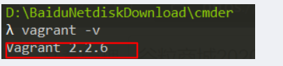
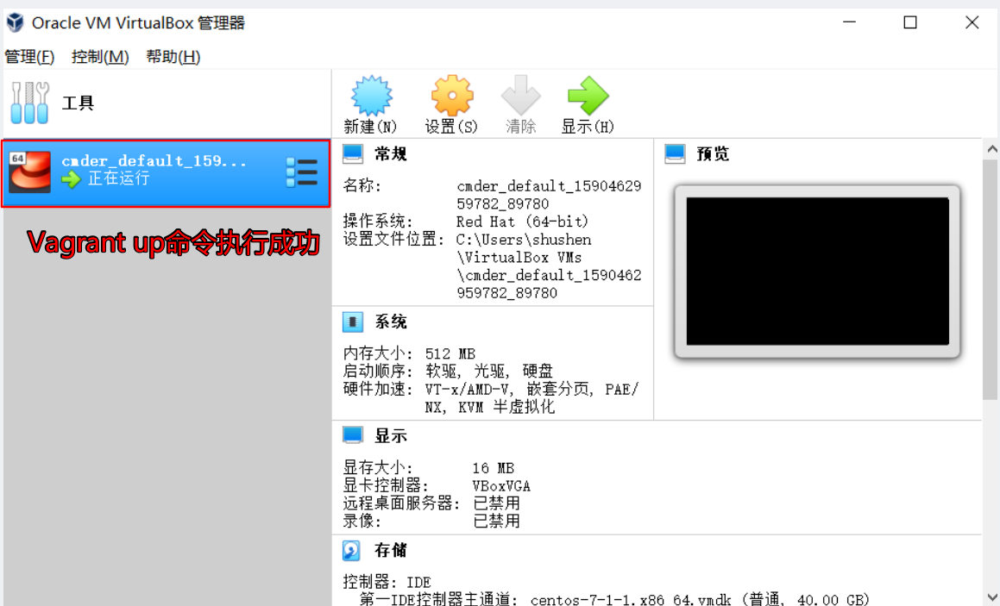
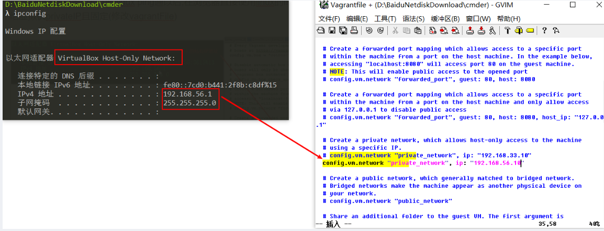
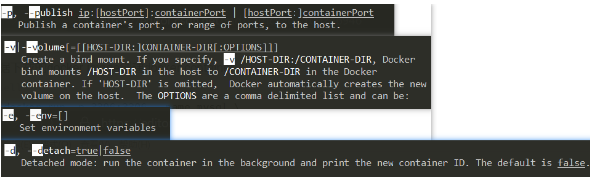
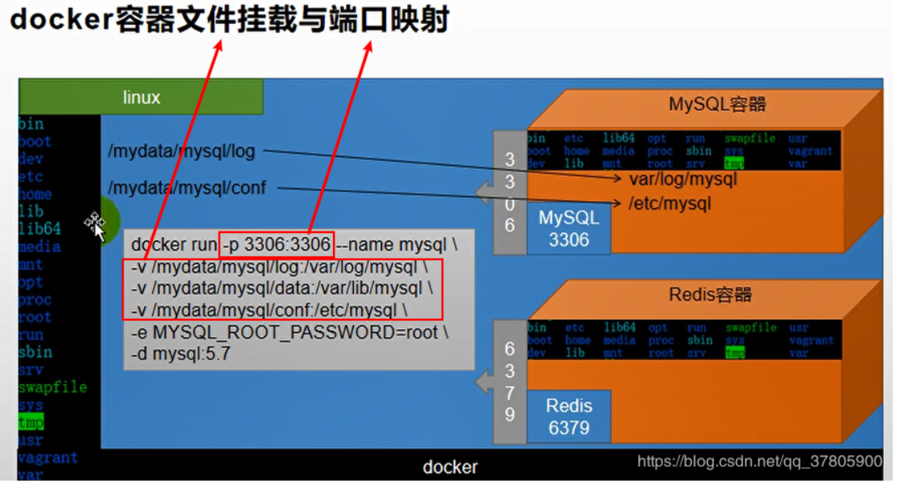
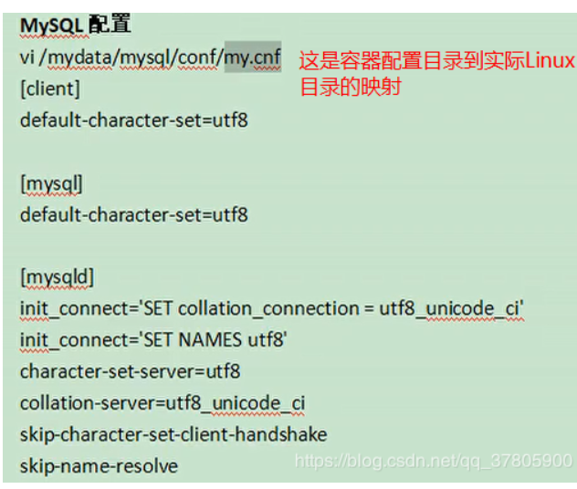

# Linux环境搭建

> 传统搭建：VMWare+Centos+CRT 再加软件包或者Docker
>
> 快速搭建：VirtualBox+Vagrant+Docker

## VirtualBox安装

>visualBox进行安装需要cpu开启虚拟化，在开机启动的时候设置主板，CPU configuration，然后点击Intel Vitualization Technology。重启电脑

[下载地址](https://www.virtualbox.org/wiki/Downloads)

[快速入门](https://segmentfault.com/a/1190000021225799)

[国内镜像源](https://blog.csdn.net/dafei1288/article/details/105828516)

安装步骤：傻瓜式安装

## Vagrant安装

[下载地址](https://www.vagrantup.com/downloads.html)

安装步骤：傻瓜式安装

>傻瓜式"下一步下一步"安装即可,改变安装路径也都没有问题,不过安装过程中可能会弹出累似下面的这个提示框,点击"Ignore"即可!
>
>

测试 ：vagrant -v （cmd窗口）



## 构建Centos环境

命令（具体哪个镜像可以去官网或者[国内镜像源](https://blog.csdn.net/dafei1288/article/details/105828516)去找）

```linux
vagrant init centos7 https://mirrors.ustc.edu.cn/centos-cloud/centos/7/vagrant/x86_64/images/CentOS-7.box
```


>普通安装linux虚拟机太麻烦，可以利用vagrant可以帮助我们快速地创建一个虚拟机。主要装了vitualbox，vagrant可以帮助我们快速创建出一个虚拟机。他有一个镜像仓库。

### 生成Vagrantfile

> Vagrantfile是构建centos的环境配置文件，你在哪个目录启动cmd就会把centos生成在哪

### 生成Centos

```
vagrant up
```

>1>基于Vagrantifile正式构建虚拟机实例(默认绑定的虚拟机软件provider就是virtualbox),第一次可能比较慢,因为要联网下载,之后就快了
>
>**2>启动后出现default folder:/cygdrive/c/User/… =>/vagrant。然后ctrl+c退出**



### 链接Centos

```linux
vagrant ssh
```

> 可以直接在windows的cmd窗口链接虚拟机

### 设置虚拟机ip

```
1.在windows用ipconfig查看ip地址，然后在VagrantFile修改Centos的ip为同一网段下，最后ping通
2.重新加载Vagrantfile,使用vagrant reload
3.确保虚拟机还是开着的，没开的话就用vagrant up
4.然后vagrant ssh连接到虚拟机
5.在虚拟机终端中使用ip addr查看ip地址和子网掩码是否和我们在Vagrantfile中设定的一致。
```


>还记得之前提到的Vagrantfile吗?之前简单提了一下它是一个配置文件,可以修改虚拟机的网络配置。如果将虚拟机IP设置成和本地主机ping通,那么之后调试就方便多了(比如在浏览器直接使用我们虚拟机linux的IP就可以了）。
>具体步骤就是先用ipconfig查看一下VirtualBox生成的虚拟网卡的IP地址和子网掩码，然后依据它修改Vagrantfile选择一个未经占用的同一子网下的IP即可，如下图所示
>
>

## 安装Docker

### 先卸载Docker

> 当前是vagrant用户命令前要加sudo（超级管理员权限）如果不加则切换用户su root（密码默认vagrant）

```dockerfile
sudo yum remove docker \
                  docker-client \
                  docker-client-latest \
                  docker-common \
                  docker-latest \
                  docker-latest-logrotate \
                  docker-logrotate \
                  docker-engine
```

### 设置docker存储库

```
sudo yum install -y yum-utils #provides the yum-config-manager utility
```

```
 sudo yum-config-manager \
    --add-repo \
    https://download.docker.com/linux/centos/docker-ce.repo
```

### 从docker存储库中安装docker engine

```
$ sudo yum install docker-ce docker-ce-cli containerd.io  #默认安装最新版
```

### 启动docker

```
sudo systemctl start docker #本次启动docker服务
```

### 设置开机启动

```
sudo systemctl enable docker #使得docker往后开机自启
```

### 查看docker版本和确认正确安装

```
sudo docker -v
```

### 配置阿里云加速

```
sudo mkdir -p /etc/docker #新建docker相关配置目录
sudo tee /etc/docker/daemon.json <<-'EOF' # 在配置目录中建立配置镜像
{
  "registry-mirrors": ["https://mam35hli.mirror.aliyuncs.com"]
}
EOF
sudo systemctl daemon-reload # 重启docker后台进程or 线程?
sudo systemctl restart docker # 重启docker服务

```

## 安装MySQL

### 下载mysql 镜像

下载最新：

```
sudo docker pull mysql #下载最新版本（用不到，别执行，执行也没关系）
```

下载指定版本

```
sudo docker pull mysql:5.7 #下载指定版本
```

查看镜像

```
docker image
```


### 根据镜像创建容器

```
sudo docker run -p 3306:3306 --name mysql \
-v /mydata/mysql/log:/var/log/mysql \
-v /mydata/mysql/log:/var/lib/mysql \
-v /mydata/mysql/conf:/etc/mysql \
-e MYSQL_ROOT_PASSWORD=root \
-d mysql:5.7
```

>**参数说明**
>-p 3306:3306;将容器的3306端口映射到主机的3306端口
>-v /mydata/mysql/cong:/etc/mysql 将docker的实例配置文件夹挂载到主机
>-v /mydata/mysql/log:/var/lib/mysql 将docker的日志文件夹载到主机
>-v /mydata/mysql/conf:/etc/mysql 将docker的配置文件夹挂载到主机
>-e MYSQL_ROOT_PASSWORD=root 初始化root用的密码
>————————————————
>**用man命令学习参数的含义最方便了:**
>
>**文件挂在和端口映射**

### 查看容器并进入容器

启动mysql容器并推出mysql客户端命令

```
docker exec -it mysql bin/bash #启动
exit#退出mysql客户端
```

查看运行的容器

```
 docker ps #有哪些容器启动
```

进入容器

```
sudo docker exec -it <容器id or 容器名> /bin/bash 
ls / # 查看目录结构
```

退出

```
exit 
```

### 修改挂载的配置

>**vi /mydata/mysql/conf/my.conf** 
>
>[client]
>default-character-set=utf8
>[mysql]
>default-character-set=utf8
>[mysqld]
>init_connect='SET collation_connection = utf8_unicode_ci'
>init_connect='SET NAMES utf8'
>character-set-server=utf8
>collation-server=utf8_unicode_ci
>skip-character-set-client-handshake
>skip-name-resolve
>
>**保存(注意评论区该配置不对，不是collection而是collation)**  #esc->:wq
>
>**docker restart mysql #重启**
>**docker exec -it <containerId or containerName> /bin/bash** #再次查看
>
>————————————————
>
>

## 安装Redis

### 创建配置文件

>如果直接挂载的话docker会以为挂载的是一个目录，所以我们先创建一个文件然后再挂载，在虚拟机中

```
# 在虚拟机中
mkdir -p /mydata/redis/conf
touch /mydata/redis/conf/redis.conf

docker pull redis

docker run -p 6379:6379 --name redis \
-v /mydata/redis/data:/data \
-v /mydata/redis/conf/redis.conf:/etc/redis/redis.conf \
-d redis redis-server /etc/redis/redis.conf

# 直接进去redis客户端。
docker exec -it redis redis-cli
```

### 持久化配置

```xml
vim /mydata/redis/conf/redis.conf
# 插入下面内容
appendonly yes
保存
docker restart redis
```

# 附录

## 常用的Linux命令


## 常用的Docker命令