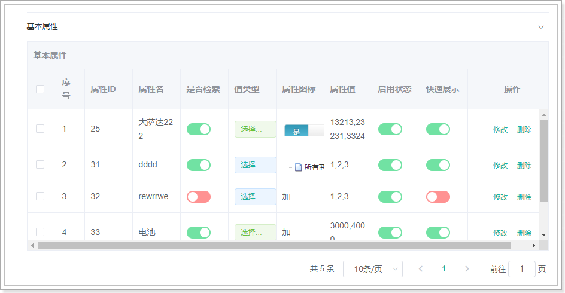
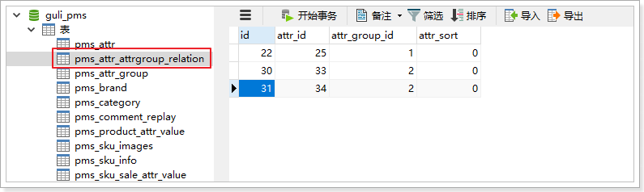
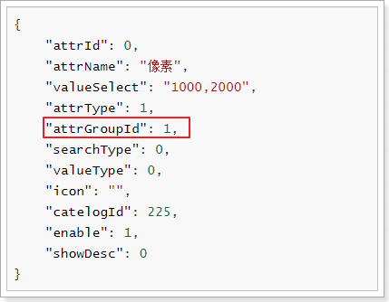
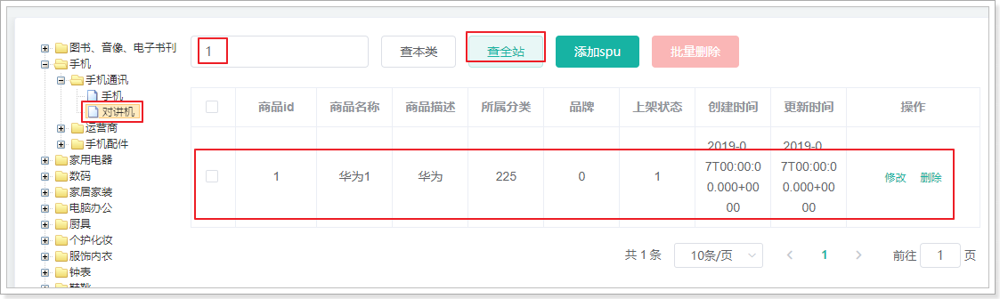
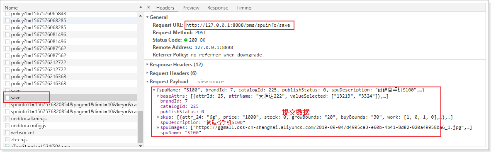
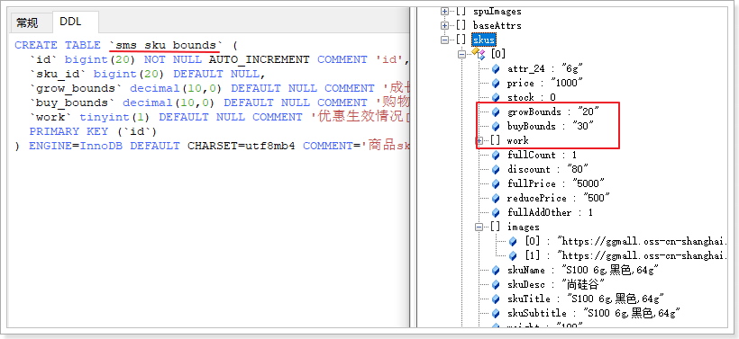
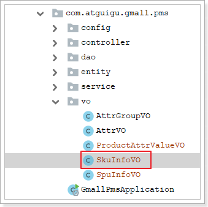
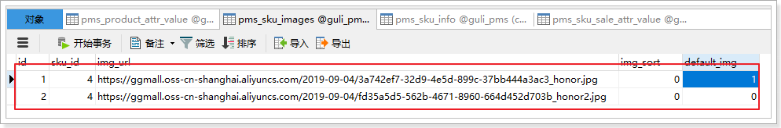

# 							商品系统接口

商城的核心自然是商品，而商品多了以后，肯定要进行分类，并且不同的商品会有不同的品牌信息，我们需要依次去完成：品牌、商品分类、商品的开发。

品牌在系统搭建后，增删改查甚至文件上传都可以正常使用。

接下来完善商品分类及商品功能的增删改查功能。

参考课前资料中的《后台管理系统接口文档.md》


# 1. 商品分类

数据结构：

```sql
CREATE TABLE `pms_category` (
  `cat_id` bigint(20) NOT NULL AUTO_INCREMENT COMMENT '分类id',
  `name` char(50) DEFAULT NULL COMMENT '分类名称',
  `parent_cid` bigint(20) DEFAULT NULL COMMENT '父分类id',
  `cat_level` int(11) DEFAULT NULL COMMENT '层级',
  `show_status` tinyint(4) DEFAULT NULL COMMENT '是否显示[0-不显示，1显示]',
  `sort` int(11) DEFAULT NULL COMMENT '排序',
  `icon` char(255) DEFAULT NULL COMMENT '图标地址',
  `product_unit` char(50) DEFAULT NULL COMMENT '计量单位',
  `product_count` int(11) DEFAULT NULL COMMENT '商品数量',
  PRIMARY KEY (`cat_id`)
) ENGINE=InnoDB AUTO_INCREMENT=1433 DEFAULT CHARSET=utf8mb4 COMMENT='商品三级分类';
```

因为商品分类会有层级关系，因此这里我们加入了`parent_cid`字段，对本表中的其它分类进行自关联。


查看控制台，浏览器会发出如下请求


参照接口文档，开发接口

## 1.1.   CategoryController

请求地址：无，因为/pms/category已经配置在CategoryController上

请求方式：GET

请求参数：

| 请求参数名 | 参数说明 | 值类型 | 是否必须 | 可取值 |
| ---------- | -------- | ------ | -------- | ------ |
| level      | 分类等级 | int    | 否       | 1-3    |
| parentCid  | 父节点id | long   | 否       |        |

响应：`Resp<List<CategoryEntity>>`

给CategoryController添加一个查询方法：

```java
@ApiOperation("根据分类等级或者父id查询分类")
@GetMapping
public Resp<List<CategoryEntity>> queryCategory(@RequestParam(value="level", defaultValue = "0")Integer level
, @RequestParam(value="parentCid", required = false)Long parentCid){
    List<CategoryEntity> categoryEntityList = this.categoryService.queryCategory(level, parentCid);
    return Resp.ok(categoryEntityList);
}
```


## 1.2.   CategoryService

在CategoryService接口中添加接口方法

```java
List<CategoryEntity> queryCategory(Integer level, Long parentCid);
```

在CategoryServiceImpl实现类中实现该方法：

```java
@Autowired
private CategoryDao categoryDao;

@Override
public List<CategoryEntity> queryCategory(Integer level, Long parentCid) {
    // 构造查询条件
    QueryWrapper<CategoryEntity> wrapper = new QueryWrapper<>();
    // 如果level为0，说明查询所有的级别
    if (level != 0) {
        wrapper.eq("cat_level", level);
    }
    // 如果parentCid为null，说明用户没有传该字段，查询所有
    if (parentCid != null){
        wrapper.eq("parent_cid", parentCid);
    }

    return this.categoryDao.selectList(wrapper);
}
```


## 1.3.   重启测试


## 1.4.  根据父节点查询

新增商品时，先根据level=1查询一级节点，选择一级分类后，需要根据父节点查询子节点。


# 2. 商品信息

## 2.1.   SPU和SKU设计

SPU：Standard Product Unit （标准产品单位） ，一组具有共同属性的商品集

SKU：Stock Keeping Unit（库存量单位），SPU商品集因具体特性不同而细分的每个商品

以图为例来看：


- 本页的 华为Mate10 就是一个商品集（SPU）
- 因为颜色、内存等不同，而细分出不同的Mate10，如亮黑色128G版。（SKU）

可以看出：

- SPU是一个抽象的商品集概念，为了方便后台的管理。
- SKU才是具体要销售的商品，每一个SKU的价格、库存可能会不一样，用户购买的是SKU而不是SPU


表结构设计：


**注意：spu图片已废弃**


## 2.2.   规格参数设计


商品规格参数有以下特点：

- 规格参数都有**分组**
- 同一类SPU（三级分类，如手机）的规格参数**名**是统一的。例如：iphone X，galaxy S10等。
- 同一spu，有些规格参数**值**是不变的，如：摄像头像素、摄像头数量等；而有些规格参数的**值**，会随着你选择的sku发生变化，如：内存、机身颜色、存储等。
- 有些规格参数需要作为sku选项（销售属性），例如：机身颜色、存储、版本等
- 有些规格参数需要参与检索（检索属性），例如：屏幕尺寸、分辨率、操作系统等
- 有些规格参数需要快速展示在商品介绍的上方


## 2.3.   规格属性查询


### 2.3.1.   查询规格分组

查看控制台，对应的发送了3个请求：


其中有一个是查询分组。结合接口文档：

请求地址：{catId}，Controller上已经标记了/pms/attrgroup

请求方式：GET

请求参数：一些基本分页条件已经封装到QueryCondition，然后有一个占位符参数（商品分类：225）

正确响应：`Resp<PageVO>`


AttrGroupController中添加Controller方法：

```java
@ApiOperation("根据三级分类id分页查询")
@GetMapping("{cid}")
public Resp<PageVo> queryByCidPage(@PathVariable("cid")Long cid, QueryCondition condition){

    PageVo pageVo = this.attrGroupService.queryByCidPage(cid, condition);
    return Resp.ok(pageVo);
}
```


AttrGroupService接口中添加接口方法：

```java
PageVo queryByCidPage(Long cid, QueryCondition condition);
```


AttrGroupServiceImpl实现类中添加实现方法：

```java
@Override
public PageVo queryByCidPage(Long cid, QueryCondition condition) {

    IPage<AttrGroupEntity> page = this.page(
        new Query<AttrGroupEntity>().getPage(condition),
        new QueryWrapper<AttrGroupEntity>().eq("catelog_id", cid)
    );

	return new PageVo(page);
}
```


测试效果：


### 2.3.2.   查询规格参数

接下来完成另外两个请求：这两个请求路径及请求方法都是一样的。即：是同一个接口方法提供的数据


参考接口文档：

请求地址：无，已经在AttrController上配置/pms/attr

请求方式：GET

请求参数：cid type QueryCondition

正确响应：Resp<PageVo>


AttrController添加方法：

```java
    @ApiOperation("根据条件分页查询")
    @GetMapping
    public Resp<PageVo> queryByCidTypePage(QueryCondition queryCondition
            , @RequestParam("cid")Long cid
            , @RequestParam(value="type", required = false) Integer type) {
        PageVo page = attrService.queryByCidTypePage(queryCondition, cid, type);

        return Resp.ok(page);
    }
```


AttrService接口方法：

```java
PageVo queryByCidTypePage(QueryCondition queryCondition, Long cid, Integer type);
```


AttrServiceImpl实现类：

```java
@Override
public PageVo queryByCidTypePage(QueryCondition queryCondition, Long cid, Integer type) {
    // 构建查询条件
    QueryWrapper<AttrEntity> wrapper = new QueryWrapper<>();
    wrapper.eq("catelog_id", cid);
    if (type != null) {
        wrapper.eq("attr_type", type);
    }
    IPage<AttrEntity> page = this.page(
        new Query<AttrEntity>().getPage(queryCondition), // 构建分页条件
        wrapper
    );

    return new PageVo(page);
}
```


测试：




### 2.3.3.   查询分组下的规格参数


点击属性分组下的维护关联关系，可以查看该分组下的所有属性，并可以添加、删除关联关系。

查看控制台：


参照接口文档：

请求地址：withattrs/{gid}

请求方式：GET

请求参数：gid

正确响应数据分析：

 

也就是说响应结果的data中除了AttrGroupEntity的一些基本字段还需要`List<AttrEntity>`以及`List<AttrAttrGroupRelationEntity>`。

这时，我们可以直接扩展AttrGroupEntity添加两个字段，这里推荐创建新的pojo对象继承AttrGroupEntity，然后在新的对象中添加这两个字段。

 

内容：

```java
@Data
public class AttrGroupVO extends AttrGroupEntity {

    private List<AttrEntity> attrEntities;

    private List<AttrAttrgroupRelationEntity> relations;
}
```


编写AttrGroupController添加方法：

```java
@ApiOperation("根据分组id查询分组及组下的规格参数")
@GetMapping("withattr/{gid}")
public Resp<AttrGroupVO> queryById(@PathVariable("gid")Long gid){

    AttrGroupVO attrGroupVO = this.attrGroupService.queryById(gid);
    return Resp.ok(attrGroupVO);
}
```


编写AttrGroupService接口方法：

```java
AttrGroupVO queryById(Long gid);
```


编写AttrGroupServiceImpl实现类的方法：

```java
    @Autowired
    private AttrGroupDao attrGroupDao;

    @Autowired
    private AttrAttrgroupRelationDao relationDao;

    @Autowired
    private AttrDao attrDao;
    
    @Override
    public AttrGroupVO queryById(Long gid) {

        // 查询分组
        AttrGroupVO attrGroupVO = new AttrGroupVO();
        AttrGroupEntity attrGroupEntity = this.attrGroupDao.selectById(gid);
        BeanUtils.copyProperties(attrGroupEntity, attrGroupVO);

        // 查询分组下的关联关系
        List<AttrAttrgroupRelationEntity> relations = this.relationDao.selectList(new QueryWrapper<AttrAttrgroupRelationEntity>().eq("attr_group_id", gid));
        // 判断关联关系是否为空，如果为空，直接返回
        if (CollectionUtils.isEmpty(relations)){
            return attrGroupVO;
        }
        attrGroupVO.setRelations(relations);

        // 收集分组下的所有规格id
        List<Long> attrIds = relations.stream().map(relation -> relation.getAttrId()).collect(Collectors.toList());
        // 查询分组下的所有规格参数
        List<AttrEntity> attrEntities = this.attrDao.selectBatchIds(attrIds);
        attrGroupVO.setAttrEntities(attrEntities);

        return attrGroupVO;
    }
```


测试：


### 2.3.4.   删除关联关系


点击删除关联关系，控制台发送请求：


结合接口文档。

请求地址：/delete/attr，在AttrAttrgroupRelationController上已配置/pms/attrattrgrouprelation

请求方式：POST

请求参数：`List<AttrAttrGroupEntity>`

正确响应：`Resp<String>`


AttrAttrgroupRelationController中添加方法：

```java
@ApiOperation("删除关联关系")
@PostMapping("/delete/attr")
public Resp<String> delete(@RequestBody List<AttrAttrgroupRelationEntity> relationEntities){

    this.attrAttrgroupRelationService.delete(relationEntities);

    return Resp.ok("删除成功");
}
```


AttrAttrgroupRelationService添加接口方法：

```java
void delete(List<AttrAttrgroupRelationEntity> relationEntities);
```


AttrAttrgroupRelationServiceImpl中添加实现方法：

```java
@Override
@Transactional
public void delete(List<AttrAttrgroupRelationEntity> relationEntities) {
    relationEntities.forEach(relationEntity -> {
        this.remove(new QueryWrapper<AttrAttrgroupRelationEntity>()
                    .eq("attr_id", relationEntity.getAttrId())
                    .eq("attr_group_id", relationEntity.getAttrGroupId())
                   );
    });
}
```


### 2.3.5.   保存规格参数

添加一个基本属性的规格参数，并选择了分组是**主体**


点击提交，显示成功！

查看数据库：pms_attr表中记录


此数据已经插入数据库。但是，规格参数与**主体**分组的关系并没有保存到中间表：



接下来，需要完善规格参数新增功能，除了把规格信息插入规格参数表，还应该把规格参数和分组的关系保存到中间表。

请求地址：/save

请求方式：POST

请求参数：json，对应AttrEntity对象，但是有一个字段attrGroupId，不属于AttrEntity。需要包装一个AttrVO

正确响应：`Resp<Object>`

 


添加AttrVO，扩展AttrEntity

 

内容：

```java
@Data
public class AttrVO extends AttrEntity {

    private Long attrGroupId;
}
```


修改AttrController中的save方法：

```java
    /**
     * 保存
     */
    @ApiOperation("保存")
    @PostMapping("/save")
    @PreAuthorize("hasAuthority('pms:attr:save')")
    public Resp<Object> save(@RequestBody AttrVO attrVO){

		this.attrService.saveAttrVO(attrVO);

        return Resp.ok(null);
    }
```


AttrService接口，添加方法：

```java
void saveAttrVO(AttrVO attrVO);
```


AttrServiceImpl实现类中添加实现方法

```java
    @Transactional
    @Override
    public void saveAttrVO(AttrVO attrVO) {
        // 新增规格参数
        this.attrDao.insert(attrVO);

        // 新增中间表
        AttrAttrgroupRelationEntity relation = new AttrAttrgroupRelationEntity();
        relation.setAttrId(attrVO.getAttrId());
        relation.setAttrGroupId(attrVO.getAttrGroupId());
        this.relationDao.insert(relation);
    }
```


## 2.4.   商品查询

### 2.4.1.   查询商品列表


查看控制台：


结合接口文档

请求地址：无，SpuInfoController类上的路径是/pms/spuinfo

请求方式：GET

请求参数：queryCondition + catId

正确响应：Resp<PageVo>


SpuInfoController添加方法：

```java
@ApiOperation("spu商品信息查询")
@GetMapping
public Resp<PageVo> querySpuInfo(QueryCondition condition, @RequestParam("catId")Long catId){

    PageVo page = this.spuInfoService.querySpuInfo(condition, catId);
    return Resp.ok(page);
}
```


SpuInfoService接口方法：

```
PageVo querySpuInfo(QueryCondition condition, Long catId);
```


SpuInfoServiceImpl实现类实现该方法：

```java
@Override
public PageVo querySpuInfo(QueryCondition condition, Long catId) {
    // 封装分页条件
    IPage<SpuInfoEntity> page = new Query<SpuInfoEntity>().getPage(condition);

    // 封装查询条件
    QueryWrapper<SpuInfoEntity> wrapper = new QueryWrapper<>();
    // 如果分类id不为0，要根据分类id查，否则查全部
    if (catId != 0){
        wrapper.eq("catalog_id", catId);
    }
    // 如果用户输入了检索条件，根据检索条件查
    String key = condition.getKey();
    if (StringUtils.isNotBlank(key)){
        wrapper.and(t -> t.like("spu_name", key).or().like("id", key));
    }

    return new PageVo(this.page(page, wrapper));
}
```


测试：




### 2.4.2.   查询SPU下的SKU

找到`库存管理`下的`商品库存`


点击一个商品的`库存维护`：


结合接口文档：

请求地址：/{spuId}

请求方式：GET

请求参数：spuId

正确响应：`Resp<List<SkuInfoEntity>>`


给SkuInfoController添加方法：

```java
@ApiOperation("查询spu下的sku")
@GetMapping("{spuId}")
public Resp<List<SkuInfoEntity>> querySkuBySpuId(@PathVariable("spuId")Long spuId){

    List<SkuInfoEntity> skuInfoEntities = this.skuInfoService.list(new QueryWrapper<SkuInfoEntity>().eq("spu_id", spuId));

    return Resp.ok(skuInfoEntities);
}
```


测试：


### 2.4.3.   查询SKU的库存信息

sku列表中的`库存维护`


参照接口文档：

请求地址：/{skuId} 在gmall-wms系统的WareSkuController中已经配置了/wms/waresku/

请求方式：GET

请求参数：skuId

正确响应：`Resp<List<WareSkuEntity>>`


WareSkuController添加方法：

```java
@ApiOperation("根据skuId查询库存信息")
@GetMapping("{skuId}")
public Resp<List<WareSkuEntity>> queryWareSkuBySkuId(@PathVariable("skuId")Long skuId){

    List<WareSkuEntity> wareSkuEntities = this.wareSkuService.list(new QueryWrapper<WareSkuEntity>().eq("sku_id", skuId));

    return Resp.ok(wareSkuEntities);
}
```


测试：


## 2.5.   商品新增


点击`添加spu`按钮，跳转到新增spu页面


填写完表单，点击`下一步`


进入`录入spu属性信息`，但是没有显示spu属性（即规格参数）。


### 2.5.1.    查询分类下的分组及其规格参数

当添加商品时，应该根据用户选择的商品分类，显示不同规格参数名，让用户填写对应的参数值。上图控制台发送的这个请求，就是根据分类id查询分组及组下的属性，并动态生成一个表单，让用户填写参数值

参照接口文档：

请求地址：/withattrs/cat/{catId}

请求方式：GET

请求参数：catId

正确响应：`Resp<List<AttrGroupVO>>`


AttrGroupController添加方法：

```java
    @ApiOperation("根据三级分类id查询分组及组下的规格参数")
    @GetMapping("/withattrs/cat/{catId}")
    public Resp<List<AttrGroupVO>> queryByCid(@PathVariable("catId")Long cid){

        List<AttrGroupVO> attrGroupVOs = this.attrGroupService.queryByCid(cid);
        return Resp.ok(attrGroupVOs);
    }
```


AttrGroupService的接口方法：

```java
List<AttrGroupVO> queryByCid(Long cid);
```


AttrGroupServiceImpl实现类实现接口方法：

```java
@Override
public List<AttrGroupVO> queryByCid(Long cid) {
    // 查询所有的分组
    List<AttrGroupEntity> attrGroupEntities = this.list(new QueryWrapper<AttrGroupEntity>().eq("catelog_id", cid));

    // 查询出每组下的规格参数
    List<AttrGroupVO> attrGroupVOs = attrGroupEntities.stream().map(attrGroupEntity -> {
    	return this.queryById(attrGroupEntity.getAttrGroupId());
    }).collect(Collectors.toList());

    return attrGroupVOs;
}
```


测试：


### 2.5.2.   为页面提交的数据构建数据模型

继续下一步：


每个sku都可以再次展开，sku基本信息，优惠信息，以及图片上传


最后点击确定，显示保存成功！？查看数据库你会发现它只保存了spu的基本信息。

查看控制台，可以看到：



提交的数据非常复杂，如下：

```json
{
    "spuName": "S100",
    "brandId": 7,
    "catalogId": 225,
    "publishStatus": 0,
    "spuDescription": "尚硅谷手机S100",
    "spuImages": [
        "https://ggmall.oss-cn-shanghai.aliyuncs.com/2019-09-04/d4995ca3-e60b-4b41-8d82-020a49958ba6_1.jpg",
        "https://ggmall.oss-cn-shanghai.aliyuncs.com/2019-09-04/43c76c93-d0dc-468d-8351-338b192dede6_2.jpg"
    ],
    "baseAttrs": [
        {
            "attrId": 25,
            "attrName": "大萨达222",
            "valueSelected": [
                "13213",
                "3324"
            ]
        },
        {
            "attrId": 40,
            "attrName": "电池容量",
            "valueSelected": [
                ""
            ]
        },
        {
            "attrId": 33,
            "attrName": "电池",
            "valueSelected": [
                "3000"
            ]
        },
        {
            "attrId": 34,
            "attrName": "屏幕",
            "valueSelected": [
                "5"
            ]
        }
    ],
    "skus": [
        {
            "attr_24": "6g",
            "price": "1000",
            "stock": 0,
            "growBounds": "20",
            "buyBounds": "30",
            "work": [
                1,
                0,
                1,
                0
            ],
            "fullCount": 1,
            "discount": "80",
            "fullPrice": "5000",
            "reducePrice": "500",
            "fullAddOther": 1,
            "images": [
                "https://ggmall.oss-cn-shanghai.aliyuncs.com/2019-09-04/3a742ef7-32d9-4e5d-899c-37bb444a3ac3_honor.jpg",
                "https://ggmall.oss-cn-shanghai.aliyuncs.com/2019-09-04/fd35a5d5-562b-4671-8960-664d452d703b_honor2.jpg"
            ],
            "skuName": "S100 6g,黑色,64g",
            "skuDesc": "尚硅谷",
            "skuTitle": "S100 6g,黑色,64g",
            "skuSubtitle": "S100 6g,黑色,64g",
            "weight": "100",
            "attr_30": "黑色",
            "attr_35": "64g",
            "ladderAddOther": 0,
            "saleAttrs": [
                {
                    "attrId": "24",
                    "attrValue": "6g"
                },
                {
                    "attrId": "30",
                    "attrValue": "黑色"
                },
                {
                    "attrId": "35",
                    "attrValue": "64g"
                }
            ]
        },
        {
            "attr_24": "6g",
            "price": "2000",
            "stock": 0,
            "growBounds": 0,
            "buyBounds": 0,
            "work": [
                0,
                0,
                0,
                0
            ],
            "fullCount": 1,
            "discount": 0,
            "fullPrice": 0,
            "reducePrice": 0,
            "fullAddOther": 0,
            "images": [],
            "skuName": "S100 6g,黑色,128g",
            "skuDesc": "",
            "skuTitle": "S100 6g,黑色,128g",
            "skuSubtitle": "S100 6g,黑色,128g",
            "weight": 0,
            "attr_30": "黑色",
            "attr_35": "128g",
            "saleAttrs": [
                {
                    "attrId": "24",
                    "attrValue": "6g"
                },
                {
                    "attrId": "30",
                    "attrValue": "黑色"
                },
                {
                    "attrId": "35",
                    "attrValue": "128g"
                }
            ]
        },
        {
            "attr_24": "6g",
            "price": "3000",
            "stock": 0,
            "growBounds": 0,
            "buyBounds": 0,
            "work": [
                0,
                0,
                0,
                0
            ],
            "fullCount": 1,
            "discount": 0,
            "fullPrice": 0,
            "reducePrice": 0,
            "fullAddOther": 0,
            "images": [],
            "skuName": "S100 6g,白色,64g",
            "skuDesc": "",
            "skuTitle": "S100 6g,白色,64g",
            "skuSubtitle": "S100 6g,白色,64g",
            "weight": 0,
            "attr_30": "白色",
            "attr_35": "64g",
            "saleAttrs": [
                {
                    "attrId": "24",
                    "attrValue": "6g"
                },
                {
                    "attrId": "30",
                    "attrValue": "白色"
                },
                {
                    "attrId": "35",
                    "attrValue": "64g"
                }
            ]
        },
        {
            "attr_24": "6g",
            "price": "4000",
            "stock": 0,
            "growBounds": 0,
            "buyBounds": 0,
            "work": [
                0,
                0,
                0,
                0
            ],
            "fullCount": 1,
            "discount": 0,
            "fullPrice": 0,
            "reducePrice": 0,
            "fullAddOther": 0,
            "images": [],
            "skuName": "S100 6g,白色,128g",
            "skuDesc": "",
            "skuTitle": "S100 6g,白色,128g",
            "skuSubtitle": "S100 6g,白色,128g",
            "weight": 0,
            "attr_30": "白色",
            "attr_35": "128g",
            "saleAttrs": [
                {
                    "attrId": "24",
                    "attrValue": "6g"
                },
                {
                    "attrId": "30",
                    "attrValue": "白色"
                },
                {
                    "attrId": "35",
                    "attrValue": "128g"
                }
            ]
        },
        {
            "attr_24": "6g",
            "price": "5000",
            "stock": 0,
            "growBounds": 0,
            "buyBounds": 0,
            "work": [
                0,
                0,
                0,
                0
            ],
            "fullCount": 1,
            "discount": 0,
            "fullPrice": 0,
            "reducePrice": 0,
            "fullAddOther": 0,
            "images": [],
            "skuName": "S100 6g,粉色,64g",
            "skuDesc": "",
            "skuTitle": "S100 6g,粉色,64g",
            "skuSubtitle": "S100 6g,粉色,64g",
            "weight": 0,
            "attr_30": "粉色",
            "attr_35": "64g",
            "saleAttrs": [
                {
                    "attrId": "24",
                    "attrValue": "6g"
                },
                {
                    "attrId": "30",
                    "attrValue": "粉色"
                },
                {
                    "attrId": "35",
                    "attrValue": "64g"
                }
            ]
        },
        {
            "attr_24": "6g",
            "price": "6000",
            "stock": 0,
            "growBounds": 0,
            "buyBounds": 0,
            "work": [
                0,
                0,
                0,
                0
            ],
            "fullCount": 1,
            "discount": 0,
            "fullPrice": 0,
            "reducePrice": 0,
            "fullAddOther": 0,
            "images": [],
            "skuName": "S100 6g,粉色,128g",
            "skuDesc": "",
            "skuTitle": "S100 6g,粉色,128g",
            "skuSubtitle": "S100 6g,粉色,128g",
            "weight": 0,
            "attr_30": "粉色",
            "attr_35": "128g",
            "saleAttrs": [
                {
                    "attrId": "24",
                    "attrValue": "6g"
                },
                {
                    "attrId": "30",
                    "attrValue": "粉色"
                },
                {
                    "attrId": "35",
                    "attrValue": "128g"
                }
            ]
        }
    ]
}
```

由于提交的是json数据，所以只能通过一个对象来进行接收，这就需要咱们来构建一个VO对象。涉及的表肯定也不只spu一张表。

这么复杂的数据结构，我们一层层的剥茧抽丝式的查看：

#### 2.5.2.1.   先看json数据的最外层

对应pms_spu_info表的信息，还多了三个字段：spuImages、baseAttrs、skus。也就是说需要对SpuInfoEntity进行扩展。首选可以确定这三个字段是集合，因为值都有方括号。


创建SpuInfoVO对象：

 

内容如下：

```java
/**
 * spuInfo扩展对象
 * 包含：spuInfo基本信息、spuImages图片信息、baseAttrs基本属性信息、skus信息
 */
@Data
public class SpuInfoVO extends SpuInfoEntity {

    // 图片信息
    private List<?> spuImages;

    // 基本属性信息
    private List<?> baseAttrs;

    // sku信息
    private List<?> skus;
}
```

接下来就分析这三个集合中，都是什么数据类型的数据。


#### 2.5.2.2.   spuImages

首先spuImages很简单，就是字符串数组：


也就是说，SpuInfoVO对象是这样的：

```java
/**
 * spuInfo扩展对象
 * 包含：spuInfo基本信息、spuImages图片信息、baseAttrs基本属性信息、skus信息
 */
@Data
public class SpuInfoVO extends SpuInfoEntity {

    // 图片信息
    private List<String> spuImages;

    // 基本属性信息
    private List<?> baseAttrs;

    // sku信息
    private List<?> skus;
}
```


#### 2.5.2.3.   baseAttrs

对应的表是pms_product_attr_value，对应的实体类是ProductAttrValueEntity


注意：attrValue的值在实体类中是String，而传过来时参数名是valueSelected，值为集合类型。

所以，必须扩展ProductAttrValueEntity类：

 

重写setter方法，因为参数接收时的本质是调用setter方法接收的：

```java
public class ProductAttrValueVO extends ProductAttrValueEntity {

    public void setValueSelected(List<Object> valueSelected){
        // 如果接受的集合为空，则不设置
        if (CollectionUtils.isEmpty(valueSelected)){
            return;
        }
        this.setAttrValue(StringUtils.join(valueSelected, ","));
    }
}
```


现在SpuInfoVO中的第二参数的集合泛型也搞定了：

```java
@Data
public class SpuInfoVO extends SpuInfoEntity {

    // 图片信息
    private List<String> spuImages;

    // 基本属性信息
    private List<ProductAttrValueVO> baseAttrs;

    // sku信息
    private List<?> skus;
}
```


#### 2.5.2.4.   skus

一部分字段对应的是pms_sku_info这张表，对应的实体类是SkuInfoEntity。


images这个字段保存到pms_sku_images这张表。

一部分字段对应的是sms_sku_bounds表，对应的实体类是gmall-sms服务中的SkuBoundsEntity



一部分字段对应的表是sms_sku_full_reduction，对应的实体类是gmall-sms微服务中的SkuFullReductionEntity


一部分字段对应的表是sms_sku_ladder，对应的实体类是gmall-sms微服务的SkuLadderEntity


最后一个字段就是saleAttrs，对应的是pms_sku_sale_attr_value，实体类是`List<SkuSaleAttrValueEntity>`


由于java是单继承，所以这里只能选择一个继承，其他的字段在从对应的实体类中copy过来。这里选择扩展SkuInfoEntity这个实体类：（注意：带下划线的字段为垃圾字段，不用接收）

 

内容如下：

```java
@Data
public class SkuInfoVO extends SkuInfoEntity {

    private List<String> images;

    // 积分活动
    private BigDecimal growBounds;
    private BigDecimal buyBounds;
    /**
     * 优惠生效情况[1111（四个状态位，从右到左）;
     * 0 - 无优惠，成长积分是否赠送;
     * 1 - 无优惠，购物积分是否赠送;
     * 2 - 有优惠，成长积分是否赠送;
     * 3 - 有优惠，购物积分是否赠送【状态位0：不赠送，1：赠送】]
     */
    private Integer work;

    // 满减活动
    private BigDecimal fullPrice;
    private BigDecimal reducePrice;
    private Integer fullAddOther;

    private Integer fullCount;
    private BigDecimal discount;
    /**
     * 是否叠加其他优惠[0-不可叠加，1-可叠加]
     */
    private Integer addOther;

    private List<SkuSaleAttrValueEntity> saleAttrs;
}
```


最终的SpuInfoVO：

```java
/**
 * spuInfo扩展对象
 * 包含：spuInfo基本信息、spuImages图片信息、baseAttrs基本属性信息、skus信息
 */
@Data
public class SpuInfoVO extends SpuInfoEntity {

    // 图片信息
    private List<String> spuImages;

    // 基本属性信息
    private List<ProductAttrValueVO> baseAttrs;

    // sku信息
    private List<SkuInfoVO> skus;
}
```


### 2.5.3.   完成SPU新增功能

SpuInfoController：改造之前的新增方法

```java
/**
 * 保存
 */
@ApiOperation("保存")
@PostMapping("/save")
@PreAuthorize("hasAuthority('pms:spuinfo:save')")
public Resp<Object> save(@RequestBody SpuInfoVO spuInfoVO){

    spuInfoService.saveSpuInfoVO(spuInfoVO);
    return Resp.ok(null);
}
```


SpuInfoService接口添加方法：

```java
void saveSpuInfoVO(SpuInfoVO spuInfoVO);
```


SpuInfoServiceImpl实现类实现新增方法：

```java
@Override
public void saveSpuInfoVO(SpuInfoVO spuInfoVO) {
    /// 1.保存spu相关
    // 1.1. 保存spu基本信息 spu_info
    spuInfoVO.setPublishStatus(1); // 默认是已上架
    spuInfoVO.setCreateTime(new Date());
    spuInfoVO.setUodateTime(spuInfoVO.getCreateTime()); // 新增时，更新时间和创建时间一致
    this.save(spuInfoVO);
    Long spuId = spuInfoVO.getId(); // 获取新增后的spuId

    // 1.2. 保存spu的描述信息 spu_info_desc
    SpuInfoDescEntity spuInfoDescEntity = new SpuInfoDescEntity();
    // 注意：spu_info_desc表的主键是spu_id,需要在实体类中配置该主键不是自增主键
    spuInfoDescEntity.setSpuId(spuId);
    // 把商品的图片描述，保存到spu详情中，图片地址以逗号进行分割
    spuInfoDescEntity.setDecript(StringUtils.join(spuInfoVO.getSpuImages(), ","));
    this.spuInfoDescDao.insert(spuInfoDescEntity);

    // 1.3. 保存spu的规格参数信息
    List<ProductAttrValueVO> baseAttrs = spuInfoVO.getBaseAttrs();
    if (!CollectionUtils.isEmpty(baseAttrs)) {
        List<ProductAttrValueEntity> productAttrValueEntities = baseAttrs.stream().map(productAttrValueVO -> {
            productAttrValueVO.setSpuId(spuId);
            productAttrValueVO.setAttrSort(0);
            productAttrValueVO.setQuickShow(0);
            return productAttrValueVO;
        }).collect(Collectors.toList());
        this.productAttrValueService.saveBatch(productAttrValueEntities);
    }

    /// 2. 保存sku相关信息
    // 2.1. 保存sku基本信息

    // 2.2. 保存sku图片信息

    // 2.3. 保存sku的规格参数（销售属性）

    // 3. 保存营销相关信息，需要远程调用gmall-sms
    // 3.1. 积分优惠

    // 3.2. 满减优惠

    // 3.3. 数量折扣
}
```


**注意：SpuInfoDescEntity对象的主键需要设置为手动设置，无法手动设置。**


测试效果：3张表的值均可正常插入


### 2.5.4.   完成SKU新增功能

继续完善SpuInfoServiceImpl实现类新增方法：

```java
    @Autowired
    private SpuInfoDescDao spuInfoDescDao;

    @Autowired
    private ProductAttrValueService productAttrValueService;

    @Autowired
    private SkuInfoDao skuInfoDao;

    @Autowired
    private SkuImagesService skuImagesService;

    @Autowired
    private AttrDao attrDao;

    private SkuSaleAttrValueService skuSaleAttrValueService;

	@Override
    public void saveSpuInfoVO(SpuInfoVO spuInfoVO) {
        /// 1.保存spu相关
        // 1.1. 保存spu基本信息 spu_info
        spuInfoVO.setPublishStatus(1); // 默认是已上架
        spuInfoVO.setCreateTime(new Date());
        spuInfoVO.setUodateTime(spuInfoVO.getCreateTime()); // 新增时，更新时间和创建时间一致
        this.save(spuInfoVO);
        Long spuId = spuInfoVO.getId(); // 获取新增后的spuId

        // 1.2. 保存spu的描述信息 spu_info_desc
        SpuInfoDescEntity spuInfoDescEntity = new SpuInfoDescEntity();
        // 注意：spu_info_desc表的主键是spu_id,需要在实体类中配置该主键不是自增主键
        spuInfoDescEntity.setSpuId(spuId);
        // 把商品的图片描述，保存到spu详情中，图片地址以逗号进行分割
        spuInfoDescEntity.setDecript(StringUtils.join(spuInfoVO.getSpuImages(), ","));
        this.spuInfoDescDao.insert(spuInfoDescEntity);

        // 1.3. 保存spu的规格参数信息
        List<ProductAttrValueVO> baseAttrs = spuInfoVO.getBaseAttrs();
        if (!CollectionUtils.isEmpty(baseAttrs)) {
            List<ProductAttrValueEntity> productAttrValueEntities = baseAttrs.stream().map(productAttrValueVO -> {
                productAttrValueVO.setSpuId(spuId);
                productAttrValueVO.setAttrSort(0);
                productAttrValueVO.setQuickShow(0);
                return productAttrValueVO;
            }).collect(Collectors.toList());
            this.productAttrValueService.saveBatch(productAttrValueEntities);
        }

        /// 2. 保存sku相关信息
        List<SkuInfoVO> skuInfoVOs = spuInfoVO.getSkus();
        if (CollectionUtils.isEmpty(skuInfoVOs)){
            return;
        }
        skuInfoVOs.forEach(skuInfoVO -> {
            // 2.1. 保存sku基本信息
            SkuInfoEntity skuInfoEntity = new SkuInfoEntity();
            BeanUtils.copyProperties(skuInfoVO, skuInfoEntity);
            // 品牌和分类的id需要从spuInfo中获取
            skuInfoEntity.setBrandId(spuInfoVO.getBrandId());
            skuInfoEntity.setCatalogId(spuInfoVO.getCatalogId());
            // 获取随机的uuid作为sku的编码
            skuInfoEntity.setSkuCode(UUID.randomUUID().toString().substring(0, 10).toUpperCase());
            // 获取图片列表
            List<String> images = skuInfoVO.getImages();
            // 如果图片列表不为null，则设置默认图片
            if (!CollectionUtils.isEmpty(images)){
                // 设置第一张图片作为默认图片
                skuInfoEntity.setSkuDefaultImg(skuInfoEntity.getSkuDefaultImg()==null ? images.get(0) : skuInfoEntity.getSkuDefaultImg());
            }
            skuInfoEntity.setSpuId(spuId);
            this.skuInfoDao.insert(skuInfoEntity);
            // 获取skuId
            Long skuId = skuInfoEntity.getSkuId();

            // 2.2. 保存sku图片信息
            if (!CollectionUtils.isEmpty(images)){
                String defaultImage = images.get(0);
                List<SkuImagesEntity> skuImageses = images.stream().map(image -> {
                    SkuImagesEntity skuImagesEntity = new SkuImagesEntity();
                    skuImagesEntity.setDefaultImg(StringUtils.equals(defaultImage, image) ? 1 : 0);
                    skuImagesEntity.setSkuId(skuId);
                    skuImagesEntity.setImgSort(0);
                    skuImagesEntity.setImgUrl(image);
                    return skuImagesEntity;
                }).collect(Collectors.toList());
                this.skuImagesService.saveBatch(skuImageses);
            }

            // 2.3. 保存sku的规格参数（销售属性）
            List<SkuSaleAttrValueEntity> saleAttrs = skuInfoVO.getSaleAttrs();
            saleAttrs.forEach(saleAttr -> {
                // 设置属性名，需要根据id查询AttrEntity
                saleAttr.setAttrName(this.attrDao.selectById(saleAttr.getId()).getAttrName());
                saleAttr.setAttrSort(0);
                saleAttr.setSkuId(skuId);
            });
            this.skuSaleAttrValueService.saveBatch(saleAttrs);

            // 3. 保存营销相关信息，需要远程调用gmall-sms
            // 3.1. 积分优惠

            // 3.2. 满减优惠

            // 3.3. 数量折扣
        });
    }
```


测试：sku相关的3张表保存成功





### 2.5.5.    sms提供营销保存接口

SkuInfoVO中剩余没有保存的字段都是营销信息的字段，需要把这些数据传输给营销系统，接下来首先创建一个数据模型

在gmall-sms中添加DTO对象（Data Transfer Object）

 

内容如下：营销信息 + skuId

```java
@Data
public class SkuSaleDTO {

    private Long skuId;

    // 积分活动
    private BigDecimal growBounds;
    private BigDecimal buyBounds;
    /**
     * 优惠生效情况[1111（四个状态位，从右到左）;
     * 0 - 无优惠，成长积分是否赠送;
     * 1 - 无优惠，购物积分是否赠送;
     * 2 - 有优惠，成长积分是否赠送;
     * 3 - 有优惠，购物积分是否赠送【状态位0：不赠送，1：赠送】]
     */
    private List<Integer> work;

    // 满减活动
    private BigDecimal fullPrice;
    private BigDecimal reducePrice;
    private Integer fullAddOther;

    private Integer fullCount;
    private BigDecimal discount;
    /**
     * 是否叠加其他优惠[0-不可叠加，1-可叠加]
     */
    private Integer addOther;
}
```


在SkuBoundsController中添加方法：

```java
    @ApiOperation("新增sku的营销信息")
    @PostMapping("/skusale/save")
    public Resp<Object> saveSkuSaleInfo(@RequestBody SkuSaleDTO skuSaleDTO){
        this.skuBoundsService.saveSkuSaleInfo(skuSaleDTO);

        return Resp.ok(null);
    }
```


给SkuBoundsService接口添加方法：

```java
void saveSkuSaleInfo(SkuSaleDTO skuSaleDTO);
```


给SkuBoundsServiceImpl实现类添加实现方法：

```java
    @Autowired
    private SkuFullReductionDao skuFullReductionDao;

    @Autowired
    private SkuLadderDao skuLadderDao;
    
    @Override
    public void saveSkuSaleInfo(SkuSaleDTO skuSaleDTO) {
        // 3.1. 积分优惠
        SkuBoundsEntity skuBoundsEntity = new SkuBoundsEntity();
        BeanUtils.copyProperties(skuSaleDTO, skuBoundsEntity);
        // 数据库保存的是整数0-15，页面绑定是0000-1111
        List<Integer> work = skuSaleDTO.getWork();
        if (!CollectionUtils.isEmpty(work)){
            skuBoundsEntity.setWork(work.get(0) * 8 + work.get(1) * 4 + work.get(2) * 2 + work.get(3));
        }
        this.save(skuBoundsEntity);

        // 3.2. 满减优惠
        SkuFullReductionEntity skuFullReductionEntity = new SkuFullReductionEntity();
        BeanUtils.copyProperties(skuSaleDTO, skuFullReductionEntity);
        skuFullReductionEntity.setAddOther(skuSaleDTO.getFullAddOther());
        this.skuFullReductionDao.insert(skuFullReductionEntity);

        // 3.3. 数量折扣
        SkuLadderEntity skuLadderEntity = new SkuLadderEntity();
        BeanUtils.copyProperties(skuSaleDTO, skuLadderEntity);
        this.skuLadderDao.insert(skuLadderEntity);
    }
```


### 2.5.6.   pms调用营销保存接口

feign的玩法分以下三步：

1. 引入openfeign的启动器，已添加
2. 在引导类上添加@EnableFeignClients
3. 编写feign接口


在gmall-pms的引导类（GmallPmsApplication）上添加@EnableFeignClients注解


添加SkuSaleDTO实体类和SkuSaleFeign接口

 

SkuSaleDTO的内容参照gmall-sms中的SkuSaleDTO的内容

SkuSaleFeign的内容：

```java
@FeignClient("sms-service")
public interface SkuSaleFeign {

    @PostMapping("/sms/skubounds/skusale/save")
    public Resp<Object> saveSkuSaleInfo(@RequestBody SkuSaleDTO skuSaleDTO);
}
```


完成商品新增：

```java
@Service("spuInfoService")
public class SpuInfoServiceImpl extends ServiceImpl<SpuInfoDao, SpuInfoEntity> implements SpuInfoService {

    @Autowired
    private SpuInfoDescDao spuInfoDescDao;

    @Autowired
    private ProductAttrValueService productAttrValueService;

    @Autowired
    private SkuInfoDao skuInfoDao;

    @Autowired
    private SkuImagesService skuImagesService;

    @Autowired
    private AttrDao attrDao;

    @Autowired
    private SkuSaleAttrValueService skuSaleAttrValueService;

    @Autowired
    private SkuSaleFeign skuSaleFeign;

    @Override
    public PageVo queryPage(QueryCondition params) { ... }

    @Override
    public PageVo querySpuInfo(QueryCondition condition, Long catId) { ... }

    @Transactional
    @Override
    public void saveSpuInfoVO(SpuInfoVO spuInfoVO) {
        /// 1.保存spu相关
        // 1.1. 保存spu基本信息 spu_info
        saveSpuInfo(spuInfoVO);

        // 1.2. 保存spu的描述信息 spu_info_desc
        saveSpuDesc(spuInfoVO);

        // 1.3. 保存spu的规格参数信息
        saveBaseAttrs(spuInfoVO);

        /// 2. 保存sku相关信息
        this.saveSkuInfoWithSaleInfo(spuInfoVO);

    }

    /**
     * 保存sku相关信息及营销信息
     * @param spuInfoVO
     */
    private void saveSkuInfoWithSaleInfo(SpuInfoVO spuInfoVO) {
        List<SkuInfoVO> skuInfoVOs = spuInfoVO.getSkus();
        if (CollectionUtils.isEmpty(skuInfoVOs)){
            return;
        }
        skuInfoVOs.forEach(skuInfoVO -> {
            // 2.1. 保存sku基本信息
            SkuInfoEntity skuInfoEntity = new SkuInfoEntity();
            BeanUtils.copyProperties(skuInfoVO, skuInfoEntity);
            // 品牌和分类的id需要从spuInfo中获取
            skuInfoEntity.setBrandId(spuInfoVO.getBrandId());
            skuInfoEntity.setCatalogId(spuInfoVO.getCatalogId());
            // 获取随机的uuid作为sku的编码
            skuInfoEntity.setSkuCode(UUID.randomUUID().toString().substring(0, 10).toUpperCase());
            // 获取图片列表
            List<String> images = skuInfoVO.getImages();
            // 如果图片列表不为null，则设置默认图片
            if (!CollectionUtils.isEmpty(images)){
                // 设置第一张图片作为默认图片
                skuInfoEntity.setSkuDefaultImg(skuInfoEntity.getSkuDefaultImg()==null ? images.get(0) : skuInfoEntity.getSkuDefaultImg());
            }
            skuInfoEntity.setSpuId(spuInfoVO.getId());
            this.skuInfoDao.insert(skuInfoEntity);
            // 获取skuId
            Long skuId = skuInfoEntity.getSkuId();

            // 2.2. 保存sku图片信息
            if (!CollectionUtils.isEmpty(images)){
                String defaultImage = images.get(0);
                List<SkuImagesEntity> skuImageses = images.stream().map(image -> {
                    SkuImagesEntity skuImagesEntity = new SkuImagesEntity();
                    skuImagesEntity.setDefaultImg(StringUtils.equals(defaultImage, image) ? 1 : 0);
                    skuImagesEntity.setSkuId(skuId);
                    skuImagesEntity.setImgSort(0);
                    skuImagesEntity.setImgUrl(image);
                    return skuImagesEntity;
                }).collect(Collectors.toList());
                this.skuImagesService.saveBatch(skuImageses);
            }

            // 2.3. 保存sku的规格参数（销售属性）
            List<SkuSaleAttrValueEntity> saleAttrs = skuInfoVO.getSaleAttrs();
            saleAttrs.forEach(saleAttr -> {
                // 设置属性名，需要根据id查询AttrEntity
                saleAttr.setAttrName(this.attrDao.selectById(saleAttr.getAttrId()).getAttrName());
                saleAttr.setAttrSort(0);
                saleAttr.setSkuId(skuId);
            });
            this.skuSaleAttrValueService.saveBatch(saleAttrs);

            // 3. 保存营销相关信息，需要远程调用gmall-sms
            SkuSaleDTO skuSaleDTO = new SkuSaleDTO();
            BeanUtils.copyProperties(skuInfoVO, skuSaleDTO);
            skuSaleDTO.setSkuId(skuId);
            this.skuSaleFeign.saveSkuSaleInfo(skuSaleDTO);
        });
    }

    /**
     * 保存spu基本属性信息
     * @param spuInfoVO
     */
    private void saveBaseAttrs(SpuInfoVO spuInfoVO) {
        List<ProductAttrValueVO> baseAttrs = spuInfoVO.getBaseAttrs();
        if (!CollectionUtils.isEmpty(baseAttrs)) {
            List<ProductAttrValueEntity> productAttrValueEntities = baseAttrs.stream().map(productAttrValueVO -> {
                productAttrValueVO.setSpuId(spuInfoVO.getId());
                productAttrValueVO.setAttrSort(0);
                productAttrValueVO.setQuickShow(0);
                return productAttrValueVO;
            }).collect(Collectors.toList());
            this.productAttrValueService.saveBatch(productAttrValueEntities);
        }
    }

    /**
     * 保存spu描述信息（图片）
     * @param spuInfoVO
     */
    private void saveSpuDesc(SpuInfoVO spuInfoVO) {
        SpuInfoDescEntity spuInfoDescEntity = new SpuInfoDescEntity();
        // 注意：spu_info_desc表的主键是spu_id,需要在实体类中配置该主键不是自增主键
        spuInfoDescEntity.setSpuId(spuInfoVO.getId());
        // 把商品的图片描述，保存到spu详情中，图片地址以逗号进行分割
        spuInfoDescEntity.setDecript(StringUtils.join(spuInfoVO.getSpuImages(), ","));
        this.spuInfoDescDao.insert(spuInfoDescEntity);
    }

    /**
     * 保存spu基本信息
     * @param spuInfoVO
     */
    private void saveSpuInfo(SpuInfoVO spuInfoVO) {
        spuInfoVO.setPublishStatus(1); // 默认是已上架
        spuInfoVO.setCreateTime(new Date());
        spuInfoVO.setUodateTime(spuInfoVO.getCreateTime()); // 新增时，更新时间和创建时间一致
        this.save(spuInfoVO);
    }

}
```


# 3. feign的最佳实践


以上的这些代码直接从营销微服务中拷贝而来，完全一致。差别就是没有方法的具体实现。大家觉得这样有没有问题？

而FeignClient代码遵循SpringMVC的风格，因此与商品微服务的Controller完全一致。这样就存在一定的问题：

- 代码冗余。尽管不用写实现，只是写接口，但服务调用方要写与服务controller一致的代码，有几个消费者就要写几次。另外DTO对象，在每个需要feign的工程里面都要维护一份。
- 增加开发成本。调用方还得清楚知道接口的路径，才能编写正确的FeignClient。


解决方案：

- 我们的服务提供方不仅提供实体类，还要提供api接口声明
- 调用方不用自己编写接口方法声明，直接继承提供方给的Api接口即可


第一步：服务的提供方在`gmall-sms-interface`中提供API接口，并编写接口声明：

第二步：在调用方`gmall-pms`中编写FeignClient，但不要写方法声明了，直接继承`gmall-sms-interface`提供的api接口：


## 3.1.   服务提供方添加接口工程

服务提供方需要创建接口工程：


工程结构如下：

 

pom.xml中的内容：

```xml
<?xml version="1.0" encoding="UTF-8"?>
<project xmlns="http://maven.apache.org/POM/4.0.0"
         xmlns:xsi="http://www.w3.org/2001/XMLSchema-instance"
         xsi:schemaLocation="http://maven.apache.org/POM/4.0.0 http://maven.apache.org/xsd/maven-4.0.0.xsd">
    <parent>
        <artifactId>gmall</artifactId>
        <groupId>com.atguigu</groupId>
        <version>0.0.1-SNAPSHOT</version>
    </parent>
    <modelVersion>4.0.0</modelVersion>

    <artifactId>gmall-sms-interface</artifactId>

    <dependencies>
        <dependency>
            <groupId>com.atguigu</groupId>
            <artifactId>gmall-core</artifactId>
            <version>1.0-SNAPSHOT</version>
        </dependency>
        <dependency>
            <groupId>org.springframework</groupId>
            <artifactId>spring-webmvc</artifactId>
            <version>5.1.9.RELEASE</version>
        </dependency>
    </dependencies>

</project>
```


SkuSaleDTO的内容跟之前没有变化，只是移动到接口工程了

```java
@Data
public class SkuSaleVO {
    private Long skuId;

    // 积分活动
    private BigDecimal growBounds;
    private BigDecimal buyBounds;
    /**
     * 优惠生效情况[1111（四个状态位，从右到左）;
     * 0 - 无优惠，成长积分是否赠送;
     * 1 - 无优惠，购物积分是否赠送;
     * 2 - 有优惠，成长积分是否赠送;
     * 3 - 有优惠，购物积分是否赠送【状态位0：不赠送，1：赠送】]
     */
    private List<Integer> work;

    // 满减活动
    private BigDecimal fullPrice;
    private BigDecimal reducePrice;
    private Integer fullAddOther;

    private Integer fullCount;
    private BigDecimal discount;
    /**
     * 是否叠加其他优惠[0-不可叠加，1-可叠加]
     */
    private Integer addOther;
}
```


SkuSaleApi接口：

```java
public interface GmallSmsApi {

    @PostMapping("/sms/skubounds/skusale/save")
    public Resp<Object> saveSkuSaleInfo(@RequestBody SkuSaleVO skuSaleVO);
}
```


## 3.2.   服务提供方微服务

只要引入接口工程，重新到一下包即可

```xml
        <dependency>
            <groupId>com.atguigu</groupId>
            <artifactId>gmall-sms-interface</artifactId>
            <version>0.0.1-SNAPSHOT</version>
        </dependency>
```

之前微服务中定义的DTO可以删掉了：

 


## 3.3.   服务消费方

 

也需要依赖营销的接口工程即可：

```xml
        <dependency>
            <groupId>com.atguigu</groupId>
            <artifactId>gmall-sms-interface</artifactId>
            <version>0.0.1-SNAPSHOT</version>
        </dependency>
```

也不需要自己定义DTO了，另外SkuSaleFeign内容变的及其简单：

```java
@FeignClient("sms-service")
public interface SkuSaleFeign extends SkuSaleApi {
}
```


## 3.4.   小结

