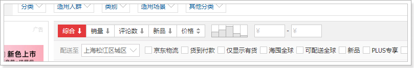
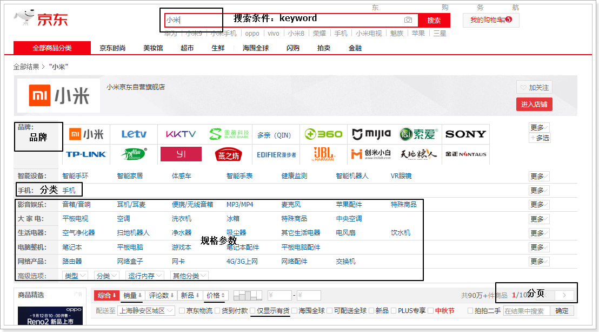

# 1. 导入商品数据

## 1.1.   搭建搜索工程


 

pom.xml内容如下：

```xml
<?xml version="1.0" encoding="UTF-8"?>
<project xmlns="http://maven.apache.org/POM/4.0.0" xmlns:xsi="http://www.w3.org/2001/XMLSchema-instance"
         xsi:schemaLocation="http://maven.apache.org/POM/4.0.0 https://maven.apache.org/xsd/maven-4.0.0.xsd">
    <modelVersion>4.0.0</modelVersion>
    <parent>
        <groupId>org.springframework.boot</groupId>
        <artifactId>spring-boot-starter-parent</artifactId>
        <version>2.1.8.RELEASE</version>
        <relativePath/> <!-- lookup parent from repository -->
    </parent>
    <groupId>com.atguigu</groupId>
    <artifactId>gmall-search</artifactId>
    <version>0.0.1-SNAPSHOT</version>
    <name>gmall-search</name>
    <description>谷粒商城搜索系统</description>

    <properties>
        <java.version>1.8</java.version>
        <spring-cloud.version>Greenwich.SR2</spring-cloud.version>
    </properties>

    <dependencies>
        <dependency>
            <groupId>com.atguigu</groupId>
            <artifactId>gmall-core</artifactId>
            <version>1.0-SNAPSHOT</version>
            <exclusions>
                <exclusion>
                    <groupId>com.baomidou</groupId>
                    <artifactId>mybatis-plus-boot-starter</artifactId>
                </exclusion>
                <exclusion>
                    <groupId>com.baomidou</groupId>
                    <artifactId>mybatis-plus</artifactId>
                </exclusion>
            </exclusions>
        </dependency>
        <dependency>
            <groupId>org.springframework.boot</groupId>
            <artifactId>spring-boot-starter-actuator</artifactId>
        </dependency>
        <dependency>
            <groupId>org.springframework.boot</groupId>
            <artifactId>spring-boot-starter-web</artifactId>
        </dependency>
        <dependency>
            <groupId>io.searchbox</groupId>
            <artifactId>jest</artifactId>
            <version>6.3.1</version>
        </dependency>
        <dependency>
            <groupId>org.elasticsearch</groupId>
            <artifactId>elasticsearch-core</artifactId>
            <version>6.8.3</version>
        </dependency>
        <dependency>
            <groupId>org.springframework.cloud</groupId>
            <artifactId>spring-cloud-starter-openfeign</artifactId>
        </dependency>

        <dependency>
            <groupId>org.springframework.boot</groupId>
            <artifactId>spring-boot-starter-test</artifactId>
            <scope>test</scope>
        </dependency>
    </dependencies>

    <dependencyManagement>
        <dependencies>
            <dependency>
                <groupId>org.springframework.cloud</groupId>
                <artifactId>spring-cloud-dependencies</artifactId>
                <version>${spring-cloud.version}</version>
                <type>pom</type>
                <scope>import</scope>
            </dependency>
        </dependencies>
    </dependencyManagement>

    <build>
        <plugins>
            <plugin>
                <groupId>org.springframework.boot</groupId>
                <artifactId>spring-boot-maven-plugin</artifactId>
            </plugin>
        </plugins>
    </build>

</project>
```

bootstrap.properties:

```properties
# 简化配置如下，完整配置请参考之前的工程
spring.cloud.nacos.config.server-addr=127.0.0.1:8848
spring.application.name=search-service
```

application.properties:

```properties
server.port=8086
spring.cloud.nacos.discovery.server-addr=127.0.0.1:8848
spring.elasticsearch.jest.uris=http://172.16.116.100:9200
```

GmallSearchApplication.java引导类：

```java
@SpringBootApplication
@EnableDiscoveryClient
@EnableFeignClients
public class GmallSearchApplication {

    public static void main(String[] args) {
        SpringApplication.run(GmallSearchApplication.class, args);
    }

}
```


## 1.2.   构建es数据模型

接下来，我们需要商品数据导入索引库，便于用户搜索。

那么问题来了，我们有SPU和SKU，到底如何保存到索引库？

先看京东搜索，输入“小米”搜索：


可以看到每条记录就是一个sku，再来看看每条记录需要哪些字段：

 

直观能看到：sku的默认图片、sku的价格、标题、skuId



排序及筛选字段：综合、新品、销量、价格、库存（是否有货）等


聚合字段：品牌、分类、搜索规格参数（多个）


最终可以构建一个GoodsVO对象：（注意属性名需要提前和前端约定好，不能随便改）

```java
@Data
public class GoodsVO {
    private Long id;  //skuId
    private Long brandId; //品牌id
    private String brandName;  //品牌名
    private Long productCategoryId;  //sku的分类id
    private String productCategoryName; //sku的名字


    private String pic; //sku的默认图片
    private String name;//这是需要检索的sku的标题
    private BigDecimal price;//sku-price；
    private Integer sale;//sku-sale 销量
    private Long stock;//sku-stock 库存
    private Integer sort;//排序分 热度分

    //保存当前sku所有需要检索的属性；
    //检索属性来源于spu的基本属性中的search_type=1（销售属性都已经拼接在标题中了）
    private List<SpuAttributeValueVO> attrValueList;//检索属性
}
```

搜索规格参数：SpuAttributeValueVO

```java
@Data
public class SpuAttributeValueVO {

    private Long id;  //商品和属性关联的数据表的主键id
    private Long productAttributeId; //当前sku对应的属性的attr_id
    private String name;//属性名  电池
    private String value;//3G   3000mah
    private Long spuId;//这个属性关系对应的spu的id
}
```


## 1.3.   批量导入

### 1.3.1.   数据接口

索引库中的数据来自于数据库，我们不能直接去查询商品的数据库，因为真实开发中，每个微服务都是相互独立的，包括数据库也是一样。所以我们只能调用商品微服务提供的接口服务。

先思考我们需要的数据：

- 分页查询已上架的SPU信息
- 根据SpuId查询对应的SKU信息（接口已写好）
- 根据分类id查询商品分类（逆向工程已自动生成）
- 根据品牌id查询品牌（逆向工程已自动生成）
- 根据skuid查询库存（gmall-wms中接口已写好）
- 根据spuId查询检索规格参数及值

大部分接口之前已经编写完成，接下来开发接口：


#### 1.3.1.1.   分页查询已上架SPU

在gmall-pms的SpuInfoController中添加方法：

```java
    @ApiOperation("分页查询已发布spu商品信息")
    @PostMapping("{status}")
    public Resp<List<SpuInfoEntity>> querySpuInfoByStatus(@RequestBody QueryCondition condition, @PathVariable("status")Integer status){

        IPage<SpuInfoEntity> spuInfoEntityIPage = this.spuInfoService.page(new Query<SpuInfoEntity>().getPage(condition), new QueryWrapper<SpuInfoEntity>().eq("publish_status", status));
        return Resp.ok(spuInfoEntityIPage.getRecords());
    }
```


#### 1.3.1.2.    根据spuId查询检索属性及值

在gmall-pms的ProductAttrValueController中添加方法：

```java
    @ApiOperation("根据spuId查询检索属性及值")
    @GetMapping("/{spuId}")
    public Resp<List<ProductAttrValueEntity>> querySearchAttrValue(@PathVariable("spuId")Long spuId){
        List<ProductAttrValueEntity> productAttrValueEntities = productAttrValueService.querySearchAttrValue(spuId);

        return Resp.ok(productAttrValueEntities);
    }
```

在ProductAttrValueService中添加接口方法：

```java
List<ProductAttrValueEntity> querySearchAttrValue(Long spuId);
```

在实现类ProductAttrValueServiceImpl中添加实现方法：

```java
@Autowired
ProductAttrValueDao productAttrValueDao;

@Override
public List<ProductAttrValueEntity> querySearchAttrValue(Long spuId) {

    List<ProductAttrValueEntity> productAttrValueEntities = this.productAttrValueDao.querySearchAttrValue(spuId);
    return productAttrValueEntities;
}
```

在ProductAttrValueDao接口中添加接口方法：

```java
@Mapper
public interface ProductAttrValueDao extends BaseMapper<ProductAttrValueEntity> {

    List<ProductAttrValueEntity> querySearchAttrValue(Long spuId);
}
```

在ProductAttrValueDao对应的映射文件中添加配置：

```xml
<select id="querySearchAttrValue" resultMap="productAttrValueMap">
    select a.id,a.attr_id,a.attr_name,a.attr_value,a.spu_id
    from pms_product_attr_value a INNER JOIN pms_attr b on a.attr_id=b.attr_id
    where a.spu_id=#{spuId} and b.search_type=1
</select>
```


### 1.3.2.   编写接口工程

参考gmall-sms-interface，创建gmall-pms-interface及gmall-wms-interface

 

 


把gmall-wms和gmall-pms这两个工程中对应的entity都copy过来，方便通用。原先工程对应的entity就不用了，例如gmall-pms：

 

这时，gmall-pms的pom.xml中需要引入gmall-pms-interface的依赖。gmall-wms也是相同的处理方式。


GmallPmsApi：

```java
public interface GmallPmsApi {

    @GetMapping("pms/brand/info/{brandId}")
    public Resp<BrandEntity> info(@PathVariable("brandId") Long brandId);

    @GetMapping("pms/category/info/{catId}")
    public Resp<CategoryEntity> catInfo(@PathVariable("catId") Long catId);

    @GetMapping("pms/productattrvalue/{spuId}")
    public Resp<List<ProductAttrValueEntity>> querySearchAttrValue(@PathVariable("spuId")Long spuId);

    @GetMapping("pms/skuinfo/{spuId}")
    public Resp<List<SkuInfoEntity>> querySkuBySpuId(@PathVariable("spuId")Long spuId);

    @PostMapping("pms/spuinfo/{status}")
    public Resp<List<SpuInfoEntity>> querySpuInfoByStatus(@RequestBody QueryCondition condition, @PathVariable("status")Integer status);
}
```

GmallWmsApi：

```java
public interface GmallWmsApi {

    @GetMapping("wms/waresku/{skuId}")
    public Resp<List<WareSkuEntity>> queryWareSkuBySkuId(@PathVariable("skuId")Long skuId);
}
```


### 1.3.3.   es数据映射

```json
PUT /goods
{
  "mappings" : {
    "info" : {
      "properties" : {
        "attrValueList" : {
          "type": "nested",
          "properties" : {
            "id" : {
              "type" : "long"
            },
            "name" : {
              "type" : "keyword"
            },
            "productAttributeId" : {
              "type" : "long"
            },
            "spuId" : {
              "type" : "long"
            },
            "value" : {
              "type" : "keyword"
            }
          }
        },
        "brandId" : {
          "type" : "long"
        },
        "brandName" : {
          "type" : "keyword"
        },
        "id" : {
          "type" : "long"
        },
        "name" : {
          "type" : "text",
          "analyzer": "ik_max_word"
        },
        "pic" : {
          "type" : "keyword"
        },
        "price" : {
          "type" : "long"
        },
        "productCategoryId" : {
          "type" : "long"
        },
        "productCategoryName" : {
          "type" : "keyword"
        },
        "sale" : {
          "type" : "long"
        },
        "sort" : {
          "type" : "long"
        }
      }
    }
  }
}
```

"type": "nested" 

嵌套结构，防止数据扁平化问题。

参照官方文档：https://www.elastic.co/guide/cn/elasticsearch/guide/current/nested-objects.html


### 1.3.4.   数据导入

在gmall-search中引入依赖：

```xml
<dependency>
    <groupId>com.atguigu</groupId>
    <artifactId>gmall-pms-interface</artifactId>
    <version>0.0.1-SNAPSHOT</version>
</dependency>
<dependency>
    <groupId>com.atguigu</groupId>
    <artifactId>gmall-wms-interface</artifactId>
    <version>0.0.1-SNAPSHOT</version>
</dependency>
```

在gmall-search中添加feign接口：

 

GmallPmsFeign：

```java
@FeignClient("pms-service")
public interface GmallPmsFeign extends GmallPmsApi {

}
```

GmallWmsFeign：

```java
@FeignClient("wms-service")
public interface GmallWmsFeign extends GmallWmsApi {
}
```

由于数据导入只需导入一次，这里就写一个测试用例。后续索引库和数据库的数据同步，通过程序自身来维护。

在测试用例中导入数据：

```java
@RunWith(SpringRunner.class)
@SpringBootTest
public class GmallSearchApplicationTests {

    @Autowired
    JestClient jestClient;

    @Autowired
    private GmallPmsFeign gmallPmsFeign;

    @Autowired
    private GmallWmsFeign gmallWmsFeign;

    @Test
    public void importData() throws IOException {

        //System.out.println(gmallPmsFeign.info(7l));
        Long pageSize = 100l;
        Long page = 1l;
        do {
            // 分页查询已上架商品，即spu中publish_status=1的商品
            QueryCondition queryCondition = new QueryCondition();
            queryCondition.setPage(1l);
            queryCondition.setLimit(10l);
            Resp<List<SpuInfoEntity>> resp = this.gmallPmsFeign.querySpuInfoByStatus(queryCondition, 1);
            System.out.println(resp);
            List<SpuInfoEntity> spuInfoEntities = resp.getData();
            // 当前页的记录数
            pageSize = (long)spuInfoEntities.size();

            spuInfoEntities.forEach(spuInfoEntity -> {
                Resp<List<SkuInfoEntity>> skuInfoResp = this.gmallPmsFeign.querySkuBySpuId(spuInfoEntity.getId());
                List<SkuInfoEntity> skuInfoEntities = skuInfoResp.getData();
                if (!CollectionUtils.isEmpty(skuInfoEntities)){
                    skuInfoEntities.forEach(skuInfoEntity -> {
                        GoodsVO goodsVO = new GoodsVO();
                        goodsVO.setId(skuInfoEntity.getSkuId());
                        goodsVO.setName(skuInfoEntity.getSkuName());
                        goodsVO.setPic(skuInfoEntity.getSkuDefaultImg());
                        goodsVO.setPrice(skuInfoEntity.getPrice());
                        goodsVO.setSale(0); // 销量，数据库暂没设计
                        goodsVO.setSort(0);
                        // 设置库存
                        Resp<List<WareSkuEntity>> wareSkuResp = this.gmallWmsFeign.queryWareSkuBySkuId(skuInfoEntity.getSkuId());
                        List<WareSkuEntity> wareSkuEntities = wareSkuResp.getData();
                        if (!CollectionUtils.isEmpty(wareSkuEntities)) {
                            long sum = wareSkuEntities.stream().mapToLong(WareSkuEntity::getSkuId).sum();
                            goodsVO.setStock(sum);
                        }
                        // 设置品牌
                        goodsVO.setBrandId(skuInfoEntity.getBrandId());
                        if (skuInfoEntity.getBrandId() != null) {
                            Resp<BrandEntity> brandEntityResp = this.gmallPmsFeign.info(skuInfoEntity.getBrandId());
                            if (brandEntityResp.getData() != null) {
                                goodsVO.setBrandName(brandEntityResp.getData().getName());
                            }
                        }
                        // 设置分类
                        goodsVO.setProductCategoryId(skuInfoEntity.getCatalogId());
                        if (skuInfoEntity.getCatalogId() != null) {
                            Resp<CategoryEntity> categoryEntityResp = this.gmallPmsFeign.catInfo(skuInfoEntity.getCatalogId());
                            if (categoryEntityResp.getData() != null) {
                                goodsVO.setProductCategoryName(categoryEntityResp.getData().getName());
                            }
                        }
                        // 设置搜索的规格属性
                        Resp<List<ProductAttrValueEntity>> listResp = this.gmallPmsFeign.querySearchAttrValue(spuInfoEntity.getId());
                        if (!CollectionUtils.isEmpty(listResp.getData())) {
                            List<SpuAttributeValueVO> spuAttributeValueVOS = listResp.getData().stream().map(productAttrValueEntity -> {
                                SpuAttributeValueVO spuAttributeValueVO = new SpuAttributeValueVO();
                                spuAttributeValueVO.setId(productAttrValueEntity.getId());
                                spuAttributeValueVO.setName(productAttrValueEntity.getAttrName());
                                spuAttributeValueVO.setValue(productAttrValueEntity.getAttrValue());
                                spuAttributeValueVO.setProductAttributeId(productAttrValueEntity.getAttrId());
                                spuAttributeValueVO.setSpuId(productAttrValueEntity.getSpuId());
                                return spuAttributeValueVO;
                            }).collect(Collectors.toList());
                            goodsVO.setAttrValueList(spuAttributeValueVOS);
                        }
                        Index action = new Index.Builder(goodsVO).index("goods").type("info").id(skuInfoEntity.getSkuId().toString()).build();
                        try {
                            jestClient.execute(action);
                        } catch (IOException e) {
                            e.printStackTrace();
                        }
                    });
                }
            });
            
            page++;
        } while (pageSize == 100); // 当前页记录数不等于100，则退出循环

    }

}
```


# 2. 基本检索

前端根据用户输入的查询、过滤、排序、分页条件等，后台生成DSL，查询出最终结果响应给前端，渲染页面展示给用户。

## 2.1.   编写完整的DSL

```json
GET /goods/_search
{
  "query": {
    "bool": {
      "must": [
        {
          "match": {
            "name": {
              "query": "xxxx",
              "operator": "and"
            }
          }
        }
      ],
      "filter": [
        {
          "nested": {
            "path": "attrValueList",
            "query": {
              "bool": {
                "must": [
                  {
                    "term": {
                      "attrValueList.productAttributeId": {
                        "value": "33"
                      }
                    }
                  },
                  {
                    "terms": {
                      "attrValueList.value": ["3000","4000","5000"]
                    }
                  }
                ]
              }
            }
          }
        },
        {
          "nested": {
            "path": "attrValueList",
            "query": {
              "bool": {
                "must": [
                  {
                    "term": {
                      "attrValueList.productAttributeId": {
                        "value": "34"
                      }
                    }
                  },
                  {
                    "term": {
                      "attrValueList.value": {
                        "value": "5"
                      }
                    }
                  }
                ]
              }
            }
          }
        },
        {
          "terms": {
            "brandId": [7]
          }
        },
        {
          "terms": {
            "productCategoryId": [225]
          }
        },
        {
          "range": {
            "price": {
              "gte": 0,
              "lte": 10000
            }
          }
        }
      ]
    }
  },
  "from": 0,
  "size": 10,
  "highlight": {
    "fields": {
      "name": {}
    },
    "pre_tags": "<b style='color:red'>",
    "post_tags": "</b>"
  },
  "sort": [
    {
      "price": {
        "order": "desc"
      }
    }
  ],
  "aggs": {
    "attr_agg": {
      "nested": {
        "path": "attrValueList"
      },
      "aggs": {
        "attrId_agg": {
          "terms": {
            "field": "attrValueList.productAttributeId"
          },
          "aggs": {
            "attrName": {
              "terms": {
                "field": "attrValueList.name"
              }
            },
            "attrValue": {
              "terms": {
                "field": "attrValueList.value"
              }
            }
          }
        }
      }
    },
    "brandId": {
      "terms": {
        "field": "brandId"
      },
      "aggs": {
        "brandName": {
          "terms": {
            "field": "brandName"
          }
        }
      }
    },
    "categoryId": {
      "terms": {
        "field": "productCategoryId"
      },
      "aggs": {
        "categoryName": {
          "terms": {
            "field": "productCategoryName"
          }
        }
      }
    }
  }
}
```


## 2.2.   封装前端检索条件

参照京东：



结合课前资料中的接口文档《前端商城接口文档.md》，设计模型如下

 

内容：

```java
@Data
public class SearchParamVO {

    // search?catelog3=手机&catelog3=配件&brand=1&props=43:3g-4g-5g&props=45:4.7-5.0
    // &order=2:asc/desc&priceFrom=100&priceTo=10000&pageNum=1&pageSize=12&keyword=手机
    private String[] catelog3;//三级分类id

    private String[] brand;//品牌id

    private String keyword;//检索的关键字

    // order=1:asc  排序规则   0:asc
    private String order;// 0：综合排序  1：销量  2：价格

    private Integer pageNum = 1;//分页信息

    //props=2:全高清&  如果前端想传入很多值    props=2:青年-老人-女士

    //2:win10-android-
    //3:4g
    //4:5.5
    private String[] props;//页面提交的数组

    private Integer pageSize = 12;

    private Integer priceFrom;//价格区间开始
    private Integer priceTo;//价格区间结束
}
```


## 2.3.   搜索的业务逻辑

 

SearchController：

```java
@RequestMapping("search")
@RestController
public class SearchController {

    @Autowired
    private SearchService searchService;

    @GetMapping
    public Resp<Object> search(SearchParamVO searchParamVO){

        this.searchService.search(searchParamVO);

        return Resp.ok(null);
    }
}
```

SearchService：

```java
public interface SearchService {

    void search(SearchParamVO searchParamVO);
}
```

SearchServiceImpl：

```java
@Service
public class SearchServiceImpl implements SearchService {

    @Autowired
    private JestClient jestClient;

    @Override
    public void search(SearchParamVO searchParamVO) {
        // 构建查询条件
        String query = buildDslQuery(searchParamVO);
        Search action = new Search.Builder(query).addIndex("goods").addType("info").build();
        try {
            // 执行搜索，获取搜索结果集
            SearchResult result = this.jestClient.execute(action);

            // 解析结果集并响应
            System.out.println(result.toString());

        } catch (IOException e) {
            e.printStackTrace();
        }
    }

    private String buildDslQuery(SearchParamVO searchParamVO) {
        // 搜索条件构建器，辅助构建dsl语句
        SearchSourceBuilder sourceBuilder = new SearchSourceBuilder();

        // 1.查询及过滤条件
        BoolQueryBuilder boolQueryBuilder = QueryBuilders.boolQuery();
        sourceBuilder.query(boolQueryBuilder);
        if (StringUtils.isNotBlank(searchParamVO.getKeyword())) {
            boolQueryBuilder.must(QueryBuilders.matchQuery("name", searchParamVO.getKeyword()).operator(Operator.AND));
        }
        // 属性过滤 2:win10-android-ios   3:4g	   4:5.5
        String[] props = searchParamVO.getProps();
        if (props != null && props.length > 0) {
            for (String prop : props) {
                String[] attr = StringUtils.split(prop, ":");
                if (attr == null || attr.length != 2){
                    continue;
                }
                BoolQueryBuilder boolQuery = QueryBuilders.boolQuery();
                boolQuery.must(QueryBuilders.termQuery("attrValueList.productAttributeId", attr[0]));
                boolQuery.must(QueryBuilders.termsQuery("attrValueList.value", attr[1].split("-")));
                NestedQueryBuilder nestedQuery = QueryBuilders.nestedQuery("attrValueList", boolQuery, ScoreMode.None);
                boolQueryBuilder.filter(nestedQuery);
            }
        }

        // 品牌过滤
        String[] brands = searchParamVO.getBrand();
        if (brands != null && brands.length > 0) {
            boolQueryBuilder.filter(QueryBuilders.termsQuery("brandId", brands));
        }

        // 分类过滤
        String[] catelog3 = searchParamVO.getCatelog3();
        if (catelog3 != null && catelog3.length > 0){
            boolQueryBuilder.filter(QueryBuilders.termsQuery("productCategoryId", catelog3));
        }

        // 价格范围过滤
        Integer priceFrom = searchParamVO.getPriceFrom();
        Integer priceTo = searchParamVO.getPriceTo();
        RangeQueryBuilder rangeQueryBuilder = QueryBuilders.rangeQuery("price");
        if (priceFrom != null) {
            rangeQueryBuilder.gte(priceFrom);
        }
        if (priceTo != null) {
            rangeQueryBuilder.lte(priceTo);
        }

        // 2.分页条件
        int start = (searchParamVO.getPageNum() - 1) * searchParamVO.getPageSize();
        sourceBuilder.from(start);
        sourceBuilder.size(searchParamVO.getPageSize());

        // 3.高亮
        if (searchParamVO.getKeyword() != null) {
            sourceBuilder.highlighter(new HighlightBuilder().field("name").preTags("<em style='color: red'>").postTags("<em>"));
        }

        // 4.排序 0：综合排序  1：销量  2：价格 order=1:asc
        String order = searchParamVO.getOrder();
        if (order != null) {
            String[] orderParams = StringUtils.split(order, ":");
            SortOrder sortOrder = StringUtils.equals("asc", orderParams[1]) ? SortOrder.ASC : SortOrder.DESC;
            if (orderParams != null && orderParams.length == 2) {
                switch (orderParams[0]){
                    case "0": sourceBuilder.sort("_source", sortOrder);
                    case "1": sourceBuilder.sort("sale", sortOrder);
                    case "2": sourceBuilder.sort("price", sortOrder);
                    default: break;
                }
            }
        }

        // 5.属性聚合（嵌套聚合）
        NestedAggregationBuilder nestedAgg = AggregationBuilders.nested("attr_agg", "attrValueList");
        // 外层聚合出属性id，terms是聚合名称，field-聚合字段
        TermsAggregationBuilder attrIdAgg = AggregationBuilders.terms("attrId_agg").field("attrValueList.productAttributeId");
        nestedAgg.subAggregation(attrIdAgg); // 添加子聚合
        // 聚合出属性名
        attrIdAgg.subAggregation(AggregationBuilders.terms("attrName").field("attrValueList.name"));
        // 聚合出属性值
        attrIdAgg.subAggregation(AggregationBuilders.terms("attrValue").field("attrValueList.value"));
        sourceBuilder.aggregation(nestedAgg);

        // 品牌聚合
        TermsAggregationBuilder BrandAgg = AggregationBuilders.terms("brandId").field("brandId")
                .subAggregation(AggregationBuilders.terms("brandName").field("brandName"));
        sourceBuilder.aggregation(BrandAgg);

        // 分类聚合
        TermsAggregationBuilder categoryAgg = AggregationBuilders.terms("categoryId").field("productCategoryId")
                .subAggregation(AggregationBuilders.terms("categoryName").field("productCategoryName"));
        sourceBuilder.aggregation(categoryAgg);

        return sourceBuilder.toString();
    }

    public static void main(String[] args) {
        SearchParamVO searchParamVO = new SearchParamVO();
        searchParamVO.setKeyword("xxxx");
        searchParamVO.setBrand(new String[]{"7"});
        searchParamVO.setCatelog3(new String[]{"225"});
        searchParamVO.setOrder("1:desc");
        searchParamVO.setPriceFrom(2000);
        searchParamVO.setPriceTo(5000);
        System.out.println(new SearchServiceImpl().buildDslQuery(searchParamVO));
    }

}
```


## 2.4.   响应的数据模型

虽然实现了搜索的业务过程，但是，还没有对搜索后的结果进行封装。首先响应数据的数据模型参考笔记目录下的


copy到gmall-search工程的vo包下：

 


## 2.5.   完成搜索功能

封装之前，先启动搜索微服务，并在RestClient工具（例如：Postman）中访问，看看控制台打印的搜索结果

在地址栏访问：输入一个有数据的关键字条件


打印出的结果：放到`jsonviewer`工具查看，发现数据结构跟kibana几乎一模一样。直接参考kibana即可完成对数据的封装。


最终完成代码，如下

SearchController：

```java
@RequestMapping("search")
@RestController
public class SearchController {

    @Autowired
    private SearchService searchService;

    @GetMapping
    public SearchResponse search(SearchParamVO searchParamVO){

        SearchResponse searchResponse = this.searchService.search(searchParamVO);

        return searchResponse;
    }
}
```

SearchService：

```java
public interface SearchService {

    SearchResponse search(SearchParamVO searchParamVO);

}
```

SearchServiceImpl：

```java
@Service
public class SearchServiceImpl implements SearchService {

    @Autowired
    private JestClient jestClient;

    @Override
    public SearchResponse search(SearchParamVO searchParamVO) {
        // 构建查询条件
        String query = buildDslQuery(searchParamVO);
        Search action = new Search.Builder(query).addIndex("goods").addType("info").build();
        try {
            // 执行搜索，获取搜索结果集
            SearchResult result = this.jestClient.execute(action);

            // 解析结果集并响应
            System.out.println(result.toString());
            SearchResponse response = buildSearchResult(result);
            response.setPageNum(searchParamVO.getPageNum()); // 页码
            response.setPageSize(searchParamVO.getPageSize()); // 每页大小
            response.setTotal(result.getTotal()); // 总记录数

            return response;
        } catch (IOException e) {
            e.printStackTrace();
        }
        return null;
    }

    private SearchResponse buildSearchResult(SearchResult result) {
        SearchResponse response = new SearchResponse();

        // 1.解析查询的记录结果
        List<SearchResult.Hit<GoodsVO, Void>> hits = result.getHits(GoodsVO.class);
        List<GoodsVO> goodsVOList = hits.stream().map(hit -> hit.source).collect(Collectors.toList());
        response.setProducts(goodsVOList);

        // 2. 解析聚合结果集
        // 筛选属性
        MetricAggregation aggregations = result.getAggregations();
        // 属性子聚合
        ChildrenAggregation attrAgg = aggregations.getChildrenAggregation("attr_agg");
        // 属性id聚合
        TermsAggregation attrIdAgg = attrAgg.getTermsAggregation("attrId_agg");
        // 遍历id聚合桶
        List<SearchResponseAttrVO> attrVOs = attrIdAgg.getBuckets().stream().map(bucket -> {
            SearchResponseAttrVO searchResponseAttrVO = new SearchResponseAttrVO();
            // 属性id
            searchResponseAttrVO.setProductAttributeId(Long.valueOf(bucket.getKeyAsString()));

            // 获取属性名子聚合
            TermsAggregation attrNameAgg = bucket.getTermsAggregation("attrName");
            // 从属性名子聚合中获取属性名
            searchResponseAttrVO.setName(attrNameAgg.getBuckets().get(0).getKeyAsString());

            // 获取属性值子聚合
            TermsAggregation attrValueAgg = bucket.getTermsAggregation("attrValue");
            List<String> values = attrValueAgg.getBuckets().stream().map(b -> b.getKeyAsString()).collect(Collectors.toList());
            // 设置属性值
            searchResponseAttrVO.setValue(values);

            return searchResponseAttrVO;
        }).collect(Collectors.toList());
        response.setAttrs(attrVOs);

        // 封装品牌 TODO
        SearchResponseAttrVO brand = new SearchResponseAttrVO();
        response.setBrand(brand);

        // 封装分类 TODO
        response.setCatelog(new SearchResponseAttrVO());

        return response;
    }

    private String buildDslQuery(SearchParamVO searchParamVO) {
        // 搜索条件构建器，辅助构建dsl语句
        SearchSourceBuilder sourceBuilder = new SearchSourceBuilder();

        // 1.查询及过滤条件
        BoolQueryBuilder boolQueryBuilder = QueryBuilders.boolQuery();
        sourceBuilder.query(boolQueryBuilder);
        if (StringUtils.isNotBlank(searchParamVO.getKeyword())) {
            boolQueryBuilder.must(QueryBuilders.matchQuery("name", searchParamVO.getKeyword()).operator(Operator.AND));
        }
        // 属性过滤 2:win10-android-ios   3:4g	   4:5.5
        String[] props = searchParamVO.getProps();
        if (props != null && props.length > 0) {
            for (String prop : props) {
                String[] attr = StringUtils.split(prop, ":");
                if (attr == null || attr.length != 2){
                    continue;
                }
                BoolQueryBuilder boolQuery = QueryBuilders.boolQuery();
                boolQuery.must(QueryBuilders.termQuery("attrValueList.productAttributeId", attr[0]));
                boolQuery.must(QueryBuilders.termsQuery("attrValueList.value", attr[1].split("-")));
                NestedQueryBuilder nestedQuery = QueryBuilders.nestedQuery("attrValueList", boolQuery, ScoreMode.None);
                boolQueryBuilder.filter(nestedQuery);
            }
        }

        // 封装品牌 TODO
        SearchResponseAttrVO brand = new SearchResponseAttrVO();
        response.setBrand(brand);
        brand.setName("品牌"); // 品牌时 name-就是“品牌”
        // value：[{id:100,name:华为},{id:101,name:小米}]
        TermsAggregation brandIdAgg = aggregations.getTermsAggregation("brandId");
        // 获取品牌id聚合结果，并遍历桶
        List<String> brandValue = brandIdAgg.getBuckets().stream().map(b -> {
            Map<String, String> map = new HashMap<>();
            // 桶的key就是品牌的id
            map.put("id", b.getKeyAsString());
            // 子聚合得出品牌
            map.put("name", b.getTermsAggregation("brandName").getBuckets().get(0).getKeyAsString());
            // 把map转化成json字符串
            return JSON.toJSONString(map);
        }).collect(Collectors.toList());
        brand.setValue(brandValue);

        // 封装分类，类似于品牌
        SearchResponseAttrVO category = new SearchResponseAttrVO();
        response.setCatelog(category);
        category.setName("分类");
        TermsAggregation categoryIdAgg = aggregations.getTermsAggregation("categoryId");
        List<String> categoryValue = categoryIdAgg.getBuckets().stream().map(b -> {
            Map<String, String> map = new HashMap<>();
            // 桶的key就是品牌的id
            map.put("id", b.getKeyAsString());
            // 子聚合得出品牌
            map.put("name", b.getTermsAggregation("categoryName").getBuckets().get(0).getKeyAsString());
            // 把map转化成json字符串
            return JSON.toJSONString(map);
        }).collect(Collectors.toList());
        category.setValue(categoryValue);

        // 价格范围过滤
        Integer priceFrom = searchParamVO.getPriceFrom();
        Integer priceTo = searchParamVO.getPriceTo();
        RangeQueryBuilder rangeQueryBuilder = QueryBuilders.rangeQuery("price");
        if (priceFrom != null) {
            rangeQueryBuilder.gte(priceFrom);
        }
        if (priceTo != null) {
            rangeQueryBuilder.lte(priceTo);
        }

        // 2.分页条件
        int start = (searchParamVO.getPageNum() - 1) * searchParamVO.getPageSize();
        sourceBuilder.from(start);
        sourceBuilder.size(searchParamVO.getPageSize());

        // 3.高亮
        if (searchParamVO.getKeyword() != null) {
            sourceBuilder.highlighter(new HighlightBuilder().field("name").preTags("<em style='color: red'>").postTags("<em>"));
        }

        // 4.排序 0：综合排序  1：销量  2：价格 order=1:asc
        String order = searchParamVO.getOrder();
        if (order != null) {
            String[] orderParams = StringUtils.split(order, ":");
            SortOrder sortOrder = StringUtils.equals("asc", orderParams[1]) ? SortOrder.ASC : SortOrder.DESC;
            if (orderParams != null && orderParams.length == 2) {
                switch (orderParams[0]){
                    case "0": sourceBuilder.sort("_source", sortOrder);
                    case "1": sourceBuilder.sort("sale", sortOrder);
                    case "2": sourceBuilder.sort("price", sortOrder);
                    default: break;
                }
            }
        }

        // 5.属性聚合（嵌套聚合）
        NestedAggregationBuilder nestedAgg = AggregationBuilders.nested("attr_agg", "attrValueList");
        // 外层聚合出属性id，terms是聚合名称，field-聚合字段
        TermsAggregationBuilder attrIdAgg = AggregationBuilders.terms("attrId_agg").field("attrValueList.productAttributeId");
        nestedAgg.subAggregation(attrIdAgg); // 添加子聚合
        // 聚合出属性名
        attrIdAgg.subAggregation(AggregationBuilders.terms("attrName").field("attrValueList.name"));
        // 聚合出属性值
        attrIdAgg.subAggregation(AggregationBuilders.terms("attrValue").field("attrValueList.value"));
        sourceBuilder.aggregation(nestedAgg);

        // 品牌聚合
        TermsAggregationBuilder BrandAgg = AggregationBuilders.terms("brandId").field("brandId")
                .subAggregation(AggregationBuilders.terms("brandName").field("brandName"));
        sourceBuilder.aggregation(BrandAgg);

        // 分类聚合
        TermsAggregationBuilder categoryAgg = AggregationBuilders.terms("categoryId").field("productCategoryId")
                .subAggregation(AggregationBuilders.terms("categoryName").field("productCategoryName"));
        sourceBuilder.aggregation(categoryAgg);

        return sourceBuilder.toString();
    }

    public static void main(String[] args) {
        SearchParamVO searchParamVO = new SearchParamVO();
        searchParamVO.setKeyword("xxxx");
        searchParamVO.setBrand(new String[]{"7"});
        searchParamVO.setCatelog3(new String[]{"225"});
        searchParamVO.setOrder("1:desc");
        searchParamVO.setPriceFrom(2000);
        searchParamVO.setPriceTo(5000);
        System.out.println(new SearchServiceImpl().buildDslQuery(searchParamVO));
    }

}
```


# 3. 门户前端

课前资料/前端工程/gmall-shop.zip，就是谷粒商城前端页面。启动效果如下：


把压缩包解压的特定目录下：


打开cmd窗口，进入gmall-shop根目录下，执行如下命令：

```shell
npm install
npm start
```

即可启动成功。

启动成功后，访问：http://localhost:2000/即可看到页面效果。要使用搜索框功能，要注意

前端发送的请求路径：http://localhost:8888/api/search?keyword=xxxx

也就是说前端会通过网关访问search工程，并给请求路径前都添加了/api前缀。所以网关工程要添加配置：

```yml
server:
  port: 8888
spring:
  cloud:
    nacos:
      discovery:
        server-addr: 127.0.0.1:8848
    gateway:
      routes: 
        - id: pms-route 
          uri: lb://pms-service
          predicates:
            - Path=/pms/**
        - id: oms-route 
          uri: lb://oms-service
          predicates:
            - Path=/oms/**
        - id: ums-route 
          uri: lb://ums-service
          predicates:
            - Path=/ums/**
        - id: wms-route 
          uri: lb://wms-service
          predicates:
            - Path=/wms/**
        - id: sms-route 
          uri: lb://sms-service
          predicates:
            - Path=/sms/**
        - id: search-route  # 搜索服务路由
          uri: lb://search-service
          predicates:
            - Path=/api/search/**
          filters:
            - RewritePath=/api/(?<segment>.*), /$\{segment} # 重写前缀，去掉/api
```

改好后，不要忘记重启网关工程。

访问搜索功能，如下：


