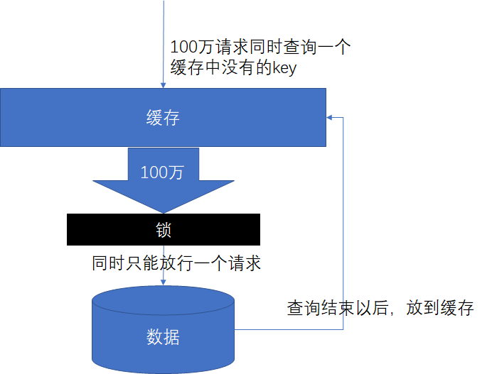
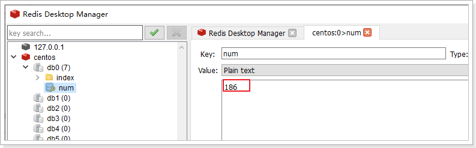
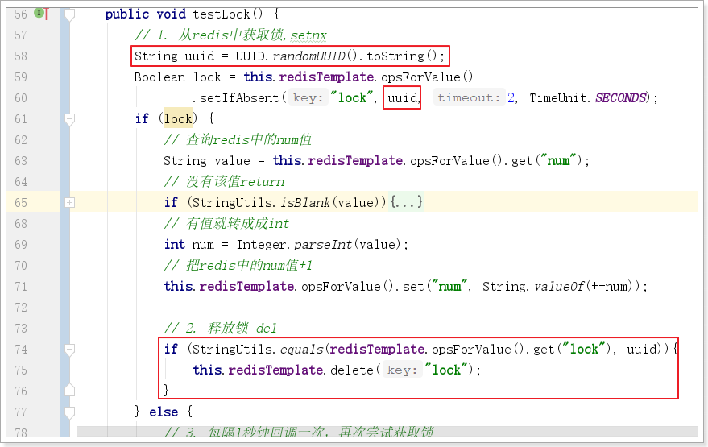

# 1. 门户首页商品分类

搜索做完之后，把目光移动首页，首页最重要的模块之一便是商品分类，商品分类也是进入商品列表，找到心仪商品的另一个主要途径。


访问谷粒商城的首页，也会发出请求获取商品分类信息：


在处理这个请求之前，首先需要搭建一个module。这个页面作为整个商城的门户入口，访问量巨大，为了方便优化扩展，需要搭建独立的系统。


## 1.1.   创建首页Module

需要重启网关


## 1.2.   获取一级分类

进入首页，首先完成一级分类的加载。


查看控制台请求结合《前端商城接口文档.md》

请求地址：/index/cates

请求方式：GET

请求参数：无

正确响应：`List<CategoryEntity>`

实现如下：

 

IndexController：

```java
@RestController
@RequestMapping("index")
public class IndexController {

    @Autowired
    private IndexService indexService;

    @GetMapping("cates")
    public Resp<List<CategoryEntity>> queryLevel1Category() {

        List<CategoryEntity> categoryEntities = this.indexService.queryLevel1Category();

        return Resp.ok(categoryEntities);
    }

}
```

IndexService：

```java
public interface IndexService {

    List<CategoryEntity> queryLevel1Category();
}
```

IndexServiceImpl：

```java
@Service
public class IndexServiceImpl implements IndexService {

    @Autowired
    private GmallPmsFeign gmallPmsFeign;

    @Override
    public List<CategoryEntity> queryLevel1Category() {
        Resp<List<CategoryEntity>> categoryResp = this.gmallPmsFeign.queryCategory(1, 0l);
        return categoryResp.getData();
    }

}
```

GmallPmsFeign：

```java
@FeignClient("pms-service")
public interface GmallPmsFeign extends GmallPmsApi {
}
```

注意：需要引入gmall-pms-interface的依赖

```xml
        <dependency>
            <groupId>com.atguigu</groupId>
            <artifactId>gmall-pms-interface</artifactId>
            <version>0.0.1-SNAPSHOT</version>
        </dependency>
```

页面效果：


## 1.3.   获取二、三级分类

对标京东：


鼠标在一级分类中移动时，会发送请求加载一级分类对应的二级分类及其下的所有三级分类。


结合接口文档：

请求地址：/index/cates/${pid}

请求方式：GET

请求参数：pid（一级分类的id）

正确响应：`List<CategoryVO>`  需要给CategoryEntity扩展一个字段subs


需要gmall-pms提供这样的接口，然后在gmall-index中调用这个接口。


### 1.3.1.   gmall-pms提供数据接口

在CategoryController中添加方法：

```java
    @ApiOperation("父id查询二级分类及其子分类")
    @GetMapping("{pid}")
    public Resp<List<CategoryEntity>> querySubCategory(@PathVariable("pid")Long pid){
        List<CategoryEntity> categoryEntityList = this.categoryService.querySubCategory(pid);
        return Resp.ok(categoryEntityList);
    }
```

CategoryService：

```java
public interface CategoryService extends IService<CategoryEntity> {

    PageVo queryPage(QueryCondition params);

    List<CategoryEntity> queryCategory(Integer level, Long parentCid);

    List<CategoryEntity> querySubCategory(Long pid);
}
```

在CategoryServiceImpl实现类中实现方法：

```java
    @Override
    public List<CategoryEntity> querySubCategory(Long pid) {
        List<CategoryEntity> categoryEntities = this.categoryDao.querySubCategory(pid);
        return categoryEntities;
    }
```

CategoryDao：

```java
@Mapper
public interface CategoryDao extends BaseMapper<CategoryEntity> {

    List<CategoryEntity> querySubCategory(Long pid);
}
```

CategoryDao.xml：

```xml
<?xml version="1.0" encoding="UTF-8"?>
<!DOCTYPE mapper PUBLIC "-//mybatis.org//DTD Mapper 3.0//EN" "http://mybatis.org/dtd/mybatis-3-mapper.dtd">

<mapper namespace="com.atguigu.gmall.pms.dao.CategoryDao">

	<!-- 可根据自己的需求，是否要使用 -->
    <resultMap type="com.atguigu.gmall.pms.entity.CategoryEntity" id="categoryMap">
        <result property="catId" column="cat_id"/>
        <result property="name" column="name"/>
        <result property="parentCid" column="parent_cid"/>
        <result property="catLevel" column="cat_level"/>
        <result property="showStatus" column="show_status"/>
        <result property="sort" column="sort"/>
        <result property="icon" column="icon"/>
        <result property="productUnit" column="product_unit"/>
        <result property="productCount" column="product_count"/>
        <collection property="subs" select="querySubCategory" column="cat_id"/>
    </resultMap>

    <select id="querySubCategory" resultMap="categoryMap">
        select * from pms_category where parent_cid = #{pid}
    </select>

</mapper>
```


测试：


### 1.3.2.   gmall-pms-interface定义api方法

在GmallPmsApi定义抽象的api接口方法

```java
@GetMapping("pms/category/{pid}")
public Resp<List<CategoryEntity>> querySubCategory(@PathVariable("pid")Long pid);
```


### 1.3.3.   gmall-index调用接口

IndexController：

```java
    @GetMapping("cates/{pid}")
    public Resp<List<CategoryEntity>> querySubCategories(@PathVariable("pid")Long pid){

        List<CategoryEntity> categoryEntities = this.indexService.querySubCategories(pid);

        return Resp.ok(categoryEntities);
    }
```

IndexService：

```java
public interface IndexService {

    List<CategoryEntity> queryLevel1Category();

    List<CategoryEntity> querySubCategories(Long pid);
}
```

IndexServiceImpl：

```java
@Override
public List<CategoryEntity> querySubCategories(Long pid) {
    Resp<List<CategoryEntity>> subCategoryResp = this.gmallPmsFeign.querySubCategory(pid);
    return subCategoryResp.getData();
}
```


重启测试：

不经过网关：


首页测试：


# 2.   缓存

首页的访问量非常大，而首页中的商品类目访问量更大，鼠标移动就在访问，查询所有的数据，如果每次访问都实时到数据库获取数据，数据库的访问压力太大。

而这些信息一般更新的频率比较低，短时间内不会发生改变。因此，我们可以考虑在前台系统中，增加一层缓存，把这些数据缓存起来，请求到来时，不再调用数据接口，而是直接读取缓存中的数据。

这样就能大大减少首页分类加载所需时间，提高并发性能。

 

加不加缓存的标准：

1. 变化频率低

2. 访问频繁

 

实现：使用Redis实现缓存。


## 2.1.   如何实现

1. **先读缓存**，缓存有，直接返回。
2. 缓存没有，**再读数据库**

写：

1. 双写模式：写数据库，写缓存

2. 失效模式：缓存失效（删除缓存），写数据库


读取缓存步骤数据一致性一般没有什么问题，但是一旦涉及到数据更新：数据库和缓存更新，就容易出现**缓存(Redis)和数据库（MySQL）间的数据一致性问题**。

不管先保存到MySQL，还是先保存到Redis都面临着一个保存成功而另外一个保存失败的情况。

不管是先写MySQL数据库，再删除Redis缓存；还是先删除缓存，再写库，都有可能出现数据不一致的情况。举一个例子：

1.如果删除了缓存Redis，还没有来得及写库MySQL，另一个线程就来读取，发现缓存为空，则去数据库中读取数据写入缓存，此时缓存中为脏数据。

2.如果先写了库，在删除缓存前，写库的线程宕机了，没有删除掉缓存，则也会出现数据不一致情况。

因为写和读是并发的，没法保证顺序,就会出现缓存和数据库的数据不一致的问题。


解决：

1. 基于mysql的binlog日志（canal）
2. 消息队列


## 2.2.   缓存的基本实现

接下来以根据父节点查询子节点演示缓存功能：

```java
@Override
public List<CategoryEntity> querySubCategories(Long pid) {
    // 从缓存中获取
    String cacheCategories = this.redisTemplate.opsForValue().get(CATEGORY_CACHE_KEY_PREFIX + pid);
    if (StringUtils.isNotBlank(cacheCategories)){
        // 如果缓存中有，直接返回
        List<CategoryEntity> categoryEntities = JSON.parseArray(cacheCategories, CategoryEntity.class);
        return categoryEntities;
    }

    // 如果缓存中没有则调用远程接口获取
    Resp<List<CategoryEntity>> subCategoryResp = this.gmallPmsFeign.querySubCategory(pid);
    List<CategoryEntity> categoryEntities = subCategoryResp.getData();

    // 把查询结果放入缓存
    this.redisTemplate.opsForValue().set(CATEGORY_CACHE_KEY_PREFIX + pid, JSON.toJSONString(cacheCategories));

    return categoryEntities;
}
```

查询一级分类的缓存功能请自行实现。


测试：


## 2.3.   缓存常见问题

缓存最常见的3个问题：

1. 缓存穿透

2. 缓存雪崩

3. 缓存击穿


**缓存穿透**是指查询一个**不存在的数据**，由于缓存无法命中，将去查询数据库，但是数据库也无此记录，并且出于容错考虑，我们没有将这次查询的null写入缓存，这将导致这个不存在的数据每次请求都要到存储层去查询，失去了缓存的意义。在流量大时，可能DB就挂掉了，要是有人利用不存在的key频繁攻击我们的应用，这就是**漏洞**。

解决：空结果也进行缓存，但它的过期时间会很短，最长不超过五分钟。


**缓存雪崩**是指在我们设置缓存时采用了**相同的过期时间**，导致缓存在某一时刻同时失效，请求全部转发到DB，DB瞬时压力过重雪崩。

解决：原有的失效时间基础上增加一个随机值，比如1-5分钟随机，这样每一个缓存的过期时间的重复率就会降低，就很难引发集体失效的事件。


**缓存击穿**是指对于一些设置了过期时间的key，如果这些key可能会在某些时间点被超高并发地访问，是一种非常“热点”的数据。这个时候，需要考虑一个问题：如果这个key在大量请求同时进来之前正好失效，那么所有对这个key的数据查询都落到db，我们称为缓存击穿。

与缓存雪崩的区别：

1. 击穿是一个热点key失效
2. 雪崩是很多key集体失效

解决：锁




# 3. 分布式锁

## 3.1.   本地锁的局限性

之前，我们学习过synchronized及lock锁，这些锁都是本地锁。接下来写一个案例，演示本地锁的问题

### 3.1.1.   编写测试代码

在gmall-index中的IndexController中添加测试方法：

```java
    @GetMapping("testlock")
    public Resp<Object> testLock(){
        indexService.testLock();

        return Resp.ok(null);
    }
```

在IndexService方法中添加接口方法：

```java
void testLock();
```

在IndexServiceImpl实现上面接口方法：

```java
    @Override
    public void testLock() {
        // 查询redis中的num值
        String value = this.redisTemplate.opsForValue().get("num");
        // 没有该值return
        if (StringUtils.isBlank(value)){
            return ;
        }
        // 有值就转成成int
        int num = Integer.parseInt(value);
        // 把redis中的num值+1
        this.redisTemplate.opsForValue().set("num", String.valueOf(++num));
    }
```


### 3.1.2.   使用ab工具测试

之前在redis中，玩过ab测试工具：httpd-tools（yum install -y httpd-tools）

```
ab  -n（一次发送的请求数）  -c（请求的并发数） 访问路径
```

测试如下：5000请求，100并发


只完成了1794个请求。查看redis中的值：



只有186。这代码问题很大！


### 3.1.3.   添加本地锁


使用ab工具压力测试：5000次请求，并发100


查看redis中的结果：


完美！是否真的完美？

接下来再看集群情况下，会怎样？


### 3.1.4.   本地锁问题演示

接下来启动8087 8088 8089三个运行实例。

运行多个gmall-index实例：


这样就能启动多个运行实例


由于这三个运行实例的服务名都是index-service，而网关配置的就是通过服务名负载均衡，我们只要通过网关访问，网关就会给我们做负载均衡了。gmall-gateway网关配置如下：


通过网关压力测试：


查看redis中的值：


集群情况下又出问题了！！！

以上测试，可以发现：

​		本地锁只能锁住同一工程内的资源，在分布式系统里面都存在局限性。

此时需要分布式锁。。


## 3.2.   分布式锁的实现

随着业务发展的需要，原单体单机部署的系统被演化成分布式集群系统后，由于分布式系统多线程、多进程并且分布在不同机器上，这将使原单机部署情况下的并发控制锁策略失效，单纯的Java API并不能提供分布式锁的能力。为了解决这个问题就需要一种跨JVM的互斥机制来控制共享资源的访问，这就是分布式锁要解决的问题！


分布式锁主流的实现方案：

1. 基于数据库实现分布式锁
2. 基于缓存（Redis等）
3. 基于Zookeeper

每一种分布式锁解决方案都有各自的优缺点：

1. 性能：redis最高
2. 可靠性：zookeeper最高

这里，我们就基于redis实现分布式锁。


### 3.2.1.   基本实现

借助于redis中的命令setnx(key, value)，key不存在就新增，存在就什么都不做。同时有多个客户端发送setnx命令，只有一个客户端可以成功，返回1（true）；其他的客户端返回0（false）。


1. 多个客户端同时获取锁（setnx）
2. 获取成功，执行业务逻辑，执行完成释放锁（del）
3. 其他客户端等待重试


代码：

```java
@Override
public void testLock() {
    // 1. 从redis中获取锁,setnx
    Boolean lock = this.redisTemplate.opsForValue().setIfAbsent("lock", "111");
    if (lock) {
        // 查询redis中的num值
        String value = this.redisTemplate.opsForValue().get("num");
        // 没有该值return
        if (StringUtils.isBlank(value)){
            return ;
        }
        // 有值就转成成int
        int num = Integer.parseInt(value);
        // 把redis中的num值+1
        this.redisTemplate.opsForValue().set("num", String.valueOf(++num));

        // 2. 释放锁 del
        this.redisTemplate.delete("lock");
    } else {
        // 3. 每隔1秒钟回调一次，再次尝试获取锁
        try {
            Thread.sleep(1000);
            testLock();
        } catch (InterruptedException e) {
            e.printStackTrace();
        }
    }
}
```


重启，服务集群，通过网关压力测试：


查看redis中num的值：


基本实现。


问题：setnx刚好获取到锁，业务逻辑出现异常，导致锁无法释放

解决：设置过期时间，自动释放锁。


### 3.2.2.   优化之设置锁的过期时间

设置过期时间有两种方式：

1. 首先想到通过expire设置过期时间（缺乏原子性：如果在setnx和expire之间出现异常，锁也无法释放）
2. 在set时指定过期时间（推荐）


设置过期时间：


压力测试肯定也没有问题。自行测试


问题：可能会释放其他服务器的锁。

场景：如果业务逻辑的执行时间是7s。执行流程如下

1. index1业务逻辑没执行完，3秒后锁被自动释放。

2. index2获取到锁，执行业务逻辑，3秒后锁被自动释放。

3. index3获取到锁，执行业务逻辑

4. index1业务逻辑执行完成，开始调用del释放锁，这时释放的是index3的锁，导致index3的业务只执行1s就被别人释放。

   最终等于没锁的情况。

解决：setnx获取锁时，设置一个指定的唯一值（例如：uuid）；释放前获取这个值，判断是否自己的锁


### 3.2.3.   优化之UUID防误删


实现如下：



问题：删除操作缺乏原子性。

场景：

1. index1执行删除时，查询到的lock值确实和uuid相等
2. index1执行删除前，lock刚好过期时间已到，被redis自动释放
3. index2获取了lock
4. index1执行删除，此时会把index2的lock删除


### 3.2.4.   优化之LUA脚本保证删除的原子性

删除LUA脚本：

```lua
if redis.call('get', KEYS[1]) == ARGV[1] then return redis.call('del', KEYS[1]) else return 0 end
```


实现：

```java
@Override
public void testLock() {
    // 1. 从redis中获取锁,setnx
    String uuid = UUID.randomUUID().toString();
    Boolean lock = this.redisTemplate.opsForValue()
        .setIfAbsent("lock", uuid, 2, TimeUnit.SECONDS);
    if (lock) {
        // 查询redis中的num值
        String value = this.redisTemplate.opsForValue().get("num");
        // 没有该值return
        if (StringUtils.isBlank(value)){
            return ;
        }
        // 有值就转成成int
        int num = Integer.parseInt(value);
        // 把redis中的num值+1
        this.redisTemplate.opsForValue().set("num", String.valueOf(++num));

        // 2. 释放锁 del
        String script = "if redis.call('get', KEYS[1]) == ARGV[1] then return redis.call('del', KEYS[1]) else return 0 end";
        this.redisTemplate.execute(new DefaultRedisScript<>(script), Arrays.asList("lock"), Arrays.asList(uuid));

        /*if (StringUtils.equals(redisTemplate.opsForValue().get("lock"), uuid)){
                this.redisTemplate.delete("lock");
            }*/
    } else {
        // 3. 每隔1秒钟回调一次，再次尝试获取锁
        try {
            Thread.sleep(500);
            testLock();
        } catch (InterruptedException e) {
            e.printStackTrace();
        }
    }
}
```


### 3.2.5.   总结

1、加锁

```java
String uuid = UUID.randomUUID().toString();
Boolean lock = this.redisTemplate.opsForValue().setIfAbsent("lock", uuid, 2, TimeUnit.SECONDS);
```


2、释放锁

```java
String script = "if redis.call('get', KEYS[1]) == ARGV[1] then return redis.call('del', KEYS[1]) else return 0 end";
this.redisTemplate.execute(new DefaultRedisScript<>(script), Arrays.asList("lock"), Arrays.asList(uuid));
```


3、重试

```java
try {
    Thread.sleep(1000);
    testLock();
} catch (InterruptedException e) {
    e.printStackTrace();
}
```


为了确保分布式锁可用，我们至少要确保锁的实现同时满足以下四个条件：

- 互斥性。在任意时刻，只有一个客户端能持有锁。
- 不会发生死锁。即使有一个客户端在持有锁的期间崩溃而没有主动解锁，也能保证后续其他客户端能加锁。
- 解铃还须系铃人。加锁和解锁必须是同一个客户端，客户端自己不能把别人加的锁给解了。
- 加锁和解锁必须具有原子性。


redis集群状态下的问题：

1. 客户端A从master获取到锁
2. 在master将锁同步到slave之前，master宕掉了。
3. slave节点被晋级为master节点
4. 客户端B取得了同一个资源被客户端A已经获取到的另外一个锁。

**安全失效**！


## 3.3.   分布式锁之Redisson

​		Redisson是一个在Redis的基础上实现的Java驻内存数据网格（In-Memory Data Grid）。它不仅提供了一系列的分布式的Java常用对象，还提供了许多分布式服务。其中包括(BitSet, Set, Multimap, SortedSet, Map, List, Queue, BlockingQueue, Deque, BlockingDeque, Semaphore, Lock, AtomicLong, CountDownLatch, Publish / Subscribe, Bloom filter, Remote service, Spring cache, Executor service, Live Object service, Scheduler service) Redisson提供了使用Redis的最简单和最便捷的方法。Redisson的宗旨是促进使用者对Redis的关注分离（Separation of Concern），从而让使用者能够将精力更集中地放在处理业务逻辑上。


官方文档地址：https://github.com/redisson/redisson/wiki


### 3.3.1.   快速入门

1. 引入依赖

```xml
<dependency>
    <groupId>org.redisson</groupId>
    <artifactId>redisson</artifactId>
    <version>3.11.2</version>
</dependency>
```


2. 添加配置

```java
@Configuration
public class RedissonConfig {

    @Bean
    public RedissonClient redissonClient(){
        Config config = new Config();
        // 可以用"rediss://"来启用SSL连接
        config.useSingleServer().setAddress("redis://172.16.116.100:6379");
        return Redisson.create(config);
    }
}
```


3. 代码实现

```java
@Autowired
private RedissonClient redissonClient;

@Override
public void testLock() {

    RLock lock = this.redissonClient.getLock("lock"); // 只要锁的名称相同就是同一把锁
    lock.lock(); // 加锁

    // 查询redis中的num值
    String value = this.redisTemplate.opsForValue().get("num");
    // 没有该值return
    if (StringUtils.isBlank(value)) {
        return;
    }
    // 有值就转成成int
    int num = Integer.parseInt(value);
    // 把redis中的num值+1
    this.redisTemplate.opsForValue().set("num", String.valueOf(++num));

    lock.unlock(); // 解锁
}
```


使用ab压力测试，查看redis内容：


### 3.3.2.   可重入锁（Reentrant Lock）

基于Redis的Redisson分布式可重入锁`RLock` Java对象实现了`java.util.concurrent.locks.Lock`接口。

大家都知道，如果负责储存这个分布式锁的Redisson节点宕机以后，而且这个锁正好处于锁住的状态时，这个锁会出现锁死的状态。为了避免这种情况的发生，Redisson内部提供了一个监控锁的看门狗，它的作用是在Redisson实例被关闭前，不断的延长锁的有效期。默认情况下，看门狗的检查锁的超时时间是30秒钟，也可以通过修改`Config.lockWatchdogTimeout`来另行指定。

另外Redisson还通过加锁的方法提供了`leaseTime`的参数来指定加锁的时间。超过这个时间后锁便自动解开了。


快速入门使用的就是可重入锁。也是最常使用的锁。


最常见的使用：

```java
RLock lock = redisson.getLock("anyLock");
// 最常使用
lock.lock();


// 加锁以后10秒钟自动解锁
// 无需调用unlock方法手动解锁
lock.lock(10, TimeUnit.SECONDS);


// 尝试加锁，最多等待100秒，上锁以后10秒自动解锁
boolean res = lock.tryLock(100, 10, TimeUnit.SECONDS);
if (res) {
   try {
     ...
   } finally {
       lock.unlock();
   }
}
```


改造程序：


重启后在浏览器测试：


在这10s期间，可以在redis客户端看到lock锁的内容：


### 3.3.3.   读写锁（ReadWriteLock）

基于Redis的Redisson分布式可重入读写锁`RReadWriteLock` Java对象实现了`java.util.concurrent.locks.ReadWriteLock`接口。其中读锁和写锁都继承了RLock接口。

分布式可重入读写锁允许同时有多个读锁和一个写锁处于加锁状态。

```java
RReadWriteLock rwlock = redisson.getReadWriteLock("anyRWLock");
// 最常见的使用方法
rwlock.readLock().lock();
// 或
rwlock.writeLock().lock();


// 10秒钟以后自动解锁
// 无需调用unlock方法手动解锁
rwlock.readLock().lock(10, TimeUnit.SECONDS);
// 或
rwlock.writeLock().lock(10, TimeUnit.SECONDS);

// 尝试加锁，最多等待100秒，上锁以后10秒自动解锁
boolean res = rwlock.readLock().tryLock(100, 10, TimeUnit.SECONDS);
// 或
boolean res = rwlock.writeLock().tryLock(100, 10, TimeUnit.SECONDS);
...
lock.unlock();
```


IndexController中的两个方法：

```java
    @GetMapping("read")
    public Resp<String> read(){
        String msg = indexService.readLock();

        return Resp.ok(msg);
    }

    @GetMapping("write")
    public Resp<String> write(){
        String msg = indexService.writeLock();

        return Resp.ok(msg);
    }
```

IndexService接口方法：

```java
String readLock();

String writeLock();
```

IndexServiceImpl实现类：**注意保证锁的名称一致，才能使用同一把锁**

```java
@Override
public String readLock() {
    // 初始化读写锁
    RReadWriteLock readWriteLock = redissonClient.getReadWriteLock("readwriteLock");
    RLock rLock = readWriteLock.readLock(); // 获取读锁

    rLock.lock(10, TimeUnit.SECONDS); // 加10s锁

    String msg = this.redisTemplate.opsForValue().get("msg");

    //rLock.unlock(); // 解锁
    return msg;
}

@Override
public String writeLock() {
    // 初始化读写锁
    RReadWriteLock readWriteLock = redissonClient.getReadWriteLock("readwriteLock");
    RLock rLock = readWriteLock.writeLock(); // 获取写锁

    rLock.lock(10, TimeUnit.SECONDS); // 加10s锁

    this.redisTemplate.opsForValue().set("msg", UUID.randomUUID().toString());

    //rLock.unlock(); // 解锁
    return "成功写入了内容。。。。。。";
}
```


打开开两个浏览器窗口测试：

- 同时访问写：一个写完之后，等待一会儿（约10s），另一个写开始

- 同时访问读：不用等待

- 先写后读：读要等待（约10s）写完成

- 先读后写：写要等待（约10s）读完成


### 3.3.4.   信号量（Semaphore）和闭锁（CountDownLatch）

基于Redis的Redisson的分布式信号量（Semaphore）Java对象`RSemaphore`采用了与`java.util.concurrent.Semaphore`相似的接口和用法。

```java
RSemaphore semaphore = redisson.getSemaphore("semaphore");
semaphore.acquire();
//或
semaphore.acquire(23);
semaphore.tryAcquire();
semaphore.tryAcquire(23, TimeUnit.SECONDS);

// 释放资源
semaphore.release();
```


基于Redisson的Redisson分布式闭锁（CountDownLatch）Java对象`RCountDownLatch`采用了与`java.util.concurrent.CountDownLatch`相似的接口和用法。

```java
RCountDownLatch latch = redisson.getCountDownLatch("anyCountDownLatch");
latch.trySetCount(1);
latch.await();

// 在其他线程或其他JVM里
RCountDownLatch latch = redisson.getCountDownLatch("anyCountDownLatch");
latch.countDown();
```

需要两个线程，一个等待。一个计数countDown


**演示代码**

IndexController：

```java
/**
     * 等待
     * @return
     */
@GetMapping("latch")
public Resp<Object> countDownLatch(){

    String msg = indexService.latch();

    return Resp.ok(msg);
}

/**
     * 计数
     * @return
     */
@GetMapping("out")
public Resp<Object> out(){

    String msg = indexService.countDown();

    return Resp.ok(msg);
}
```

IndexService：

```java
String latch();

String countDown();
```

IndexServiceImpl实现：

```java
@Override
public String latch() {
    RCountDownLatch countDownLatch = this.redissonClient.getCountDownLatch("countdown");
    try {
        String count = this.redisTemplate.opsForValue().get("count");
        countDownLatch.trySetCount(Integer.parseInt(count));
        countDownLatch.await();

        return "关门了。。。。。";
    } catch (InterruptedException e) {
        e.printStackTrace();
    }
    return null;
}

@Override
public String countDown() {
    RCountDownLatch countDownLatch = this.redissonClient.getCountDownLatch("countdown");

    String countString = this.redisTemplate.opsForValue().get("count");
    int count = Integer.parseInt(countString);
    this.redisTemplate.opsForValue().set("count", String.valueOf(--count));
    countDownLatch.countDown();
    return "还剩下" + count + "人。。。";
}
```

需要在redis中设置count值，例如：set count 10

重启测试，打开两个页面：


## 3.4.   分布式锁 + AOP实现缓存

 随着业务中缓存及分布式锁的加入，业务代码变的复杂起来，除了需要考虑业务逻辑本身，还要考虑缓存及分布式锁的问题，增加了程序员的工作量及开发难度。而缓存的玩法套路特别类似于事务，而声明式事务就是用了aop的思想实现的。


1. 以 @Transactional 注解为植入点的切点，这样才能知道@Transactional注解标注的方法需要被代理。
2. @Transactional注解的切面逻辑类似于@Around

模拟事务，缓存可以这样实现：

1. 自定义缓存注解@GmallCache（类似于事务@Transactional）
2. 编写切面类，使用环绕通知实现缓存的逻辑封装

 

定义一个注解：GmallCache

```java
@Target({ElementType.METHOD})
@Retention(RetentionPolicy.RUNTIME)
//@Inherited // 子类可继承
@Documented
public @interface GmallCache {

    /**
     * 缓存key的前缀
     * @return
     */
    String prefix() default "cache";
}
```

定义一个切面类加强注解：

```java
@Component
@Aspect
public class GmallCacheAspect {

    @Autowired
    private StringRedisTemplate redisTemplate;

    @Autowired
    private RedissonClient redissonClient;

    /**
     * 1.返回值object
     * 2.参数proceedingJoinPoint
     * 3.抛出异常Throwable
     * 4.proceedingJoinPoint.proceed(args)执行业务方法
     */
    @Around("@annotation(com.atguigu.gmall.index.annotation.GmallCache)")
    public Object cacheAroundAdvice(ProceedingJoinPoint point) throws Throwable {

        Object result = null;
        // 获取连接点签名
        MethodSignature signature = (MethodSignature) point.getSignature();
        // 获取连接点的GmallCache注解信息
        GmallCache gmallCache = signature.getMethod().getAnnotation(GmallCache.class);
        // 获取缓存的前缀
        String prefix = gmallCache.prefix();

        // 组装成key
        String key = prefix + Arrays.asList(point.getArgs()).toString();

        // 1. 查询缓存
        result = this.cacheHit(signature, key);

        if (result != null) {
            return result;
        }

        // 初始化分布式锁
        RLock lock = this.redissonClient.getLock("gmallCache");
        // 防止缓存穿透 加锁
        lock.lock();

        // 再次检查内存是否有，因为高并发下，可能在加锁这段时间内，已有其他线程放入缓存
        result = this.cacheHit(signature, key);
        if (result != null) {
            lock.unlock();
            return result;
        }

        // 2. 执行查询的业务逻辑从数据库查询
        result = point.proceed(point.getArgs());
        // 并把结果放入缓存
        this.redisTemplate.opsForValue().set(key, JSON.toJSONString(result));

        // 释放锁
        lock.unlock();

        return result;
    }

    /**
     * 查询缓存的方法
     *
     * @param signature
     * @param key
     * @return
     */
    private Object cacheHit(MethodSignature signature, String key) {
        // 1. 查询缓存
        String cache = this.redisTemplate.opsForValue().get(key);
        if (StringUtils.isNotBlank(cache)) {
            // 有，则反序列化，直接返回
            Class returnType = signature.getReturnType(); // 获取方法返回类型
            // 不能使用parseArray<cache, T>，因为不知道List<T>中的泛型
            return JSON.parseObject(cache, returnType);
        }
        return null;
    }
}
```


在IndexServiceImpl的querySubCategories方法中使用注解，完成数据缓存功能：

```java
@GmallCache(prefix = CATEGORY_CACHE_KEY_PREFIX)
@Override
public List<CategoryEntity> querySubCategories(Long pid) {

    // 如果缓存中没有则调用远程接口获取
    Resp<List<CategoryEntity>> subCategoryResp = this.gmallPmsFeign.querySubCategory(pid);
    List<CategoryEntity> categoryEntities = subCategoryResp.getData();

    return categoryEntities;
}
```

该方法的实现只需要考虑业务逻辑本身，使用注解即可完成缓存功能。


## 3.4.   复习各种锁

1. 锁是什么？干什么用？

   锁主要用来实现资源共享的同步。只有获取到了锁才能访问该同步代码，否则等待其他线程使用结束释放锁。
   一句话：**限制多线程资源竞争**

2. 知道下面这些锁吗？

   自旋锁、阻塞锁、可重入锁、读写锁、互斥锁、悲观锁、乐观锁、公平锁、偏向锁、对象锁、线程锁、锁粗化、锁消除、轻量级锁、重量级锁、信号量、独享锁、共享锁、分段锁 、闭锁

其实我们真正用到的锁也就那么两三种，只不过依据设计方案和性质对其进行了大量的划分。


### 3.4.1.   常见（kao）的锁

Synchronized：它就是一个非公平，悲观，独享，互斥，可重入，重量级

```
Synchronized a (){
    b(); // a已有锁，会使用a的锁
}

Synchronized b (){
}
```


Lock：以下两个锁都在JUC包下，是API层面上的实现

- ReentrantLock，它是一个：默认非公平但可实现公平的，悲观，独享，互斥，可重入，重量级锁。
- ReentrantReadWriteLocK，它是一个，默认非公平但可实现公平的，悲观，写独享，读共享，读写，可重入，重量级锁。


**ReentrantLock与synchronized 的区别？**

**ReentrantLock（可重入锁）：**

- 中断等待

  ReentrantLock 拥有Synchronized相同的并发性和内存语义，此外还多了 锁投票，定时锁等候和中断锁等候。

  线程A和B都要获取对象O的锁定，假设A获取了对象O锁，B将等待A释放对O的锁定：

  如果使用 synchronized ，如果A不释放，B将一直等下去，**不能被中断**

  如果 使用ReentrantLock，如果A不释放，可以使B在等待了足够长的时间以后，**中断等待，而干别的事情**

- ReentrantLock获取锁定有三种方式

  **lock()**，如果获取了锁立即返回，如果别的线程持有锁， 当前线程则一直**处于休眠状态，直到获取锁**

  **tryLock()**，如果获取了锁立即返回true， 如果别的线程正持有锁，立即返回false

  **tryLock(long timeout,TimeUnit unit)**，如果获取了锁定立即返回true， 如果别的线程正持有锁， 会等待参数给定的时间，在等待的过程中，如果获取了锁定，就返回true， 如果等待超时，返回false；

  **lockInterruptibly**，如果获取了锁定立即返回， 如果没有获取锁定，当前线程**处于休眠状态**， 直到获取锁定，或者**当前线程被别的线程中断**

- 可实现公平锁

  对于ReentrantLock而言， 通过构造函数指定该锁是否是公平锁， 默认是非公平锁。非公平锁的优点在于吞

  吐量比公平锁大。

- 锁绑定多个条件

  锁绑定多个条件是指一个ReentrantLock对象可以**同时绑定多个Condition对象**，而在synchronized中，锁对象的wait（）和notify（）或notifyAll（）方法可以实现一个隐含的条件，如果要和多于一个的条件关联的时候，就不得不额外地添加一个锁，而ReentrantLock则无须这样做，只需要多次调用newCondition（）方法即可。

- 公平锁

  AbstractQueuedSynchronizer

  简称AQS；抽象的队列同步器；所有抢锁的线程都去queue里面


**synchronized（也可重入）：**

- 优势：synchronized是在JVM层面上实现的， 不但可以通过一些监控工具监控synchronized的锁定， 而且在代码执行时出现异常，JVM会自动释放锁定， 但是使用Lock则不行，lock是通过代码实现的， 要保证锁一定会被释放，就必须将unLock()放到finally{}中
- 在资源竞争不是很激烈的情况下，Synchronized的性能要优于ReetrantLock， 但是在资源竞争很激烈的情况下，Synchronized的性能会下降几十倍，但是ReetrantLock的性能能维持常态； 实际上，我推荐大家以压力测试为准


### 3.4.2.   按照性质分类

**公平锁/非公平锁**

公平锁：公平锁是指多个线程按照申请锁的顺序来获取锁。

非公平锁：非公平锁是指多个线程获取锁的顺序并不是按照申请锁的顺序， 有可能后申请的线程比先申请的线程优先获取锁。有可能，会造成优先级反转或者饥饿现象。

​	ReentrantLock而言，通过构造函数指定该锁是否是公平锁，默认是非公平

​	非公平锁的优点在于吞吐量比公平锁大。

​	对于Synchronized而言，也是一种非公平锁。

​	ReentrantLock是通过AQS的来实现线程调度，实现公平锁（AbstractQueuedSynchronizer）


**乐观锁/悲观锁**

乐观锁与悲观锁不是指具体的什么类型的锁，而是指看待并发同步的角度

悲观锁：悲观锁认为对于同一个数据的并发操作， 一定是会发生修改的，哪怕没有修改，也会认为修改。 因此对于同一个数据的并发操作，悲观锁采取加锁的形式

​	悲观锁适合写操作非常多的场景

​	悲观锁在Java中的使用，就是利用各种锁。

乐观锁：乐观锁则认为对于同一个数据的并发操作，是不会发生修改的。 在更新数据的时候，会采用尝试更新，不断重新的方式更新数据。 乐观的认为，不加锁的并发操作是没有事情的

​	乐观锁适合读操作非常多的场景

​	不加锁会带来大量的性能提升

​	乐观锁在Java中的使用，是无锁编程，常常采用的是CAS算法， 典型的例子就是原子类，通过CAS自旋实现原子操作的更新。


**独享锁/共享锁**

独享锁：独享锁是指该锁一次只能被一个线程所持有。

​	ReentrantLock是独享锁。

​	Synchronized是独享锁

共享锁：共享锁是指该锁可被多个线程所持有

​	ReentrantReadWriteLock，其读锁是共享锁，其写锁是独享锁。

​	读锁的共享锁可保证并发读是非常高效的，读写，写读 ，写写的过程是互斥的。独享锁与共享锁也是通过AQS来实现的， 通过实现不同的方法，来实现独享或者共享。


**互斥锁/读写锁**

独享锁/共享锁是一种广义的说法，互斥锁/读写锁就是具体的实现。

互斥锁：ReentrantLock

读写锁：读写锁在Java中的具体实现就是ReentrantReadWriteLock


**可重入锁**

可重入锁又名递归锁，是指在同一个线程在外层方法获取锁的时候，在进入内层加锁方法会自动获取锁。

ReentrantLock、Synchronized都是可重入锁，可重入锁的一个好处是可一定程度避免死锁。

如果锁是不具有可重入性特点的话，那么线程在调用同步方法、含有锁的方法时就会产生死锁。

所以**所有的锁都应该被设计成可重入的**


### 3.4.3.   按照设计分类

**自旋锁/自适应自旋锁**

自旋锁：在Java中，自旋锁是指尝试获取锁的线程不会立即阻塞， 而是采用循环的方式去尝试获取锁，这样的好处是减少线程上下文切换的消耗，缺点是循环会消耗CPU。 **非阻塞方式获取锁**

自适应自旋锁：如果锁被占用的时间很短，自旋等待的效果就会非常好，反之，如果锁被占用的时间很长，那么自旋的线程只会白白消耗处理器资源，而不会做任何有用的工作，反而会带来性能上的浪费。

​	在JDK1.6中引入了自适应的自旋锁。

​	自旋的时间不固定，由前一次在同一个锁上的自旋时间及锁的拥有者的状态来决定。


**锁粗化/锁消除**

锁消除：是指虚拟机即时编译器在运行时，对一些代码上要求同步，但是被检测到不可能存在共享数据竞争的锁进行消除。

​		锁消除的主要判定依据来源于逃逸分析的数据支持，如果判断在一段代码中，堆上的所有数据都不会逃逸出去从而被其他线程访问到，那就可以把它们当做栈上数据对待，认为它们是线程私有的，同步加锁自然就无须进行。 

锁粗化：如果一系列的连续操作都对同一个对象反复加锁和解锁，甚至加锁操作是出现在循环体中的，那即使没有线程竞争，频繁地进行互斥同步操作也会导致不必要的性能损耗。如果虚拟机探测到有这样一串零碎的操作都对同一个对象加锁，将会把加锁同步的范围扩展（粗化）到整个操作序列的外部


**偏向锁/轻量级锁/重量级锁**

这三种锁是指锁的状态，并且是针对Synchronized

偏向锁：是指一段同步代码一直被一个线程所访问， 那么该线程会自动获取锁。降低获取锁的代价。

轻量级锁：是指当锁是偏向锁的时候，被另一个线程所访问， 偏向锁就会升级为轻量级锁，其他线程会通过自旋的形式尝试获取锁，不会阻塞，提高性能。

重量级锁：当锁为轻量级锁的时候，另一个线程虽然是自旋，但自旋不会一直持续下去， 当**自旋一定次数**的时候，还没有获取到锁，就会进入阻塞，该锁膨胀为重量级锁。
	重量级锁会让其他申请的线程进入阻塞，性能降低。


**分段锁**

分段锁是一种锁的设计，并不是具体的一种锁

ConcurrentHashMap并发的实现就是通过分段锁的形式来实现高效的并发操作

ConcurrentHashMap中的分段锁称为Segment，它即类似于HashMap（JDK7与JDK8中HashMap的实现）的结构，即内部拥有一个Entry数组，数组中的每个元素又是一个链表；同时又是一个ReentrantLock（Segment继承了ReentrantLock)。

当需要put元素的时候，并不是对整个hashmap进行加锁，而是先通过hashcode来知道他要放在那一个分段中，然后对这个分段进行加锁，所以当多线程put的时候，只要不是放在一个分段中，就实现了真正的并行的插入。

但是，在统计size的时候，可就是获取hashmap全局信息的时候，就需要获取所有的分段锁才能统计。分段锁的设计目的是细化锁的粒度，当操作不需要更新整个数组的时候，就仅仅针对数组中的一项进行加锁操作。


### 3.4.4.   数据库锁

表锁、行锁、间隙锁、悲观锁、乐观锁、共享锁（读锁）、排他锁（写锁）


### 3.4.5.   线程阻塞

阻塞指的是暂停一个线程的执行以等待某个条件发生（如某资源就绪）

**sleep()**：睡眠，阻塞而不释放锁

**wait()**：等待，阻塞并释放锁

**yield()**：礼让，暂停当前线程，主动让出自己的CPU时间。

​		Thread.yield() 方法，暂停当前正在执行的线程对象，把执行机会让给相同或者更高优先级的线程。

​		yield() 使得线程放弃当前分得的 CPU 时间，但是不使线程阻塞，即线程仍处于可执行状态，随时可能再次分得 CPU 时间。

​		调用 yield() 的效果等价于调度程序认为该线程已执行了足够的时间从而转到另一个线程.

**join()**：插队，当前线程等待join进来的执行完，再继续。

​		类似sleep，停止当前线程，让join线程先执行完毕，或执行指定的时间。//插队拼接

suspend()和resume()：暂停/恢复，有死锁倾向。JDK1.5以后已经废除

​		两个方法配套使用，suspend()使得线程进入阻塞状态，并且不会自动恢复。

​		必须其对应的resume() 被调用，才能使得线程重新进入可执行状态。


join：

```
public static void main(String[] args) throws InterruptedException
{
    System.out.println("main start");

    Thread t1 = new Thread(new Worker("thread-1"));
    t1.start();
    t1.join();
    System.out.println("main end");
}
```

main线程要等到t1线程运行结束后，才会输出“main end”。如果不加t1.join(),main线程和t1线程是并行的。而加上t1.join(),程序就变成是顺序执行了。


### 3.4.6.   线程类常用方法

sleep(): 强迫一个线程睡眠Ｎ毫秒。

isAlive(): 判断一个线程是否存活。

join(): 等待线程终止。

activeCount(): 程序中活跃的线程数。

enumerate(): 枚举程序中的线程。

currentThread(): 得到当前线程。

isDaemon(): 一个线程是否为守护线程。

setDaemon(): 设置一个线程为守护线程。(用户线程和守护线程的区别在于，是否等待主线程依赖于主线程结束而结束)

setName(): 为线程设置一个名称。

wait(): 强迫一个线程等待。

notify(): 通知一个线程继续运行。

setPriority(): 设置一个线程的优先级。