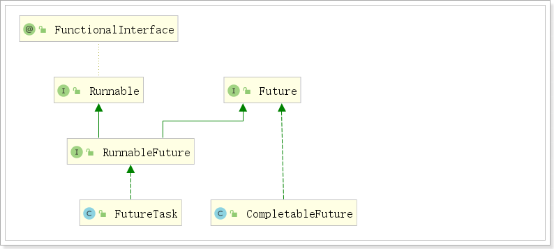

# 1. 商品详情

当用户搜索到商品，肯定会点击查看，就会进入商品详情页，接下来我们完成商品详情页的展示。

商品详情浏览量比较大，并发高，我们会独立开启一个微服务，用来展示商品详情。

## 1.1.   创建module


 


pom.xml依赖：

```xml
    <dependencies>
        <dependency>
            <groupId>com.atguigu</groupId>
            <artifactId>gmall-core</artifactId>
            <version>1.0-SNAPSHOT</version>
            <exclusions>
                <exclusion>
                    <groupId>com.baomidou</groupId>
                    <artifactId>mybatis-plus-boot-starter</artifactId>
                </exclusion>
                <exclusion>
                    <groupId>com.baomidou</groupId>
                    <artifactId>mybatis-plus</artifactId>
                </exclusion>
            </exclusions>
        </dependency>
        <dependency>
            <groupId>com.atguigu</groupId>
            <artifactId>gmall-pms-interface</artifactId>
            <version>0.0.1-SNAPSHOT</version>
        </dependency>
        <dependency>
            <groupId>com.atguigu</groupId>
            <artifactId>gmall-sms-interface</artifactId>
            <version>0.0.1-SNAPSHOT</version>
        </dependency>
        <dependency>
            <groupId>com.atguigu</groupId>
            <artifactId>gmall-wms-interface</artifactId>
            <version>0.0.1-SNAPSHOT</version>
        </dependency>
        <dependency>
            <groupId>org.springframework.boot</groupId>
            <artifactId>spring-boot-starter-web</artifactId>
        </dependency>
        <dependency>
            <groupId>org.springframework.cloud</groupId>
            <artifactId>spring-cloud-starter-openfeign</artifactId>
        </dependency>

        <dependency>
            <groupId>org.springframework.boot</groupId>
            <artifactId>spring-boot-starter-test</artifactId>
            <scope>test</scope>
        </dependency>
    </dependencies>
```

bootstrap.properties：

```properties
spring.application.name=item-service
spring.cloud.nacos.config.server-addr=127.0.0.1:8848
```

application.properties：

```properties
server.port=8088
spring.cloud.nacos.discovery.server-addr=127.0.0.1:8848
```

GmallItemApplication：

```java
@SpringBootApplication
@EnableDiscoveryClient
@EnableFeignClients
public class GmallItemApplication {

    public static void main(String[] args) {
        SpringApplication.run(GmallItemApplication.class, args);
    }

}
```


别忘了配置网关：


## 1.2.   数据模型

当点击搜索列表中的一个记录，会跳转到商品详情页。这个商品详情页是一个spu？还是sku？

以京东为例：

在京东搜索小米，出现搜索列表后。点击其中一条记录，跳转到商品详情页，这个商品详情页展示的是：


其实，已经根据销售属性定位到一个sku。所以，一个商品详情页是一个sku

结合页面，商品详情页需要的数据有：

- sku的基本信息
- sku的所有图片
- sku的所有促销信息
- sku的所有销售组合
- spu的描述信息
- spu的所有基本规格分组及规格参数


最终设计如下：

 

商品详情页总的数据模型：ItemVO

```java
/**
 * 商品详情页
 */
@Data
public class ItemVO {

    //1、当前sku的基本信息
    private Long skuId;
    private Long spuId;
    private Long catalogId;
    private Long brandId;
    private String skuTitle;
    private String skuSubtitle;
    private BigDecimal price;
    private BigDecimal weight;

    //2、sku的所有图片
    private List<String> pics;

    //3、sku的所有促销信息
    private List<SaleVO> sales;

    //4、sku的所有销售属性组合
    private List<SkuSaleAttrValueEntity> saleAttrs;

    //5、spu的所有基本属性
    private List<BaseGroupVO> attrGroups;

    //6、详情介绍
    private SpuInfoDescEntity desc;
}
```

SaleVO：

```java
/**
 * 所有的优惠信息
 */
@Data
public class SaleVO {

    // 0-优惠券    1-满减    2-阶梯
    private Integer type;

    private String name;//促销信息/优惠券的名字

}
```

BaseGroupVO：

```java
/**
 * 基本属性分组及组下的规格参数
 */
@Data
public class BaseGroupVO {

    private Long id;
    private String name;//分组的名字
    private List<BaseAttrVO> attrs;
}
```

BaseAttrVO：

```java
/**
 * 基本属性名及值
 */
@Data
public class BaseAttrVO {

    private Long attrId;
    private String attrName;
    private String[]  attrValues;
}
```


## 1.3.   远程调用接口

这些数据模型需要调用远程接口从其他微服务获取，所以这里先编写feign接口

 

GmallPmsFeign：

```java
@FeignClient("pms-service")
public interface GmallPmsFeign extends GmallPmsApi {
}
```

GmallSmsFeign：

```java
@FeignClient("sms-service")
public interface GmallSmsFeign extends GmallSmsApi {
}
```

GmallWmsFeign：

```java
@FeignClient("wms-service")
public interface GmallWmsFeign extends GmallWmsApi {
}
```


给GmallPmsApi添加几个接口：

```java
    // 根据id查询sku，对应SkuInfoController的info方法
	@GetMapping("pms/skuinfo/info/{skuId}") 
    public Resp<SkuInfoEntity> querySkuById(@PathVariable("skuId") Long skuId);

    @GetMapping("pms/skuimages/{skuId}") // 根据skuId查询sku的图片
    public Resp<List<SkuImagesEntity>> queryImagesBySkuId(@PathVariable("skuId") Long skuId);

    @GetMapping("pms/skusaleattrvalue/{spuId}")  // 根据spuId查询所有的销售属性
    public Resp<List<SkuSaleAttrValueEntity>> querySkuSaleAttrValueBySpuId(@PathVariable("spuId")Long spuId);
```


### 1.3.1.   根据skuId查询sku的图片

在SkuImagesController中添加：

```java
@GetMapping("{skuId}")
public Resp<List<SkuImagesEntity>> queryImagesBySkuId(@PathVariable("skuId") Long skuId){
    List<SkuImagesEntity> imagesEntities = this.skuImagesService.list(new QueryWrapper<SkuImagesEntity>().eq("sku_id", skuId));

    return Resp.ok(imagesEntities);
}
```


### 1.3.2.   根据spuId查询销售属性

SkuSaleAttrValueController中添加查询方法

```java
@ApiOperation("查询spu的所有销售属性")
@GetMapping("/{spuId}")
public Resp<List<SkuSaleAttrValueEntity>> querySkuSaleAttrValueBySpuId(@PathVariable("spuId")Long spuId) {

    List<SkuSaleAttrValueEntity> skuSaleAttrValueEntities = this.skuSaleAttrValueService.querySkuSaleAttrValueBySpuId(spuId);

    return Resp.ok(skuSaleAttrValueEntities);
}
```

在SkuSaleAttrValueService接口中添加抽象方法：

```java
List<SkuSaleAttrValueEntity> querySkuSaleAttrValueBySpuId(Long spuId);
```

在SkuSaleAttrValueServiceImpl中实现该方法：

```java
@Autowired
private SkuInfoDao skuInfoDao;

@Override
public List<SkuSaleAttrValueEntity> querySkuSaleAttrValueBySpuId(Long spuId) {
    // 查询出所有的sku
    List<SkuInfoEntity> skuInfoEntities = this.skuInfoDao.selectList(new QueryWrapper<SkuInfoEntity>().eq("spu_id", spuId));
    // 获取所有的skuId
    List<Long> skuIds = skuInfoEntities.stream().map(skuInfoEntity -> skuInfoEntity.getSkuId()).collect(Collectors.toList());

    // 查询出spu下所有sku对应的销售属性及值
    List<SkuSaleAttrValueEntity> skuSaleAttrValueEntities = this.list(new QueryWrapper<SkuSaleAttrValueEntity>().in("sku_id", skuIds));

    return skuSaleAttrValueEntities;
}
```


## 1.4.   封装数据


请求路径：/item/{skuId}

请求参数：skuId

请求方式：GET

响应：ItemVO的json数据

 

ItemController：

```java
@RestController
@RequestMapping("item")
public class ItemController {

    @Autowired
    private ItemService itemService;

    @GetMapping("{skuId}.html")
    public Resp<ItemVO> loadItem(@PathVariable("skuId")Long skuId){

        ItemVO itemVO = this.itemService.loadData(skuId);

        return Resp.ok(itemVO);
    }
}
```

ItemService：

```java
public interface ItemService {

    ItemVO loadData(Long skuId);
}
```

ItemServiceImpl：

```java
@Service
public class ItemServiceImpl implements ItemService {

    @Autowired
    private GmallPmsFeign pmsFeign;

    @Autowired
    private GmallSmsFeign smsFeign;

    @Autowired
    private GmallWmsFeign wmsFeign;

    @Override
    public ItemVO loadData(Long skuId) {

        ItemVO itemVO = new ItemVO();

        // 1. 获取sku的基本信息
        Resp<SkuInfoEntity> skuInfoEntityResp = this.pmsFeign.querySkuById(skuId);
        SkuInfoEntity skuInfoEntity = skuInfoEntityResp.getData();
        if (skuInfoEntity != null) {
            BeanUtils.copyProperties(skuInfoEntity, itemVO);
        }

        // 2. 获取sku的图片信息
        Resp<List<SkuImagesEntity>> listResp = this.pmsFeign.queryImagesBySkuId(skuId);
        List<SkuImagesEntity> images = listResp.getData();
        if (!CollectionUtils.isEmpty(images)){
            List<String> imageUrls = images.stream().map(image -> image.getImgUrl()).collect(Collectors.toList());
            itemVO.setPics(imageUrls);
        }

        // 3. 获取sku的促销信息 TODO

        // 4. 获取spu的所有销售属性
        Resp<List<SkuSaleAttrValueEntity>> skuSaleAttrValueResp = this.pmsFeign.querySkuSaleAttrValueBySpuId(skuInfoEntity.getSpuId());
        List<SkuSaleAttrValueEntity> skuSaleAttrValueEntities = skuSaleAttrValueResp.getData();
        itemVO.setSaleAttrs(skuSaleAttrValueEntities);

        // 5. 获取规格参数组及组下的规格参数 TODO

        return itemVO;
    }
}
```

其他查询请自行完成！！


# 2. CompletableFuture异步编排

问题：查询商品详情页的逻辑非常复杂，数据的获取都需要远程调用，必然需要花费更多的时间。

假如商品详情页的每个查询，需要如下标注的时间才能完成

```java
// 1. 获取sku的基本信息	0.5s

// 2. 获取sku的图片信息	0.5s

// 3. 获取sku的促销信息 TODO 1s

// 4. 获取spu的所有销售属性	1s

// 5. 获取规格参数组及组下的规格参数 TODO	1.5s

// 6. spu详情 TODO	1s
```

那么，用户需要6.5s后才能看到商品详情页的内容。很显然是不能接受的。

如果有多个线程同时完成这6步操作，也许只需要1.5s即可完成响应。


## 2.1.   线程回顾

初始化线程的4种方式：

1. 继承Thread
2. 实现Runnable接口
3. 实现Callable接口 + FutureTask （可以拿到返回结果，可以处理异常）
4. 线程池

方式1和方式2：主进程无法获取线程的运算结果。不适合当前场景

方式3：主进程可以获取线程的运算结果，并设置给itemVO，但是不利于控制服务器中的线程资源。可以导致服务器资源耗尽。

方式4：通过如下两种方式初始化线程池：

```java
Executors.newFiexedThreadPool(3);
//或者
new ThreadPoolExecutor(corePoolSize, maximumPoolSize, keepAliveTime, TimeUnit unit, workQueue, threadFactory, handler);
```

通过线程池性能稳定，也可以获取执行结果，并捕获异常。但是，在业务复杂情况下，一个异步调用可能会依赖于另一个异步调用的执行结果。


## 2.2.   CompletableFuture介绍

Future是Java 5添加的类，用来描述一个异步计算的结果。你可以使用`isDone`方法检查计算是否完成，或者使用`get`阻塞住调用线程，直到计算完成返回结果，你也可以使用`cancel`方法停止任务的执行。

虽然`Future`以及相关使用方法提供了异步执行任务的能力，但是对于结果的获取却是很不方便，只能通过阻塞或者轮询的方式得到任务的结果。阻塞的方式显然和我们的异步编程的初衷相违背，轮询的方式又会耗费无谓的CPU资源，而且也不能及时地得到计算结果，为什么不能用观察者设计模式当计算结果完成及时通知监听者呢？

很多语言，比如Node.js，采用回调的方式实现异步编程。Java的一些框架，比如Netty，自己扩展了Java的 `Future`接口，提供了`addListener`等多个扩展方法；Google guava也提供了通用的扩展Future；Scala也提供了简单易用且功能强大的Future/Promise异步编程模式。

作为正统的Java类库，是不是应该做点什么，加强一下自身库的功能呢？

在Java 8中, 新增加了一个包含50个方法左右的类: CompletableFuture，提供了非常强大的Future的扩展功能，可以帮助我们简化异步编程的复杂性，提供了函数式编程的能力，可以通过回调的方式处理计算结果，并且提供了转换和组合CompletableFuture的方法。

CompletableFuture类实现了Future接口，所以你还是可以像以前一样通过`get`方法阻塞或者轮询的方式获得结果，但是这种方式不推荐使用。


CompletableFuture和FutureTask同属于Future接口的实现类，都可以获取线程的执行结果。




## 2.3.   创建异步对象

CompletableFuture 提供了四个静态方法来创建一个异步操作。

```java
static CompletableFuture<Void> runAsync(Runnable runnable)
public static CompletableFuture<Void> runAsync(Runnable runnable, Executor executor)
public static <U> CompletableFuture<U> supplyAsync(Supplier<U> supplier)
public static <U> CompletableFuture<U> supplyAsync(Supplier<U> supplier, Executor executor)
```

**没有指定Executor的方法会使用ForkJoinPool.commonPool() 作为它的线程池执行异步代码**。如果指定线程池，则使用指定的线程池运行。以下所有的方法都类同。

- runAsync方法不支持返回值。
- supplyAsync可以支持返回值。


## 2.4.   计算完成时回调方法

当CompletableFuture的计算结果完成，或者抛出异常的时候，可以执行特定的Action。主要是下面的方法：

```java
public CompletableFuture<T> whenComplete(BiConsumer<? super T,? super Throwable> action);
public CompletableFuture<T> whenCompleteAsync(BiConsumer<? super T,? super Throwable> action);
public CompletableFuture<T> whenCompleteAsync(BiConsumer<? super T,? super Throwable> action, Executor executor);

public CompletableFuture<T> exceptionally(Function<Throwable,? extends T> fn);
```

whenComplete可以处理正常和异常的计算结果，exceptionally处理异常情况。BiConsumer<? super T,? super Throwable>可以定义处理业务

whenComplete 和 whenCompleteAsync 的区别：
		whenComplete：是执行当前任务的线程执行继续执行 whenComplete 的任务。
		whenCompleteAsync：是执行把 whenCompleteAsync 这个任务继续提交给线程池来进行执行。

**方法不以Async结尾，意味着Action使用相同的线程执行，而Async可能会使用其他线程执行（如果是使用相同的线程池，也可能会被同一个线程选中执行）**


代码示例：

```java
public class CompletableFutureDemo {

    public static void main(String[] args) throws ExecutionException, InterruptedException {
        CompletableFuture future = CompletableFuture.supplyAsync(new Supplier<Object>() {
            @Override
            public Object get() {
                System.out.println(Thread.currentThread().getName() + "\t completableFuture");
                int i = 10 / 0;
                return 1024;
            }
        }).whenComplete(new BiConsumer<Object, Throwable>() {
            @Override
            public void accept(Object o, Throwable throwable) {
                System.out.println("-------o=" + o.toString());
                System.out.println("-------throwable=" + throwable);
            }
        }).exceptionally(new Function<Throwable, Object>() {
            @Override
            public Object apply(Throwable throwable) {
                System.out.println("throwable=" + throwable);
                return 6666;
            }
        });
        System.out.println(future.get());
    }
}
```


## 2.5.   handle 方法

handle 是执行**任务完成时**对结果的处理。
handle 是在任务完成后再执行，还可以处理异常的任务。

```java
public <U> CompletionStage<U> handle(BiFunction<? super T, Throwable, ? extends U> fn);
public <U> CompletionStage<U> handleAsync(BiFunction<? super T, Throwable, ? extends U> fn);
public <U> CompletionStage<U> handleAsync(BiFunction<? super T, Throwable, ? extends U> fn,Executor executor);
```


## 2.6.   线程串行化方法

thenApply 方法：当一个线程依赖另一个线程时，获取上一个任务返回的结果，并返回当前任务的返回值。

thenAccept方法：消费处理结果。接收任务的处理结果，并消费处理，无返回结果。

thenRun方法：只要上面的任务执行完成，就开始执行thenRun，只是处理完任务后，执行 thenRun的后续操作

带有Async默认是异步执行的。这里所谓的异步指的是不在当前线程内执行。

```java
public <U> CompletableFuture<U> thenApply(Function<? super T,? extends U> fn)
public <U> CompletableFuture<U> thenApplyAsync(Function<? super T,? extends U> fn)
public <U> CompletableFuture<U> thenApplyAsync(Function<? super T,? extends U> fn, Executor executor)

public CompletionStage<Void> thenAccept(Consumer<? super T> action);
public CompletionStage<Void> thenAcceptAsync(Consumer<? super T> action);
public CompletionStage<Void> thenAcceptAsync(Consumer<? super T> action,Executor executor);

public CompletionStage<Void> thenRun(Runnable action);
public CompletionStage<Void> thenRunAsync(Runnable action);
public CompletionStage<Void> thenRunAsync(Runnable action,Executor executor);
```

Function<? super T,? extends U>
		T：上一个任务返回结果的类型
		U：当前任务的返回值类型

代码演示：

```java
public static void main(String[] args) throws ExecutionException, InterruptedException {
    CompletableFuture<Integer> future = CompletableFuture.supplyAsync(new Supplier<Integer>() {
        @Override
        public Integer get() {
            System.out.println(Thread.currentThread().getName() + "\t completableFuture");
            //int i = 10 / 0;
            return 1024;
        }
    }).thenApply(new Function<Integer, Integer>() {
        @Override
        public Integer apply(Integer o) {
            System.out.println("thenApply方法，上次返回结果：" + o);
            return  o * 2;
        }
    }).whenComplete(new BiConsumer<Integer, Throwable>() {
        @Override
        public void accept(Integer o, Throwable throwable) {
            System.out.println("-------o=" + o);
            System.out.println("-------throwable=" + throwable);
        }
    }).exceptionally(new Function<Throwable, Integer>() {
        @Override
        public Integer apply(Throwable throwable) {
            System.out.println("throwable=" + throwable);
            return 6666;
        }
    }).handle(new BiFunction<Integer, Throwable, Integer>() {
        @Override
        public Integer apply(Integer integer, Throwable throwable) {
            System.out.println("handle o=" + integer);
            System.out.println("handle throwable=" + throwable);
            return 8888;
        }
    });
    System.out.println(future.get());
}
```


## 2.7.   两任务组合 - 都要完成

两个任务必须都完成，触发该任务。

thenCombine：组合两个future，获取两个future的返回结果，并返回当前任务的返回值

thenAcceptBoth：组合两个future，获取两个future任务的返回结果，然后处理任务，没有返回值。

runAfterBoth：组合两个future，不需要获取future的结果，只需两个future处理完任务后，处理该任务。

```java
public <U,V> CompletableFuture<V> thenCombine(
    CompletionStage<? extends U> other,
    BiFunction<? super T,? super U,? extends V> fn);

public <U,V> CompletableFuture<V> thenCombineAsync(
    CompletionStage<? extends U> other,
    BiFunction<? super T,? super U,? extends V> fn);

public <U,V> CompletableFuture<V> thenCombineAsync(
    CompletionStage<? extends U> other,
    BiFunction<? super T,? super U,? extends V> fn, Executor executor);
    

public <U> CompletableFuture<Void> thenAcceptBoth(
    CompletionStage<? extends U> other,
    BiConsumer<? super T, ? super U> action);

public <U> CompletableFuture<Void> thenAcceptBothAsync(
    CompletionStage<? extends U> other,
    BiConsumer<? super T, ? super U> action);

public <U> CompletableFuture<Void> thenAcceptBothAsync(
    CompletionStage<? extends U> other,
    BiConsumer<? super T, ? super U> action, Executor executor);


public CompletableFuture<Void> runAfterBoth(CompletionStage<?> other,
                                            Runnable action);

public CompletableFuture<Void> runAfterBothAsync(CompletionStage<?> other,
                                                 Runnable action);

public CompletableFuture<Void> runAfterBothAsync(CompletionStage<?> other,
                                                 Runnable action,
                                                 Executor executor);
```

测试案例：

```java
public static void main(String[] args) {
    CompletableFuture.supplyAsync(() -> {
        return "hello";
    }).thenApplyAsync(t -> {
        return t + " world!";
    }).thenCombineAsync(CompletableFuture.completedFuture(" CompletableFuture"), (t, u) -> {
        return t + u;
    }).whenComplete((t, u) -> {
        System.out.println(t);
    });
}
```

输出：hello world! CompletableFuture


## 2.8.   两任务组合 - 一个完成

当两个任务中，任意一个future任务完成的时候，执行任务。

applyToEither：两个任务有一个执行完成，获取它的返回值，处理任务并有新的返回值。

acceptEither：两个任务有一个执行完成，获取它的返回值，处理任务，没有新的返回值。

runAfterEither：两个任务有一个执行完成，不需要获取future的结果，处理任务，也没有返回值。

```java
public <U> CompletableFuture<U> applyToEither(
    CompletionStage<? extends T> other, Function<? super T, U> fn);

public <U> CompletableFuture<U> applyToEitherAsync(
    CompletionStage<? extends T> other, Function<? super T, U> fn);

public <U> CompletableFuture<U> applyToEitherAsync(
    CompletionStage<? extends T> other, Function<? super T, U> fn,
    Executor executor);

public CompletableFuture<Void> acceptEither(
    CompletionStage<? extends T> other, Consumer<? super T> action);

public CompletableFuture<Void> acceptEitherAsync(
    CompletionStage<? extends T> other, Consumer<? super T> action);

public CompletableFuture<Void> acceptEitherAsync(
    CompletionStage<? extends T> other, Consumer<? super T> action,
    Executor executor);

public CompletableFuture<Void> runAfterEither(CompletionStage<?> other,
                                              Runnable action);

public CompletableFuture<Void> runAfterEitherAsync(CompletionStage<?> other,
                                                   Runnable action);

public CompletableFuture<Void> runAfterEitherAsync(CompletionStage<?> other,
                                                   Runnable action,
                                                   Executor executor);
```


## 2.9.   多任务组合

```java
public static CompletableFuture<Void> allOf(CompletableFuture<?>... cfs);

public static CompletableFuture<Object> anyOf(CompletableFuture<?>... cfs);
```

allOf：等待所有任务完成

anyOf：只要有一个任务完成


```java
public static void main(String[] args) {
    List<CompletableFuture> futures = Arrays.asList(CompletableFuture.completedFuture("hello"),
                                                    CompletableFuture.completedFuture(" world!"),
                                                    CompletableFuture.completedFuture(" hello"),
                                                    CompletableFuture.completedFuture("java!"));
    final CompletableFuture<Void> allCompleted = CompletableFuture.allOf(futures.toArray(new CompletableFuture[]{}));
    allCompleted.thenRun(() -> {
        futures.stream().forEach(future -> {
            try {
                System.out.println("get future at:"+System.currentTimeMillis()+", result:"+future.get());
            } catch (InterruptedException | ExecutionException e) {
                e.printStackTrace();
            }
        });
    });
}
```

测试结果：

```
get future at:1568892339473, result:hello
get future at:1568892339473, result: world!
get future at:1568892339473, result: hello
get future at:1568892339473, result:java!
```

几乎同时完成任务！


## 2.10.   优化商品详情页

```java
@Service
public class ItemServiceImpl implements ItemService {

    @Autowired
    private GmallPmsFeign pmsFeign;

    @Autowired
    private GmallSmsFeign smsFeign;

    @Autowired
    private GmallWmsFeign wmsFeign;

    @Autowired
    private ThreadPoolExecutor threadPoolExecutor;


    @Override
    public ItemVO loadData(Long skuId) throws ExecutionException, InterruptedException {

        ItemVO itemVO = new ItemVO();

        // 1. 获取sku的基本信息
        // 后续获取sku的促销信息、spu的销售属性和spu详情信息（需要sku中的spuId）都需要skuInfoEntity
        // supplyAsync有返回值
        // runAsync无返回值
        // 所以这里需要使用supplyAsync
        CompletableFuture<SkuInfoEntity> skuFuture = CompletableFuture.supplyAsync(() -> {
            Resp<SkuInfoEntity> skuInfoEntityResp = this.pmsFeign.querySkuById(skuId);
            SkuInfoEntity skuInfoEntity = skuInfoEntityResp.getData();
            if (skuInfoEntity != null) {
                BeanUtils.copyProperties(skuInfoEntity, itemVO);
            }
            return skuInfoEntity;
        }, threadPoolExecutor);


        // 2. 获取sku的图片信息
        CompletableFuture<Void> skuImageFuture = CompletableFuture.runAsync(() -> {
            Resp<List<SkuImagesEntity>> listResp = this.pmsFeign.queryImagesBySkuId(skuId);
            List<SkuImagesEntity> images = listResp.getData();
            if (!CollectionUtils.isEmpty(images)) {
                List<String> imageUrls = images.stream().map(image -> image.getImgUrl()).collect(Collectors.toList());
                itemVO.setPics(imageUrls);
            }
        }, threadPoolExecutor);


        // 3. 获取sku的促销信息 TODO

        // 4. 获取spu的所有销售属性
        // thenAcceptAsync：有参数，无返回
        // thenApplyAsync: 有参数，有返回
        // 后续spu详情也需要skuInfoEntity中的spuId，所以这里使用thenApplyAsync
        CompletableFuture<SkuInfoEntity> spuFuture = skuFuture.thenApplyAsync(skuInfoEntity -> {
            Resp<List<SkuSaleAttrValueEntity>> skuSaleAttrValueResp = this.pmsFeign.querySkuSaleAttrValueBySpuId(skuInfoEntity.getSpuId());
            List<SkuSaleAttrValueEntity> skuSaleAttrValueEntities = skuSaleAttrValueResp.getData();
            itemVO.setSaleAttrs(skuSaleAttrValueEntities);
            return skuInfoEntity;
        }, threadPoolExecutor);

        // 5. 获取规格参数组及组下的规格参数 TODO

        // 6. spu详情 TODO

        CompletableFuture<Void> future = CompletableFuture.allOf(skuFuture, skuImageFuture, spuFuture);
        // 阻塞主进程，等待子进程全部执行完毕！
        future.get();

        return itemVO;
    }


}
```

