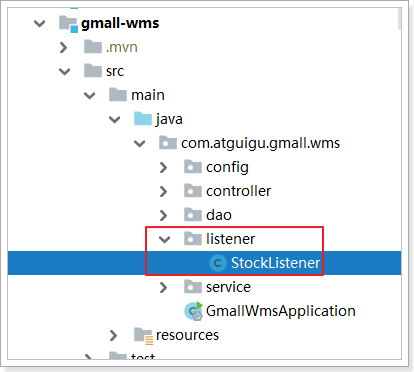

# 1. 搭建订单工程

完成购物车页面之后，点击购物车页面的“去结算”按钮，跳转到订单结算页。

接下来，先搭建订单系统：


 


pom.xml：

```xml
<?xml version="1.0" encoding="UTF-8"?>
<project xmlns="http://maven.apache.org/POM/4.0.0" xmlns:xsi="http://www.w3.org/2001/XMLSchema-instance"
         xsi:schemaLocation="http://maven.apache.org/POM/4.0.0 https://maven.apache.org/xsd/maven-4.0.0.xsd">
    <modelVersion>4.0.0</modelVersion>
    <parent>
        <groupId>org.springframework.boot</groupId>
        <artifactId>spring-boot-starter-parent</artifactId>
        <version>2.1.9.RELEASE</version>
        <relativePath/> <!-- lookup parent from repository -->
    </parent>
    <groupId>com.atguigu</groupId>
    <artifactId>gmall-order</artifactId>
    <version>0.0.1-SNAPSHOT</version>
    <name>gmall-order</name>
    <description>谷粒商城订单系统</description>

    <properties>
        <java.version>1.8</java.version>
        <spring-cloud.version>Greenwich.SR3</spring-cloud.version>
    </properties>

    <dependencies>
        <dependency>
            <groupId>com.atguigu</groupId>
            <artifactId>gmall-core</artifactId>
            <version>1.0-SNAPSHOT</version>
            <exclusions>
                <exclusion>
                    <groupId>com.baomidou</groupId>
                    <artifactId>mybatis-plus-boot-starter</artifactId>
                </exclusion>
            </exclusions>
        </dependency>
        <dependency>
            <groupId>com.atguigu</groupId>
            <artifactId>gmall-ums-interface</artifactId>
            <version>0.0.1-SNAPSHOT</version>
        </dependency>
        <dependency>
            <groupId>com.atguigu</groupId>
            <artifactId>gmall-pms-interface</artifactId>
            <version>0.0.1-SNAPSHOT</version>
            <scope>compile</scope>
        </dependency>
        <dependency>
            <groupId>com.atguigu</groupId>
            <artifactId>gmall-sms-interface</artifactId>
            <version>0.0.1-SNAPSHOT</version>
            <scope>compile</scope>
        </dependency>
        <dependency>
            <groupId>com.atguigu</groupId>
            <artifactId>gmall-wms-interface</artifactId>
            <version>0.0.1-SNAPSHOT</version>
        </dependency>
        <dependency>
            <groupId>org.springframework.boot</groupId>
            <artifactId>spring-boot-starter-amqp</artifactId>
        </dependency>
        <dependency>
            <groupId>org.springframework.boot</groupId>
            <artifactId>spring-boot-starter-web</artifactId>
        </dependency>
        <dependency>
            <groupId>org.springframework.cloud</groupId>
            <artifactId>spring-cloud-starter-openfeign</artifactId>
        </dependency>
        <dependency>
            <groupId>org.projectlombok</groupId>
            <artifactId>lombok</artifactId>
            <version>1.18.8</version>
        </dependency>
        <dependency>
            <groupId>org.springframework.boot</groupId>
            <artifactId>spring-boot-starter-data-redis</artifactId>
            <version>2.1.3.RELEASE</version>
        </dependency>

        <dependency>
            <groupId>org.springframework.boot</groupId>
            <artifactId>spring-boot-starter-test</artifactId>
            <scope>test</scope>
        </dependency>
        <dependency>
            <groupId>org.springframework.amqp</groupId>
            <artifactId>spring-rabbit-test</artifactId>
            <scope>test</scope>
        </dependency>

    </dependencies>

    <dependencyManagement>
        <dependencies>
            <dependency>
                <groupId>org.springframework.cloud</groupId>
                <artifactId>spring-cloud-dependencies</artifactId>
                <version>${spring-cloud.version}</version>
                <type>pom</type>
                <scope>import</scope>
            </dependency>
        </dependencies>
    </dependencyManagement>

    <build>
        <plugins>
            <plugin>
                <groupId>org.springframework.boot</groupId>
                <artifactId>spring-boot-maven-plugin</artifactId>
            </plugin>
        </plugins>
    </build>

</project>
```


## 1.1.   基础配置

bootstrap.yml:

```yml
spring:
  application:
    name: order-service
  cloud:
    nacos:
      config:
        server-addr: 127.0.0.1:8848
```

application.yml:

```yml
server:
  port: 8092
spring:
  cloud:
    nacos:
      discovery:
        server-addr: 127.0.0.1:8848
  redis:
    host: 172.16.116.100
  rabbitmq:
    host: 172.16.116.100
    virtual-host: /fengge
    username: fengge
    password: fengge

gmall:
  jwt:
    pubKeyPath: C:\\Resources\\rsa\\rsa.pub
    cookieName: GMALL_TOKEN
    userKeyName: user-key
    expire: 43200
```

启动类：

```java
@EnableDiscoveryClient
@EnableFeignClients
@SpringBootApplication
public class GmallOrderApplication {

    public static void main(String[] args) {
        SpringApplication.run(GmallOrderApplication.class, args);
    }

}
```


gmall-gateway网关配置添加订单路由：

```yml
        - id: order-service # 订单服务
          uri: lb://order-service
          predicates:
            - Path=/api/order/**
          filters:
            - RewritePath=/api/(?<segment>.*), /$\{segment}
```


## 1.2.   统一身份验证

参照gmall-cart购物车中的统一验证

 

可以从购物车系统把这些代码直接copy过来。


## 1.3.   线程池配置

创建订单也是一个很复杂的业务功能，关系到很多远程调用，这里也可以通过异步调用优化业务。

 

在application.yml中添加线程池配置：


添加线程池配置类：

```java
@Configuration
public class ThreadPoolConfig {

    @Bean
    public ThreadPoolExecutor threadPoolExecutor(@Value("${gmall.threadPool.corePoolSize}") Integer corePoolSize
            , @Value("${gmall.threadPool.maximunPoolSize}") Integer maximunPoolSize
            , @Value("${gmall.threadPool.keepAliveTime}") Integer keepAliveTime){

        return new ThreadPoolExecutor(corePoolSize, maximunPoolSize, keepAliveTime,
                TimeUnit.SECONDS, new LinkedBlockingDeque<>(Integer.MAX_VALUE/2));
    }
}
```


# 2. 订单结算页

购物车页面点击去结算按钮，应该发送请求到controller获取结算页需要的数据。

购物车页面传递的数据结构，至少包括两个数据：{skuId:count}

需要获取的数据模型，可以参照jd结算页，如下：


可以发现订单结算页，包含以下信息：

1. 收货人信息：有更多地址，即有多个收货地址，其中有一个默认收货地址
2. 支付方式：货到付款、在线支付，不需要后台提供
3. 送货清单：配送方式（不做）及商品列表（根据购物车选中的skuId到数据库中查询）
4. 发票：不做
5. 优惠：查询用户领取的优惠券（不做）及可用积分（京豆）


## 2.1.   数据模型

 

OrderConfirmVO:

```java
@Data
public class OrderConfirmVO {

    // 收货地址，ums_member_receive_address表
    private List<MemberReceiveAddressEntity> addresses;

    // 购物清单，根据购物车页面传递过来的skuIds查询
    private List<OrderItemVO> orderItems;

    // 可用积分，ums_member表中的integration字段
    private Integer bounds;

    // 订单令牌，防止重复提交
    private String orderToken;
}
```

注意：需要引入gmall-ums-interface依赖，并把MemberReceiveAddressEntity对象移到gmall-ums-interface工程中去。

OrderItemVO:（参照Cart对象）

```java
@Data
public class OrderItemVO {

    private Long skuId;// 商品id
    private String title;// 标题
    private String defaultImage;// 图片
    private BigDecimal price;// 加入购物车时的价格
    private Integer count;// 购买数量
    private List<SkuSaleAttrValueEntity> skuAttrValue;// 商品规格参数
    private SkuSaleVO skuSaleVO;
}
```


## 2.2.   远程数据接口

结合数据模型，需要的远程接口如下：

1. 根据当前用户的id查询收货地址（ums_member_receive_address表）

2. 根据购物车用户选中的购物车记录中的skuId查询购物清单

   该接口已有

3. 根据skuId查询营销信息（保留）

4. 根据当前用户的id查询用户信息（包含积分）


### 2.2.1.   根据用户id查询收货地址

把gmall-ums中的MemberReceiveAddressEntity移动到gmall-ums-interface工程中去：

 


在gmall-ums中的MemberReceiveAddressController中添加根据用户id查询收货地址的数据接口：

```java
@GetMapping("{userId}")
public Resp<List<MemberReceiveAddressEntity>> queryAddressesByUserId(@PathVariable("userId")Long userId){

    List<MemberReceiveAddressEntity> addressEntities = this.memberReceiveAddressService.list(new QueryWrapper<MemberReceiveAddressEntity>().eq("member_id", userId));

    return Resp.ok(addressEntities);
}
```


在gmall-ums-interface工程中的GmallUmsApi添加feign方法：

```java
/**
     * 根据用户id查询收货地址
     * @param userId
     * @return
     */
@GetMapping("ums/memberreceiveaddress/{userId}")
public Resp<List<MemberReceiveAddressEntity>> queryAddressesByUserId(@PathVariable("userId")Long userId);
```


### 2.2.2.    根据用户id查询用户积分

在gmall-ums中的MembeController已有根据用户id查询用户信息的方法：


在gmall-ums-interface工程中的GmallUmsApi添加feign方法：

```java
    /**
     * 根据id查询用户信息
     * @param id
     * @return
     */
    @GetMapping("ums/member/info/{id}")
    public Resp<MemberEntity> userInfo(@PathVariable("id") Long id);
```


## 2.3.   编写feign接口

在gmall-order工程中添加feign接口：

 

```java
@FeignClient("pms-service")
public interface GmallPmsFeign extends GmallPmsApi {
}
```

```java
@FeignClient("sms-service")
public interface GmallSmsFeign extends GmallSmsApi {
}
```

```java
@FeignClient("ums-service")
public interface GmallUmsFeign extends GmallUmsApi {
}
```

```java
@FeignClient("wms-service")
public interface GmallWmsFeign extends GmallWmsApi {
}
```


## 2.4.   完成订单结算页数据查询接口

 

OrderController：

```java
@RestController
@RequestMapping("order")
public class OrderController {

    @Autowired
    private OrderService orderService;

    /**
     * 购物车页面传递的数据结构如下：
     * {101: 3, 102: 1}
     * {skuId: count}
     * @param skuMap
     * @return
     */
    @PostMapping("confirm")
    public Resp<OrderConfirmVO> confirm(@RequestBody Map<Long, Integer> skuMap){

        OrderConfirmVO orderConfirmVO = this.orderService.confirm(skuMap);

        return Resp.ok(orderConfirmVO);
    }
}
```

OrderService：

```java
@Service
public class OrderService {

    @Autowired
    private GmallPmsFeign gmallPmsFeign;

    @Autowired
    private GmallSmsFeign gmallSmsFeign;

    @Autowired
    private GmallUmsFeign gmallUmsFeign;

    @Autowired
    private StringRedisTemplate redisTemplate;

    private static final String TOKEN_PREFIX = "order:token:";

    @Autowired
    private ThreadPoolExecutor threadPoolExecutor;

    public OrderConfirmVO confirm(Map<Long, Integer> skuMap) {

        OrderConfirmVO orderConfirmVO = new OrderConfirmVO();

        // 获取用户信息
        UserInfo userInfo = LoginInterceptor.getUserInfo();

        // 遍历map查询订单的商品清单
        CompletableFuture<Void> orderItemFuture = CompletableFuture.runAsync(() -> {
            List<OrderItemVO> orderItemVOList = skuMap.entrySet().stream().map(entrySet -> {
                OrderItemVO orderItemVO = new OrderItemVO();
                orderItemVO.setCount(entrySet.getValue());

                Long skuId = entrySet.getKey();
                Resp<SkuInfoEntity> skuInfoEntityResp = this.gmallPmsFeign.querySkuById(skuId);
                SkuInfoEntity skuInfoEntity = skuInfoEntityResp.getData();
                orderItemVO.setSkuId(skuId);
                orderItemVO.setDefaultImage(skuInfoEntity.getSkuDefaultImg());
                orderItemVO.setPrice(skuInfoEntity.getPrice());
                orderItemVO.setTitle(skuInfoEntity.getSkuTitle());

                // 查询sku的营销属性
                Resp<List<SkuSaleAttrValueEntity>> listResp = this.gmallPmsFeign.querySkuSaleAttrValueBySkuId(skuId);
                List<SkuSaleAttrValueEntity> skuSaleAttrValueEntities = listResp.getData();
                orderItemVO.setSkuAttrValue(skuSaleAttrValueEntities);

                // 查询营销信息
                orderItemVO.setSkuSaleVO(null);

                return orderItemVO;
            }).collect(Collectors.toList());
            orderConfirmVO.setOrderItems(orderItemVOList);
        }, threadPoolExecutor);

        CompletableFuture<Void> addressFuture = CompletableFuture.runAsync(() -> {
            Resp<List<MemberReceiveAddressEntity>> addressResp = this.gmallUmsFeign.queryAddressesByUserId(userInfo.getId());
            List<MemberReceiveAddressEntity> addresses = addressResp.getData();
            orderConfirmVO.setAddresses(addresses);
        }, threadPoolExecutor);
        CompletableFuture<Void> boundFuture = CompletableFuture.runAsync(() -> {
            // 获取用户可用积分信息
            Resp<MemberEntity> memberEntityResp = this.gmallUmsFeign.userInfo(userInfo.getId());
            MemberEntity memberEntity = memberEntityResp.getData();
            orderConfirmVO.setBounds(memberEntity.getIntegration());
        }, threadPoolExecutor);

        CompletableFuture<Void> tokenFuture = CompletableFuture.runAsync(() -> {
            // 随机生成唯一令牌，防止重复提交
            String token = IdWorker.getTimeId(); // 分布式id生成器，timeId适合做订单号
            this.redisTemplate.opsForValue().set(TOKEN_PREFIX + token, token);
            orderConfirmVO.setOrderToken(token);
        });

        CompletableFuture.allOf(orderItemFuture, addressFuture, boundFuture, tokenFuture).join();

        return orderConfirmVO;
    }
}
```


## 2.5.   测试订单确认页


响应数据：

```json
{
    "code": 0,
    "msg": "success",
    "data": {
        "addresses": [
            {
                "id": 1,
                "memberId": 1,
                "name": "李先锋",
                "phone": "13888888888",
                "postCode": "200122",
                "province": "上海",
                "city": "上海市",
                "region": "松江区",
                "detailAddress": "大江大厦6层",
                "areacode": "12121",
                "defaultStatus": 1
            },
            {
                "id": 2,
                "memberId": 1,
                "name": "锋哥",
                "phone": "13812345678",
                "postCode": "200122",
                "province": "上海",
                "city": "上海市",
                "region": "松江区",
                "detailAddress": "尚硅谷上海校区",
                "areacode": "12222",
                "defaultStatus": 0
            }
        ],
        "orderItems": [
            {
                "skuId": 48,
                "title": "apple iphone xr 8g,白色,256",
                "defaultImage": "https://ggmall.oss-cn-shanghai.aliyuncs.com/2019-10-06/cb587e4e-ebfb-4cff-86fa-9af8f1d4e87c_mi1.jpg",
                "price": 10000,
                "count": 3,
                "skuAttrValue": [
                    {
                        "id": 133,
                        "skuId": 48,
                        "attrId": 24,
                        "attrName": "内存",
                        "attrValue": "8g",
                        "attrSort": 0
                    },
                    {
                        "id": 134,
                        "skuId": 48,
                        "attrId": 30,
                        "attrName": "颜色",
                        "attrValue": "白色",
                        "attrSort": 0
                    },
                    {
                        "id": 135,
                        "skuId": 48,
                        "attrId": 35,
                        "attrName": "容量",
                        "attrValue": "256",
                        "attrSort": 0
                    }
                ],
                "skuSaleVO": null
            },
            {
                "skuId": 49,
                "title": "apple iphone xr 8g,白色,256",
                "defaultImage": "https://ggmall.oss-cn-shanghai.aliyuncs.com/2019-10-06/cb587e4e-ebfb-4cff-86fa-9af8f1d4e87c_mi1.jpg",
                "price": 10000,
                "count": 2,
                "skuAttrValue": [
                    {
                        "id": 136,
                        "skuId": 49,
                        "attrId": 24,
                        "attrName": "内存",
                        "attrValue": "8g",
                        "attrSort": 0
                    },
                    {
                        "id": 137,
                        "skuId": 49,
                        "attrId": 30,
                        "attrName": "颜色",
                        "attrValue": "白色",
                        "attrSort": 0
                    },
                    {
                        "id": 138,
                        "skuId": 49,
                        "attrId": 35,
                        "attrName": "容量",
                        "attrValue": "256",
                        "attrSort": 0
                    }
                ],
                "skuSaleVO": null
            }
        ],
        "bounds": 1000,
        "orderToken": "9c131d74-a95a-49bb-bb32-7fcdae2188f2"
    }
}
```


# 3. 提交订单

当用户点击提交订单按钮，应该收集页面数据提交到后台并生成订单数据。

## 3.1.   数据模型

订单确认页，需要提交的数据：

```java
@Data
public class OrderSubmitVO {

    //提交上次订单确认页给你的令牌；
    private String orderToken;

    private BigDecimal totalPrice; // 校验总价格时，拿计算价格和这个价格比较

    private Integer payType;//0-在线支付  1-货到付款

    private String delivery_company; // 配送方式

    private List<OrderItemVO> orderItems; // 订单清单

    // 地址信息，不需要id及memberId
    private String name;
    private String phone;
    private String postCode;
    private String province;
    private String city;
    private String region;
    private String detailAddress;
    private String areacode;
    private Integer defaultStatus;

    // TODO：发票相关信息略

    // TODO：营销信息等

}
```

提交以后，需要响应的数据：

```java
@Data
public class OrderSubmitResponseVO {

    private String orderId;
    
    private OrderEntity orderEntity;

    private Integer code; // 1-不可重复提交或页面已过期 2-库存不足 3-价格校验不合法 等
}
```


## 3.2.   远程接口

### 3.2.1.   验证库存并锁库存

为了保证验库存和锁库存的原子性，这里直接把验证和锁定库存封装到一个方法中，并在方法中使用分布式锁，防止多人同时锁库存。

gmall-wms工程的pom.xml中引入redisson的依赖：

```xml
<dependency>
    <groupId>org.redisson</groupId>
    <artifactId>redisson</artifactId>
    <version>3.11.2</version>
</dependency>
```

gmall-wms工程的config目录下需要添加redisson的配置文件，参照gmall-index工程：

 


给gmall-wms-interface工程添加实体类：

```
@Data
public class SkuLockVO {

    private Long skuId;

    private Long wareSkuId; // wms_ware_sku表的主键

    private Integer num; // 锁定数量

    private String orderToken; // 那个订单（订单编号）
}
```


gmall-wms工程的WareSkuController添加方法：

```java
@PostMapping("check/lock")
public Resp<Object> checkAndLockStock(@RequestBody List<SkuLockVO> skuLockVOS){

    String msg = this.wareSkuService.checkAndLockStock(skuLockVOS);
    if (StringUtils.isNotBlank(msg)) {
        return Resp.fail(msg);
    }
    return Resp.ok(null);
}
```

在添加WareSkuService的接口方法：

```java
String checkAndLockStock(List<SkuLockVO> skuLockVOS);
```

在WareSkuServiceImpl实现类中添加方法：

```java
    @Autowired
    private WareSkuDao wareSkuDao;

    @Autowired
    private RedissonClient redissonClient;

    @Autowired
    private StringRedisTemplate redisTemplate;

    private static final String LOCK_PREFIX = "sku:lock:";
	
    @Override
    public String checkAndLockStock(List<SkuLockVO> skuLockVOS) {

        // 未锁住的库存
        List<SkuLockVO> notLockSkus = new ArrayList<>();
        // 记录已锁住的库存
        List<SkuLockVO> lockedSkus = new ArrayList<>();

        // 便利所有skuLockVO，锁定库存
        skuLockVOS.forEach(skuLockVO -> {
            System.out.println("锁库存开始。。。。");
            lockSku(notLockSkus, lockedSkus, skuLockVO);
            System.out.println("锁库存结束。。。。");
        });

        // 如果没有锁住的集合为空
        if (CollectionUtils.isEmpty(notLockSkus)) {
            // 代表都锁住了, 把锁定的库存信息放入redis，方便后续释放库存
            String orderToken = skuLockVOS.get(0).getOrderToken();
            this.redisTemplate.opsForValue().set(STOCK_PREFIX + orderToken, JSON.toJSONString(lockedSkus));
            return null;
        }
        // 一旦库存锁不住，回滚已锁的库存，并提示页面那些商品的库存没锁住
        for (SkuLockVO skuLock : lockedSkus) {
            wareSkuDao.unLockSku(skuLock);
        }

        List<Long> skuIds = notLockSkus.stream().map(skuLockVO -> skuLockVO.getSkuId()).collect(Collectors.toList());

        return "锁定失败：商品" + skuIds.toString() + "库存不足";
    }

    private void lockSku(List<SkuLockVO> notLockSkus, List<SkuLockVO> lockedSkus, SkuLockVO skuLockVO) {
        // 只锁当前的sku
        RLock lock = this.redissonClient.getFairLock(LOCK_PREFIX + skuLockVO.getSkuId());
        lock.lock();

        List<WareSkuEntity> wareSkuEntities = wareSkuDao.getAllWareCanLocked(skuLockVO);
        if (wareSkuEntities != null && wareSkuEntities.size() > 0) {
            // 拿到第一个仓库锁库存
            WareSkuEntity wareSkuEntity = wareSkuEntities.get(0);
            long i = wareSkuDao.lockSku(wareSkuEntity.getId(), skuLockVO.getNum());
            if (i > 0) {
                skuLockVO.setWareSkuId(wareSkuEntity.getId());
                lockedSkus.add(skuLockVO);
            } else {
                notLockSkus.add(skuLockVO);
            }
        } else {
            notLockSkus.add(skuLockVO);
        }
        lock.unlock();
    }
```

在WareSkuDao中添加方法：

```java
@Mapper
public interface WareSkuDao extends BaseMapper<WareSkuEntity> {

    List<WareSkuEntity> getAllWareCanLocked(SkuLockVO skuLockVO);

    long lockSku(@Param("id") Long id, @Param("num") Integer num);

    void unLockSku(SkuLockVO skuLock);
}
```

在WareSkuDao对应的xml中添加映射：

```xml
    <select id="getAllWareCanLocked" resultMap="wareSkuMap">
        SELECT * FROM wms_ware_sku WHERE sku_id = #{skuId} AND stock-stock_locked >= #{num}
    </select>

    <update id="lockSku">
        UPDATE wms_ware_sku SET stock_locked = stock_locked + #{num} WHERE id = #{id}
    </update>

    <update id="unLockSku">
        UPDATE wms_ware_sku SET stock_locked = stock_locked - #{locked}
        WHERE id = #{wareSkuId}
    </update>
```


在gmall-wms-interface中的GmallWmsApi中添加接口方法

```java
@PostMapping("wms/waresku/check/lock")
public Resp<Object> checkAndLockStock(@RequestBody List<SkuLockVO> skuLockVOS);
```


### 3.2.2.   创建订单接口

搭建订单接口工程：


把OrderSubmitVO和OrderItemVO数据模型移动到gmall-oms-interface中

 

添加api接口：

```java
public interface GmallOmsApi {

    @PostMapping("oms/order/{userId}")
    public Resp<OrderEntity> saveOrder(@RequestBody OrderSubmitVO orderSubmitVO, @PathVariable("userId")Long userId);
}
```


该api接口对应的实现如下：

给OrderController添加如下方法：

```java
@PostMapping("{userId}")
public Resp<OrderEntity> saveOrder(@RequestBody OrderSubmitVO orderSubmitVO, @PathVariable("userId")Long userId){

    OrderEntity orderEntity = this.orderService.saveOrder(orderSubmitVO, userId);

    return Resp.ok(orderEntity);
}
```

给OrderService接口添加如下方法：

```java
OrderEntity saveOrder(OrderSubmitVO orderSubmitVO, Long userId);
```

给OrderServiceImpl实现类添加如下方法：

```java
    @Override
    public OrderEntity saveOrder(OrderSubmitVO orderSubmitVO, Long userId) {

        // 保存订单
        OrderEntity orderEntity = new OrderEntity();
        BeanUtils.copyProperties(orderSubmitVO, orderEntity);
        orderEntity.setOrderSn(orderSubmitVO.getOrderToken());
        orderEntity.setMemberId(userId);
        orderEntity.setCreateTime(new Date());
        orderEntity.setTotalAmount(orderSubmitVO.getTotalPrice());
        orderEntity.setPayAmount(orderSubmitVO.getTotalPrice());
        orderEntity.setPayType(orderSubmitVO.getPayType());
        orderEntity.setStatus(0);
        orderEntity.setDeliveryCompany(orderSubmitVO.getDelivery_company());

        this.save(orderEntity);

        // 保存订单详情
        List<OrderItemVO> orderItems = orderSubmitVO.getOrderItems();
        for (OrderItemVO orderItem : orderItems) {
            OrderItemEntity itemEntity = new OrderItemEntity();

            // 订单信息
            itemEntity.setOrderId(orderEntity.getId());
            itemEntity.setOrderSn(orderEntity.getOrderSn());

            // 需要远程查询spu信息 TODO

            // 设置sku信息
            itemEntity.setSkuId(orderItem.getSkuId());
            itemEntity.setSkuName(orderItem.getTitle());
            itemEntity.setSkuPrice(orderItem.getPrice());
            itemEntity.setSkuQuantity(orderItem.getCount());

            //需要远程查询优惠信息 TODO

            this.orderItemDao.insert(itemEntity);
        }
        
        return orderEntity;
    }
```


## 3.3.   提交订单基本代码实现

提交订单分以下几个基本步骤：

1. 验证令牌防止重复提交
2. 验证价格
3. 验证库存，并锁定库存
4. 生成订单
5. 删购物车中对应的记录（消息队列）

OrderController添加方法：

```java
/**
     * 提交订单返回订单id
     * @param orderSubmitVO
     * @return
     */
@PostMapping("submit")
public Resp<Object> submit(@RequestBody OrderSubmitVO orderSubmitVO){

    OrderSubmitResponseVO responseVO = this.orderService.submit(orderSubmitVO);

    return Resp.ok(responseVO);
}
```

OrderService中添加方法：

```java
@Autowired
private GmallOmsFeign gmallOmsFeign;

@Autowired
private AmqpTemplate amqpTemplate;

@Autowired
private JedisPool jedisPool;

public OrderSubmitResponseVO submit(OrderSubmitVO orderSubmitVO) {

    OrderSubmitResponseVO responseVO = new OrderSubmitResponseVO();

    // 1. 验证令牌，是否重复提交
    String orderToken = orderSubmitVO.getOrderToken();
    // 保证原子性（防止验证过程中，已下单）
    String script = "if redis.call('get', KEYS[1]) == ARGV[1] then return redis.call('del', KEYS[1]) else return 0 end";
    // 有异常
    //        Integer flag = (Integer) this.redisTemplate.execute(redisScript, Collections.singletonList(TOKEN_PREFIX + orderToken), orderToken);
    Jedis jedis = this.jedisPool.getResource();
    try {
        Long flag  = (Long) jedis.eval(script, Arrays.asList(TOKEN_PREFIX + orderToken), Arrays.asList(orderToken));

        // 验证未通过
        if (flag == 0l) {
            // 不可重复提交
            responseVO.setCode(1);
            return responseVO;
        }
    } finally {
        jedis.close();
    }

    // 2. 验证价格，防止用户在订单页面停留太久，导致的价格不一致
    BigDecimal totalPrice = orderSubmitVO.getTotalPrice(); // 获取页面价格
    List<OrderItemVO> orderItems = orderSubmitVO.getOrderItems();
    // 如果没有订单清单，直接返回
    if (CollectionUtils.isEmpty(orderItems)){
        responseVO.setCode(2);
        return responseVO;
    }

    BigDecimal currentPrice = new BigDecimal(0);
    for (OrderItemVO orderItem : orderItems) {
        Resp<SkuInfoEntity> skuInfoEntityResp = this.gmallPmsFeign.querySkuById(orderItem.getSkuId());
        SkuInfoEntity skuInfoEntity = skuInfoEntityResp.getData();
        BigDecimal decimal = skuInfoEntity.getPrice().multiply(new BigDecimal(orderItem.getCount()));
        currentPrice = currentPrice.add(decimal);
    }
    // 如果价格不同，直接返回
    if (totalPrice.compareTo(currentPrice) != 0) {
        responseVO.setCode(3);
        return responseVO;
    }

    // 3. 验库存，并锁库存
    List<SkuLockVO> skuLockVOList = orderItems.stream().map(orderItemVO -> {
        SkuLockVO skuLockVO = new SkuLockVO();
        skuLockVO.setSkuId(orderItemVO.getSkuId());
        skuLockVO.setNum(orderItemVO.getCount());
        skuLockVO.setOrderToken(orderToken);
        return skuLockVO;
    }).collect(Collectors.toList());
    // 调用远程方法验证库存并锁库存
    Resp<Object> listResp = this.gmallWmsFeign.checkAndLockStock(skuLockVOList);
    // 锁定失败
    if (listResp.getCode() == 1) {
        responseVO.setCode(4);
        return responseVO;
    }
    // 锁定成功，获取锁定的结果集

    // 4. 生成订单（保存订单及订单项）
    UserInfo userInfo = LoginInterceptor.getUserInfo();
    try {
        // 在远程方法中，创建订单，并定时关单
        Resp<OrderEntity> orderResp = this.gmallOmsFeign.saveOrder(orderSubmitVO, userInfo.getId());
        responseVO.setOrderEntity(orderResp.getData());
    } catch (Exception e) {
        e.printStackTrace();

        // 解锁库存, 发送消息
        this.amqpTemplate.convertAndSend("ORDER-STOCK-EXCHANGE", "stock.unlock", orderToken);

        responseVO.setCode(5);
        return responseVO;
    }

    // 5. 删除购物车，发送消息
    Map<String, Object> map = new HashMap<>();
    map.put("userId", userInfo.getId());
    List<String> skuIds = orderItems.stream().map(orderItemVO -> orderItemVO.getSkuId().toString()).collect(Collectors.toList());
    map.put("skuIds", skuIds);
    this.amqpTemplate.convertAndSend("ORDER-CART-EXCHANGE", "cart.delete", map);


    return responseVO;
}
```


### 3.3.1.   配置jedis

由于使用redisTemplate执行脚本偶尔会报错，所以这里直接使用jedis。

在gmall-order中作如下处理：

1. 引入jedis依赖：

```xml
<dependency>
    <groupId>redis.clients</groupId>
    <artifactId>jedis</artifactId>
    <version>3.1.0</version>
</dependency>
```

2. 添加配置：

```java
@Configuration
public class JedisConfig {

    @Bean
    public JedisPool jedisPool(){

        return new JedisPool("172.16.116.100");
    }
}
```


### 3.3.2.   删除购物车监听器

 


```java
@Component
public class CartListener {

    @Autowired
    private StringRedisTemplate redisTemplate;

    private static final String CART_PREFIX = "cart:uid:";

    @RabbitListener(bindings = @QueueBinding(
            value = @Queue(value = "GMALL-CART-QUEUE", durable = "true"),
            exchange = @Exchange(value = "ORDER-CART-EXCHANGE", ignoreDeclarationExceptions = "true", type = ExchangeTypes.TOPIC),
            key = {"cart.delete"}
    ))
    public void deleteCart(Map<String, Object> map){

        String userId = map.get("userId").toString();
        List<String> skuIds = (List<String>)map.get("skuIds");

        BoundHashOperations<String, Object, Object> ops = this.redisTemplate.boundHashOps(CART_PREFIX + userId);
        ops.delete(skuIds.toArray());
    }
}
```

引入rabbitmq依赖及配置rabbitmq的链接信息略。。。。


### 3.3.3.   库存解锁的监听器

 

```java
@Component
public class StockListener {

    @Autowired
    private WareSkuService wareSkuService;

    @RabbitListener(bindings = @QueueBinding(
            value = @Queue(value = "ORDER-STOCK-QUEUE", durable = "true"),
            exchange = @Exchange(value = "ORDER-STOCK-EXCHANGE", ignoreDeclarationExceptions = "true", type = ExchangeTypes.TOPIC),
            key = {"stock.unlock"}
    ))
    public void unlock(String orderToken){

        this.wareSkuService.unlockSku(orderToken);
    }
}
```

WareSkuService接口添加解锁方法：

```java
void unlockSku(String orderToken);
```

WareSkuServiceImpl实现类实现该接口方法：

```java
@Override
public void unlockSku(String orderToken) {
    // 查询redis中保存的锁库存信息
    System.out.println("解库存开始。。。。。。");
    String stockLockJson = this.redisTemplate.opsForValue().get(STOCK_PREFIX + orderToken);
    if (!StringUtils.isEmpty(stockLockJson)){
        List<SkuLockVO> skuLockVOS = JSON.parseArray(stockLockJson, SkuLockVO.class);
        skuLockVOS.forEach(skuLockVO -> {
            this.wareSkuDao.unLockSku(skuLockVO);
        });
    }
    System.out.println("解库存结束。。。。。。");
}
```


## 3.4.   延时队列定时关单

如果用户下单后一直不支付，库存处于锁定状态，陷入店家商品卖不出，买家无法购买的情况。所以，需要定时关单。

常用解决方案：

1. 利用定时任务轮询数据库

   方案：

   ​	spring的schedule定时任务

   ​	利用定时线程池关单

   ​		ScheduledExecutorService executorService = Executors.newScheduledThreadPool(10);
   ​		executorService.schedule(Runnable, delay, timeunit);
   ​		这种方式的缺点是：一旦服务器挂掉，线程池中的消息会丢失

​		缺点：消耗系统内存，增加了数据库的压力，存在较大的时间误差

2. rabbitmq的消息ttl和死信Exchange结合（推荐）


消息的TTL（Time To Live）就是消息的存活时间。RabbitMQ可以对队列和消息分别设置TTL。

​	**对队列设置没有消费者消费的保留时间，也可以对每一个单独的消息做单独的设置。**

​	超过了这个时间，就认为这个消息死了，称之为**死信**。

**如果队列设置了，消息也设置了，那么会取小的**。所以一个消息如果被路由到不同的队列中，这个消息的死亡时间有可能不一样（不同的队列设置）。


**死信路由DLX**（Dead Letter Exchange）：一个消息在满足如下条件下，会进死亡路由：

     		1. 一个消息被consumer拒收了，并不会再次被其他消费者使用
     		2. 消息的ttl到了，消息过期了
     		3. 队列的长度限制满了。排在前面的消息会被丢弃或者扔到死信路由上

DLX其实就是一种普通的exchange，和创建其他的exchange没有两样。只是在某一个设置Dead Letter Exchanger的队列中有消息过期了，会自动触发消息的转发，发送到DLX中去。

我们既可以控制消息在一段时间后变成死信，又可以控制消息变成死信，并被路由到某一个指定的交换机，结合二者，其实就可以实现一个延时队列

声明死信队列的方式，使用如下参数：
	arguments.put("x-dead-letter-exchange", "dlx名称");
	arguments.put("x-dead-letter-routing-key", "routingkey");
	arguments.put("x-message-ttl", "过期时间");


使用演示队列完成定时关单的流程如下：


1. 订单创建成功，发送消息到创建订单的路由
2. 创建订单的路由转发消息给延时队列，延时队列的延时时间就是订单从创建到支付过程，允许的最大等待时间。延时队列不能有消费者（即消息不能被消费）
3. 延时时间一到，消息被转入DLX（死信路由）
4. 死信路由把死信消息转发给死信队列
5. 订单系统监听死信队列，获取到死信消息后，执行关单解库存操作


为了防止在gmall-oms中订单创建成功，而gmall-order中获取响应时网络故障，或删除购物车时失败导致的关单消息发送失败，我们应该在gmall-oms创建订单的方法中发送消息，和订单创建使用一个本地事务，要么都成功要么都失败。


### 3.4.1.   配置延时队列

在gmall-oms工程中添加rabbitmq的依赖并添加rabbitmq的配置， 略。。。

在gmall-oms工程的config目录下添加rabbitmq的配置类：

 

```java
@EnableRabbit
@Configuration
public class RabbitMqConfig {

    /**
     * 交换机
     * @return
     */
    @Bean
    public Exchange exchange(){

        return new TopicExchange("ORDER-EXCHANGE", true, false, null);
    }

    /**
     * 延时队列
     * @return
     */
    @Bean("ORDER-TTL-QUEUE")
    public Queue ttlQueue(){

        Map<String, Object> arguments = new HashMap<>();
        arguments.put("x-dead-letter-exchange", "ORDER-EXCHANGE");
        arguments.put("x-dead-letter-routing-key", "order.close");
        arguments.put("x-message-ttl", 120000); // 仅仅用于测试，实际根据需求，通常30分钟或者15分钟
        return new Queue("ORDER-TTL-QUEUE", true, false, false, arguments);
    }

    /**
     * 延时队列绑定到交换机
     * rountingKey：order.create
     * @return
     */
    @Bean("ORDER-TTL-BINDING")
    public Binding ttlBinding(){

        return new Binding("ORDER-TTL-QUEUE", Binding.DestinationType.QUEUE, "ORDER-EXCHANGE", "order.create", null);
    }

    /**
     * 死信队列
     * @return
     */
    @Bean("ORDER-CLOSE-QUEUE")
    public Queue queue(){

        return new Queue("ORDER-CLOSE-QUEUE", true, false, false, null);
    }

    /**
     * 死信队列绑定到交换机
     * routingKey：order.close
     * @return
     */
    @Bean("ORDER-CLOSE-BINDING")
    public Binding closeBinding(){

        return new Binding("ORDER-CLOSE-QUEUE", Binding.DestinationType.QUEUE, "ORDER-EXCHANGE", "order.close", null);
    }
}
```


测试延时队列：

```java
@RunWith(SpringRunner.class)
@SpringBootTest
public class GmallOmsApplicationTests {

    @Autowired
    private AmqpTemplate amqpTemplate;

    @Test
    public void contextLoads() {

        this.amqpTemplate.convertAndSend("ORDER-EXCHANGE", "order.create", "hello world!");
    }

}
```


编写测试的监听器：

 

内容：

```java
@Component
public class DeadListener {

    @RabbitListener(queues = "ORDER-CLOSE-QUEUE")
    public void testDead(String msg){
        System.out.println(msg);
    }
}
```

重新启动gmall-oms工程，并启动测试用例发送消息：


延迟队列中的消息消失（转发给了ORDER-CLOSE-QUEUE）,并被DeadListener消费：

两分钟后，gmall-oms控制台打印：hello world!


### 3.4.2.   实现定时关单

1.发送延时消息

在订单创建成功后，发送消息到延时队列。在gmall-oms工程中的OrderServiceImpl实现类保存订单的最后：


2.监听器处理消息

 

```java
@Component
public class OrderListener {

    @Autowired
    private OrderService orderService;

    @Autowired
    private AmqpTemplate amqpTemplate;

    @RabbitListener(queues = "ORDER-CLOSE-QUEUE")
    public void closeOrder(String orderToken, Channel channel, Message message) throws IOException {

        try {
            // 关单
            if (this.orderService.closeOrder(orderToken) == 1) {
                // 如果关单成功，发送消息给库存系统，释放库存
                this.amqpTemplate.convertAndSend("ORDER-STOCK-EXCHANGE", "stock.unlock", orderToken);
            }
            // 如果关单失败，说明订单可能已被关闭，直接确认消息
            // 手动ACK
            channel.basicAck(message.getMessageProperties().getDeliveryTag(), false);
        } catch (IOException e) {
            // 消费失败后重新入队
            channel.basicReject(message.getMessageProperties().getDeliveryTag(), true);
        }
    }
}
```

给orderService接口添加方法：

```java
int closeOrder(String orderToken);
```

给OrderServiceImpl实现类，实现该方法：

```java
@Override
public int closeOrder(String orderToken) {
    OrderEntity orderEntity = this.getOne(new QueryWrapper<OrderEntity>().eq("order_sn", orderToken));
    if (orderEntity.getStatus() == 0) {
        return this.orderDao.updateStatus(orderToken, 4);
    }
    return 0;
}
```

给OrderDao接口添加接口方法：

```java
int updateStatus(@Param("orderToken") String orderToken, @Param("status") Integer status);
```

给OrderDao.xml添加映射：

```xml
<update id="updateStatus">
    update oms_order set status=#{status} where order_sn=#{orderToken};
</update>
```


# 4. 订单支付

订单搞定之后就是支付了，支付需要独立ip使阿里支付成功后可以回调我们的接口，所以前提条件就是内网穿透。

内网穿透和阿里支付，之前已经讲过，这里都是直接使用。


## 4.1.   内网穿透

哲西云：https://cloud.zhexi.tech

哲西云浏览器客户端配置隧道，映射网关的8888端口：


测试内网穿透：访问品牌列表


## 4.2.   阿里支付

继续改造gmall-order工程

在pom.xml中，引入阿里支付的依赖：

```xml
<dependency>
    <groupId>com.alipay.sdk</groupId>
    <artifactId>alipay-sdk-java</artifactId>
    <version>4.8.10.ALL</version>
</dependency>
```

在application.yml中添加阿里支付的配置：

```yml
alipay:
  app_id: 2016101200666477
  notify_url: http://9glldacce2.52http.net/api/order/pay/alipay/success # 域名是哲西云提供的域名，路径是订单支付成功回调的路径
  return_url: http://localhost:2000/pay/success.html
  sign_type: RSA2
  charset: utf-8
  gatewayUrl: https://openapi.alipaydev.com/gateway.do
```

把课前资料中封装的阿里支付工具类及vo对象copy到工程中：

 


## 4.3.   提交订单成功，跳转到支付

修改提交订单的gmall-order中OrderController方法，如下：

```java
    /**
     * 提交订单返回订单id
     * @param orderSubmitVO
     * @return
     */
    @PostMapping("submit")
    public Resp<Object> submit(@RequestBody OrderSubmitVO orderSubmitVO) throws AlipayApiException {

        OrderSubmitResponseVO responseVO = this.orderService.submit(orderSubmitVO);

        if (responseVO.getCode() == null){
            OrderEntity orderEntity = responseVO.getOrderEntity();
            PayVo payVo = new PayVo();
            payVo.setOut_trade_no(orderEntity.getOrderSn());
            payVo.setTotal_amount(orderEntity.getTotalAmount().toString());
            payVo.setSubject("谷粒商城收银台");
            payVo.setBody("在线支付");
            String pay = this.alipayTemplate.pay(payVo);
            System.out.println(pay);
            return Resp.ok(pay);
        }

        return Resp.ok(responseVO);
    }
```


## 4.4.   支付成功后减库存

给OrderController新增支付成功后的回调方法：

```java
    @RequestMapping("pay/alipay/success")
    public Resp<Object> paySuccess(PayAsyncVo payAsyncVo){

        this.orderService.paySuccess(payAsyncVo);

        return Resp.ok("支付成功！");
    }
```

给OrderService添加方法：

```java
    public void paySuccess(PayAsyncVo payAsyncVo) {

        // 发送消息给订单，修改订单状态
        System.out.println("支付成功：发送消息给订单系统，修改订单状态，订单号：" + payAsyncVo.getTrade_no());
        this.amqpTemplate.convertAndSend("ORDER-EXCHANGE", "order.success", payAsyncVo.getTrade_no());
    }
```


给gmall-oms中的OrderListener添加修改订单状态为支付成功（待发货）的消息监听方法：

```java
@RabbitListener(bindings = @QueueBinding(
    value = @Queue(value = "ORDER-RELEASE-QUEUE", durable = "true"),
    exchange = @Exchange(value = "ORDER-EXCHANGE", ignoreDeclarationExceptions = "true"),
    key = {"order.release"}
))
public void successOrder(String orderToken){

    if (this.orderService.successOrder(orderToken) == 1){
        // 如果订单支付成功，真正的减库存
        this.amqpTemplate.convertAndSend("ORDER-STOCK-EXCHANGE", "stock.minus", orderToken);
        // 给用户添加积分信息
        OrderEntity orderEntity = this.orderService.getOne(new QueryWrapper<OrderEntity>().eq("", orderToken));
        UserBoundVO userBoundVO = new UserBoundVO();
        userBoundVO.setIntegration(orderEntity.getIntegration());
        userBoundVO.setGrowth(orderEntity.getGrowth());
        this.amqpTemplate.convertAndSend("ORDER-USER-EXCHANGE", "bound.plus", userBoundVO);
    }
}
```

给gmall-oms工程的OrderService接口及实现类添加successOrder方法：

```java
int successOrder(String orderToken);
```

```java
@Override
public int successOrder(String orderToken) {
    OrderEntity orderEntity = this.getOne(new QueryWrapper<OrderEntity>().eq("order_sn", orderToken));
    if (orderEntity.getStatus() == 0) {
        return this.orderDao.updateStatus(orderToken, 1);
    }
    return 0;
}
```

给gmall-oms-interface工程添加UserBoundVO

 

内容：

```java
@Data
public class UserBoundVO {

    private Long userId;

    private Integer integration;

    private Integer growth;
}
```


给gmall-wms的StockListener添加减库存的监听器方法：

```java
    @RabbitListener(bindings = @QueueBinding(
            value = @Queue(value = "ORDER-MINUS-QUEUE", durable = "true"),
            exchange = @Exchange(value = "ORDER-STOCK-EXCHANGE", ignoreDeclarationExceptions = "true", type = ExchangeTypes.TOPIC),
            key = {"stock.minus"}
    ))
    public void minusStock(String orderToken){

        this.wareSkuService.minus(orderToken);
    }
```

给gmall-wms的WareSkuService添加接口方法：

```java
void minus(String orderToken);
```

给gmall-wms的WareSkuServiceImpl添加实现方法

```java
    @Override
    public void minus(String orderToken) {
        System.out.println("减库存开始。。。。。。");
        String stockLockJson = this.redisTemplate.opsForValue().get(STOCK_PREFIX + orderToken);
        if (!StringUtils.isEmpty(stockLockJson)){
            List<SkuLockVO> skuLockVOS = JSON.parseArray(stockLockJson, SkuLockVO.class);
            skuLockVOS.forEach(skuLockVO -> {
                this.wareSkuDao.minus(skuLockVO);
            });
            this.redisTemplate.delete(STOCK_PREFIX + orderToken);
        }
        System.out.println("减库存结束。。。。。。");
    }
```


gmall-ums中加积分的监听器略。。。。。。


# 5. 秒杀

秒杀具有瞬间高并发的特点，针对这一特点，必须要做限流 + 异步 + 缓存 （+ 页面静态化）。

限流方式：

1. 前端限流，一些高并发的网站直接在前端页面开始限流，例如：小米的验证码设计
2. nginx限流，直接负载部分请求到错误的静态页面：令牌算法 漏斗算法
3. 网关限流，限流的过滤器
4. 代码中使用分布式信号量
5. rabbitmq限流（能者多劳：chanel.basicQos(1)），保证发挥所有服务器的性能。


```java
/**
     * 分布式并发工具类，快速的腾出服务器的资源来处理其他请求；
     * @param skuId
     * @return
     */
@GetMapping("/miaosha/{skuId}")
public Resp<Object> kill(@PathVariable("skuId") Long skuId){
    Long userId = LoginInterceptor.getUserInfo().getId();
    if(userId!=null){
        // 查询库存
        String stock = this.redisTemplate.opsForValue().get("sec:stock:" + skuId);
        if (StringUtils.isEmpty(stock)){
            return Resp.fail("秒杀结束！");
        }

        // 通过信号量，获取秒杀库存
        RSemaphore semaphore = this.redissonClient.getSemaphore("sec:semaphore:" + skuId);
        semaphore.trySetPermits(Integer.valueOf(stock));
        //0.1s
        boolean b = semaphore.tryAcquire();
        if(b){
            //创建订单
            String orderSn = IdWorker.getTimeId();

            SkuLockVO lockVO = new SkuLockVO();
            lockVO.setOrderToken(orderSn);
            lockVO.setNum(1);
            lockVO.setSkuId(skuId);

            //准备闭锁信息
            RCountDownLatch latch = this.redissonClient.getCountDownLatch("sec:countdown:" + orderSn);
            latch.trySetCount(1);

            this.amqpTemplate.convertAndSend("SECKILL-ORDER", "sec.kill", lockVO);
            return Resp.ok("秒杀成功，订单号：" + orderSn);
        }else {
            return Resp.fail("秒杀失败，欢迎再次秒杀！");
        }
    }
    return Resp.fail("请登录后再试！");
}

@GetMapping("/miaosha/pay")
public String payKillOrder(String orderSn) throws InterruptedException {

    RCountDownLatch latch = this.redissonClient.getCountDownLatch("sec:countdown:" + orderSn);

    latch.await();

    // 查询订单信息

    return "";
}
```


